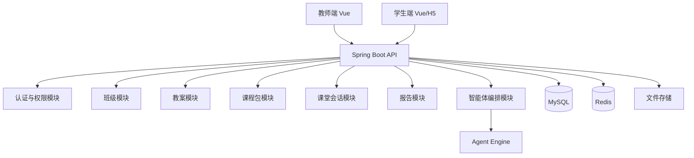
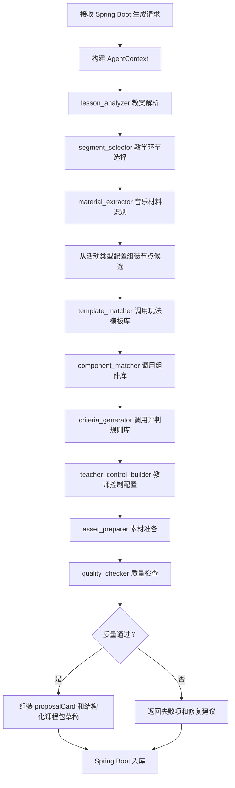

# “不亦乐乎”音乐课堂智能体总架构设计说明书

## 1. 项目总览

### 1.1 项目定位

“不亦乐乎”音乐课堂智能体系统面向中小学音乐课堂。系统将教师上传或输入的音乐教案、音乐材料和课堂目标，转化为可发布到班级的一整节课互动课程包。

核心模型：

```text
课程包 = 一组可排序活动节点的有序集合
```

每个活动节点可以是课堂入口、音乐要素控制器、乐器体验工具、节奏复刻、音高听辨与模唱、音色听辨、拖拽/点击选择题、创编工坊或展示总结页。教师可以调整活动顺序、修改题目与选项、修改体验目的和评判标准。

### 1.2 技术栈

| 层级 | 技术 |
| --- | --- |
| 前端 | Vue 3 + Vite + Pinia + Vue Router |
| 后端 | Spring Boot 3 |
| 安全 | Spring Security + JWT |
| ORM | MyBatis-Plus |
| 数据库 | MySQL 8.0 |
| 缓存 | Redis |
| 文件存储 | 本地文件存储，后续可迁移对象存储 |
| 智能体能力 | Spring Boot 调用内部 Agent Engine |

### 1.3 用户角色

| 角色 | 说明 | 核心权限 |
| --- | --- | --- |
| 教师 | 课程包创建者和课堂控制者 | 管理自己的班级、教案、课程包、课堂会话和学生数据 |
| 学生 | 课堂参与者 | 加入班级、进入已发布课程包、完成已解锁活动、提交学习数据 |

### 1.4 核心业务闭环

```text
教师登录
-> 创建班级
-> 上传教案
-> 后端调用智能体能力解析教案
-> 生成课程包草稿和方案卡
-> 教师调整活动顺序、题目、选项、体验目的、评判标准
-> 教师确认课程包版本
-> 发布到班级
-> 创建课堂会话
-> 教师开始课堂并解锁活动节点
-> 学生进入当前已解锁节点
-> 学生提交结果和学习事件
-> 后端记录进度
-> 教师查看课堂报告
```

## 2. 总体技术架构

### 2.1 系统组成



### 2.2 后端职责边界

Spring Boot 后端负责：

1. 用户认证与权限控制。
2. 班级、教案、课程包、课堂会话等业务数据管理。
3. MySQL 持久化。
4. Redis 课堂运行态缓存。
5. 调用 Agent Engine 生成课程包方案。
6. 统一对前端提供 REST API。

Agent Engine 负责：

1. 教案解析。
2. 教学环节选择。
3. 音乐材料识别。
4. 活动模板匹配。
5. 组件匹配。
6. 评判标准生成。
7. 质量检查。

## 3. 后端架构设计

### 3.1 后端包结构

```text
com.buyilehu.musicagent
├── controller
├── service
├── service.impl
├── mapper
├── entity
├── dto
│   ├── request
│   └── response
├── enums
├── config
├── security
├── redis
├── agent
├── contract
├── registry
├── runtime
├── patch
├── quality
├── storage
├── exception
└── common
```

### 3.2 Controller 层

Controller 只负责 HTTP 入参、权限注解、调用 Service 和返回统一响应，不写复杂业务逻辑。

| Controller | 职责 |
| --- | --- |
| `AuthController` | 登录、退出、获取当前用户 |
| `ClassController` | 班级创建、班级列表、学生加入、学生列表 |
| `LessonPlanController` | 教案上传、教案解析状态、教案详情 |
| `CoursePackageController` | 课程包生成、详情、确认、列表 |
| `ProposalCardController` | 获取方案卡、确认方案卡 |
| `ActivityNodeController` | 调整活动顺序、修改节点配置、修改评判标准 |
| `PublicationController` | 发布课程包到班级、撤回发布 |
| `ClassroomSessionController` | 创建课堂、开始、解锁、暂停、结束 |
| `StudentActivityController` | 学生获取当前课堂、进入节点、提交结果 |
| `LearningEventController` | 学习事件上报 |
| `ReportController` | 课堂报告 |
| `AbilityLibraryController` | 查询课堂活动库、虚拟教具库、虚拟乐器库、模板库、组件库能力 |
| `ActivitySpecController` | 查询活动合同、工具合同、课堂运行合同 |
| `ActivityPatchController` | 教师对当前活动进行局部修改 |
| `NaturalLanguagePatchController` | 教师通过自然语言预览、应用、澄清和撤回课程包修改 |
| `PublishCheckController` | 课程包发布前校验和教师确认项查询 |

### 3.3 Service 层

#### 3.3.1 `AuthService`

职责：用户登录、JWT 签发、当前用户解析。

关键函数：

```java
LoginResponse login(LoginRequest request);
CurrentUserResponse getCurrentUser(Long userId);
void logout(Long userId, String token);
```

读写表：`users`。  
读写 Redis：可选写入 `auth:token:blacklist:{token}`。  
异常：账号不存在、密码错误、用户禁用、Token 失效。

#### 3.3.2 `ClassService`

职责：教师班级管理和学生加入班级。

关键函数：

```java
CreateClassResponse createClass(Long teacherId, CreateClassRequest request);
List<ClassSummaryResponse> listTeacherClasses(Long teacherId);
JoinClassResponse joinClass(Long studentId, JoinClassRequest request);
List<StudentResponse> listClassStudents(Long teacherId, Long classId);
```

读写表：`classes`、`class_members`、`users`。  
读写 Redis：无。  
异常：邀请码不存在、班级已归档、学生重复加入、教师无权访问班级。

#### 3.3.3 `LessonPlanService`

职责：教案文件保存、文本提取、解析任务创建。

关键函数：

```java
UploadLessonPlanResponse uploadLessonPlan(Long teacherId, UploadLessonPlanRequest request);
LessonPlanDetailResponse getLessonPlan(Long teacherId, Long lessonPlanId);
LessonParseResult parseLessonPlan(Long lessonPlanId);
```

读写表：`lesson_plans`、`generation_jobs`。  
读写 Redis：`generation:job:{jobId}`。  
调用能力：`GenerationAgentService.analyzeLesson()`。  
异常：文件格式不支持、文件保存失败、解析失败、教师无权访问教案。

#### 3.3.4 `CoursePackageService`

职责：课程包草稿创建、详情查询、列表查询、状态流转。

关键函数：

```java
CreatePackageDraftResponse createDraft(Long teacherId, Long lessonPlanId, PackagePreferenceRequest request);
CoursePackageDetailResponse getPackageDetail(Long teacherId, Long packageId);
List<CoursePackageSummaryResponse> listPackages(Long teacherId);
ConfirmPackageResponse confirmPackage(Long teacherId, Long packageId, Long packageVersionId);
```

读写表：`course_packages`、`package_versions`、`activity_nodes`、`proposal_cards`。  
读写 Redis：`package:preview:{packageVersionId}`。  
调用能力：`GenerationAgentService.generateCoursePackageDraft()`。  
异常：教案不存在、生成失败、版本不存在、课程包已发布不可直接覆盖。

#### 3.3.5 `PackageVersionService`

职责：课程包版本保存、复制、锁定、查询。

关键函数：

```java
Long createVersion(Long packageId, Long baseVersionId, String versionName);
PackageVersionDetailResponse getVersion(Long teacherId, Long packageVersionId);
void lockVersion(Long packageVersionId);
```

读写表：`package_versions`、`package_modify_records`。  
读写 Redis：删除 `package:preview:{packageVersionId}`。  
异常：版本不存在、已锁定版本不可修改。

#### 3.3.6 `ActivityNodeService`

职责：活动节点配置读取与修改。

关键函数：

```java
ActivityNodeDetailResponse getNode(Long teacherId, Long nodeId);
UpdateNodeConfigResponse updateNodeConfig(Long teacherId, Long packageId, Long nodeId, UpdateNodeConfigRequest request);
UpdateNodeAssessmentResponse updateNodeAssessment(Long teacherId, Long packageId, Long nodeId, UpdateNodeAssessmentRequest request);
```

读写表：`activity_nodes`、`evaluation_criteria`、`package_versions`、`package_modify_records`。  
读写 Redis：删除 `package:preview:{packageVersionId}`。  
调用能力：`EvaluationCriteriaService.generateCriteria()` 可在体验目的变化时触发。  
异常：节点不存在、节点不属于该课程包、配置不合法、缺少评判标准。

#### 3.3.7 `ActivityOrderService`

职责：教师手动调整课程包活动节点顺序。

关键函数：

```java
ReorderNodesResponse reorderNodes(Long teacherId, Long packageId, ReorderNodesRequest request);
```

读写表：`activity_nodes`、`package_versions`、`package_modify_records`。  
读写 Redis：删除 `package:preview:{packageVersionId}`，如果未开课则删除 `classroom:session:{sessionId}:current_node`。  
异常：节点缺失、节点重复、节点不属于当前版本、课程已开始后不允许修改顺序。

#### 3.3.8 `EvaluationCriteriaService`

职责：根据体验目的、活动类型、题目、选项和音乐材料生成评判标准；保存教师确认后的标准。

关键函数：

```java
List<EvaluationCriterionResponse> generateCriteria(GenerateCriteriaRequest request);
UpdateCriteriaResponse updateCriteria(Long teacherId, Long nodeId, UpdateCriteriaRequest request);
List<EvaluationCriterionResponse> listCriteria(Long nodeId);
```

读写表：`evaluation_criteria`、`activity_nodes`。  
读写 Redis：无。  
调用能力：`AgentEngineClient.generateEvaluationCriteria()`。  
异常：体验目的为空、评判标准为空、教师未确认主观评价标准。

#### 3.3.9 `ProposalCardService`

职责：方案卡保存、查询、确认。

关键函数：

```java
ProposalCardResponse getProposalCard(Long teacherId, Long packageId);
ConfirmProposalResponse confirmProposal(Long teacherId, Long packageId, ConfirmProposalRequest request);
```

读写表：`proposal_cards`、`course_packages`、`package_versions`。  
读写 Redis：`package:preview:{packageVersionId}`。  
异常：方案卡不存在、方案卡已确认、课程包不属于教师。

#### 3.3.10 `GenerationAgentService`

职责：统一编排智能体能力，生成课程包草稿和方案卡。

关键函数：

```java
LessonAnalysisResult analyzeLesson(Long lessonPlanId);
CoursePackageDraftResult generateCoursePackageDraft(Long teacherId, Long lessonPlanId, PackagePreferenceRequest request);
QualityCheckResult checkPackage(Long packageVersionId);
```

编排流程：

```text
教案解析
-> 教学环节选择
-> 音乐材料识别
-> 活动节点生成
-> 模板匹配
-> 组件匹配
-> 评判标准生成
-> 质量检查
-> 方案卡生成
```

读写表：`lesson_plans`、`generation_jobs`、`course_packages`、`package_versions`、`activity_nodes`、`component_instances`、`evaluation_criteria`、`proposal_cards`、`assets`。  
读写 Redis：`generation:job:{jobId}`、`package:preview:{packageVersionId}`。  
调用能力：见第 4 章。  
异常：智能体调用失败、返回结构不合法、活动节点无评判标准、草稿结果无法入库。

#### 3.3.11 `AgentEngineClient`

职责：Spring Boot 调用内部智能体能力模块的统一客户端。

关键函数：

```java
LessonAnalysisResult analyzeLesson(AgentLessonAnalyzeRequest request);
SegmentSelectionResult selectTeachingSegment(AgentSegmentSelectRequest request);
MaterialEntityResult extractMaterialEntities(AgentMaterialRequest request);
GenerateCoursePackageDraftResult generateCoursePackageDraft(AgentGenerateDraftRequest request);
TemplateMatchResult matchTemplate(AgentTemplateMatchRequest request);
ComponentMatchResult matchComponents(AgentComponentRequest request);
EvaluationCriteriaResult generateEvaluationCriteria(AgentCriteriaRequest request);
TeacherControlConfigResult buildTeacherControls(AgentTeacherControlRequest request);
QualityCheckResult checkQuality(AgentQualityCheckRequest request);
AudioProcessResult processAudio(AgentAudioProcessRequest request);
AssetPrepareResult prepareAssets(AgentAssetRequest request);
ActivityDecisionResult decideActivityShape(AgentActivityDecisionRequest request);
ActivitySpecResult buildActivitySpec(AgentActivitySpecRequest request);
ToolkitSpecResult matchToolkit(AgentToolkitRequest request);
TeachingAidSpecResult buildTeachingAidSpec(AgentTeachingAidRequest request);
VirtualInstrumentSpecResult buildVirtualInstrumentSpec(AgentVirtualInstrumentRequest request);
PatchActivityResult patchActivitySpec(AgentPatchActivityRequest request);
```

#### 3.3.12 `TemplateService`

职责：根据活动类型、体验目的、音乐材料匹配玩法模板。

关键函数：

```java
TemplateMatchResponse matchTemplate(ActivityNodeCandidate candidate);
List<TemplateResponse> listAvailableTemplates();
```

调用能力：`AgentEngineClient.matchTemplate()`。  
读写表：可从配置初始化到 `component_instances` 和 `activity_nodes.node_config_json`。  
异常：无适配模板、模板必要参数不完整。

#### 3.3.13 `ComponentService`

职责：为活动节点匹配前端组件和组件配置。

关键函数：

```java
ComponentMatchResponse matchComponents(ActivityNodeCandidate candidate);
void saveComponentInstances(Long activityNodeId, List<ComponentInstanceRequest> components);
```

读写表：`component_instances`。  
调用能力：`AgentEngineClient.matchComponents()`。  
异常：组件缺少必需配置、组件不支持该体验目的。

#### 3.3.14 `QualityCheckService`

职责：生成后提供质量检查、教师确认项和发布前校验。质量检查不阻断课程包草稿生成，只在发布阶段对少数不可运行问题进行阻断。

关键函数：

```java
QualityCheckResult checkPackage(Long packageVersionId);
QualityCheckResult checkNode(Long activityNodeId);
TeacherConfirmationSummary listTeacherConfirmations(Long packageVersionId);
void assertPublishable(Long packageVersionId);
```

读写表：`quality_reports`。  
调用能力：`AgentEngineClient.checkQuality()`。  
异常：学生端配置不可运行、发布版本未确认、可提交节点缺少评判标准。

#### 3.3.15 `AudioMaterialService`

职责：处理上传音频、谱面、MIDI 和可听材料。

关键函数：

```java
AudioMaterialResponse uploadAudio(Long teacherId, MultipartFile file);
AudioProcessResult processAudio(Long teacherId, Long assetId, AudioProcessRequest request);
```

读写表：`assets`。  
调用能力：`AgentEngineClient.processAudio()`。  
异常：格式不支持、音频处理失败、文件丢失。

#### 3.3.16 `AssetService`

职责：准备课程包中需要的场景图、乐器音频、活动素材。

关键函数：

```java
List<AssetResponse> prepareAssets(Long packageVersionId, AssetPreferenceRequest request);
AssetResponse saveAsset(Long packageVersionId, AssetSaveRequest request);
```

读写表：`assets`。  
调用能力：`AgentEngineClient.prepareAssets()`。  
异常：素材生成失败、素材文件不可访问。

#### 3.3.17 `PublicationService`

职责：将确认后的课程包版本发布到班级。

关键函数：

```java
PublishPackageResponse publishPackage(Long teacherId, Long packageId, PublishPackageRequest request);
void revokePublication(Long teacherId, Long publicationId);
```

读写表：`package_publications`、`course_packages`、`package_versions`、`classes`。  
读写 Redis：无。  
调用能力：`PublishCheckService.assertNoPublishBlockingIssues()`。  
异常：课程包未确认、发布前校验存在不可运行问题、班级不属于教师。

#### 3.3.18 `ClassroomSessionService`

职责：课堂会话创建、开始、解锁、暂停、结束。

关键函数：

```java
CreateSessionResponse createSession(Long teacherId, CreateSessionRequest request);
ClassroomSessionResponse startSession(Long teacherId, Long sessionId);
UnlockNodeResponse unlockNode(Long teacherId, Long sessionId, Long nodeId);
ClassroomSessionResponse pauseSession(Long teacherId, Long sessionId);
ClassroomSessionResponse endSession(Long teacherId, Long sessionId);
```

读写表：`classroom_sessions`、`session_node_states`、`package_publications`、`activity_nodes`。  
读写 Redis：`classroom:session:{sessionId}`、`classroom:session:{sessionId}:current_node`。  
异常：课堂不属于教师、课堂未开始、节点不属于课程包、节点顺序冲突。

#### 3.3.19 `StudentActivityService`

职责：学生获取当前课堂、进入活动节点、提交活动结果。

关键函数：

```java
StudentCurrentClassroomResponse getCurrentClassroom(Long studentId);
StudentEnterNodeResponse enterNode(Long studentId, Long sessionId, Long nodeId);
SubmitNodeResultResponse submitNodeResult(Long studentId, Long sessionId, Long nodeId, SubmitNodeResultRequest request);
```

读写表：`class_members`、`classroom_sessions`、`session_node_states`、`activity_nodes`、`student_progress`、`learning_events`。  
读写 Redis：`classroom:session:{sessionId}`、`classroom:session:{sessionId}:current_node`、`lock:student_submit:{sessionId}:{studentId}:{nodeId}`。  
异常：学生未加入班级、节点未解锁、重复提交、课堂已结束。

#### 3.3.20 `LearningEventService`

职责：记录学生操作事件。

关键函数：

```java
LearningEventResponse recordEvent(Long studentId, RecordLearningEventRequest request);
```

读写表：`learning_events`。  
读写 Redis：可写 `student:online:{sessionId}`。  
异常：事件类型不合法、课堂不存在、学生无权上报。

#### 3.3.21 `ReportService`

职责：生成课堂报告、节点统计、学生统计。

关键函数：

```java
ClassroomReportResponse getClassroomReport(Long teacherId, Long sessionId);
```

读写表：`student_progress`、`learning_events`、`activity_nodes`、`classroom_sessions`、`users`。  
读写 Redis：`report:session:{sessionId}`。  
异常：课堂不属于教师、课堂数据为空。

#### 3.3.22 `AbilityLibraryService`

职责：统一管理后端可调用能力库的元数据。能力库可以先用配置文件或种子数据初始化，后续再建设管理后台。

关键函数：

```java
List<AbilityLibraryResponse> listLibraries();
List<AbilityItemResponse> listItems(String libraryType, AbilityItemQueryRequest request);
AbilityItemResponse getItem(String libraryType, String abilityCode);
List<AbilityItemResponse> findCompatibleItems(AbilityMatchRequest request);
```

能力库类型：

```text
classroom_activity
teaching_aid
virtual_instrument
game_template
component
music_rule
teacher_control
asset_pack
```

读写表：`ability_registry_items`。  
读写 Redis：可缓存 `ability:registry:{libraryType}`。  
调用能力：无，优先读取本地注册表和数据库初始化数据。  
异常：能力库类型不存在、能力项禁用、能力项配置不合法。

#### 3.3.23 `ActivitySpecService`

职责：保存和查询智能体生成的核心活动合同。`ActivitySpec` 是活动节点的上层教学合同，用于说明该节点为什么存在、学生做什么、调用哪些能力。

关键函数：

```java
ActivitySpecResponse getActivitySpec(Long teacherId, Long activityNodeId);
Long saveActivitySpec(Long activityNodeId, ActivitySpecSaveRequest request);
ToolkitSpecResponse getToolkitSpec(Long activitySpecId);
ClassroomRuntimeSpecResponse getRuntimeSpec(Long packageVersionId);
```

读写表：`activity_specs`、`toolkit_specs`、`classroom_runtime_specs`、`activity_nodes`。  
读写 Redis：删除 `package:preview:{packageVersionId}`。  
调用能力：`AgentEngineClient.buildActivitySpec()`、`AgentEngineClient.matchToolkit()`。  
异常：活动节点不存在、合同字段缺失、学生音乐行为为空。

#### 3.3.24 `ActivityDecisionService`

职责：根据教案、教师偏好、音乐材料和学生音乐行为，决定活动形态。它不直接生成组件，而是决定本节点属于虚拟教具、虚拟乐器、课堂游戏、练习页面、欣赏互动、小组活动或综合活动。

关键函数：

```java
ActivityDecisionResult decideActivityShape(ActivityDecisionRequest request);
List<ActivityNodeCandidate> buildNodeCandidates(ActivityDecisionResult decision);
```

读写表：可写 `activity_specs`。  
读写 Redis：`generation:job:{jobId}`。  
调用能力：`AgentEngineClient.decideActivityShape()`。  
异常：教学目标为空、学生音乐行为为空、活动形态无法确定。

#### 3.3.25 `TeachingAidService`

职责：管理虚拟教具合同和虚拟教具能力调用。虚拟教具用于替代课堂实体教具，例如节奏卡、唱名卡、歌词节奏条、曲式结构卡、音色证据卡、小组任务卡和评价量规。

关键函数：

```java
TeachingAidSpecResponse buildTeachingAidSpec(BuildTeachingAidRequest request);
TeachingAidSpecResponse getTeachingAidSpec(Long activityNodeId);
List<TeachingAidOptionResponse> listTeachingAidOptions(String musicElement, String studentBehavior);
```

读写表：`teaching_aid_specs`、`ability_registry_items`、`component_instances`。  
读写 Redis：可缓存 `ability:registry:teaching_aid`。  
调用能力：`AgentEngineClient.buildTeachingAidSpec()`、`ComponentService.matchComponents()`。  
异常：教具类型不存在、教具不支持该学生行为、组件不可渲染。

#### 3.3.26 `VirtualInstrumentService`

职责：管理虚拟乐器合同和可演奏能力。虚拟乐器需要可发声、可限制音域或乐器池、可记录学生操作，并能接入节奏、音高、器乐和创编活动。

关键函数：

```java
VirtualInstrumentSpecResponse buildInstrumentSpec(BuildInstrumentRequest request);
VirtualInstrumentSpecResponse getInstrumentSpec(Long activityNodeId);
List<VirtualInstrumentOptionResponse> listInstrumentOptions(InstrumentQueryRequest request);
```

读写表：`virtual_instrument_specs`、`ability_registry_items`、`assets`、`component_instances`。  
读写 Redis：可缓存 `ability:registry:virtual_instrument`。  
调用能力：`AgentEngineClient.buildVirtualInstrumentSpec()`、`AgentEngineClient.prepareAssets()`。  
异常：乐器不可用、音色素材不可访问、乐器不支持当前音域或学生动作。

#### 3.3.27 `ClassroomRuntimeSpecService`

职责：生成和维护课堂运行合同。该合同决定教师课堂中可以控制什么，以及学生端如何响应。

关键函数：

```java
ClassroomRuntimeSpecResponse buildRuntimeSpec(Long packageVersionId);
ClassroomRuntimeSpecResponse getRuntimeSpec(Long packageVersionId);
RuntimePatchResponse applyRuntimePatch(Long teacherId, Long sessionId, RuntimePatchRequest request);
```

读写表：`classroom_runtime_specs`、`package_versions`、`classroom_sessions`。  
读写 Redis：`classroom:session:{sessionId}`、`classroom:session:{sessionId}:current_node`。  
调用能力：无，优先读取教师控制/课堂组织库和课程包结构。  
异常：课程包版本不存在、课堂已结束、运行参数不允许课堂中修改。

#### 3.3.28 `ActivityPatchService`

职责：支持教师对当前活动进行局部修改，而不是全量重新生成课程包。第一阶段支持高频修改：慢一点、简单一点、难一点、只练某一句、隐藏答案、显示唱名、换小组模式、换乐器、减少文字、增加重听。

关键函数：

```java
PatchPreviewResponse previewPatch(Long teacherId, Long activityNodeId, PatchActivityRequest request);
PatchApplyResponse applyPatch(Long teacherId, Long activityNodeId, PatchActivityRequest request);
List<PatchRecordResponse> listPatchRecords(Long packageVersionId);
```

读写表：`activity_nodes`、`activity_specs`、`toolkit_specs`、`classroom_runtime_specs`、`package_modify_records`。  
读写 Redis：删除 `package:preview:{packageVersionId}`；课堂中修改时更新 `classroom:session:{sessionId}`。  
调用能力：`AgentEngineClient.patchActivitySpec()`、`AgentEngineClient.checkQuality()`。  
异常：修改超出活动能力、活动已锁定不可改、Patch 后组件配置不合法。

#### 3.3.29 `PublishCheckService`

职责：发布前统一整理 warnings、教师确认项和不可运行问题。它不参与草稿生成，不影响教师预览，只在发布动作时执行。

关键函数：

```java
PublishCheckResponse checkBeforePublish(Long teacherId, Long packageVersionId);
void assertNoPublishBlockingIssues(Long teacherId, Long packageVersionId);
```

读写表：`quality_reports`、`activity_nodes`、`component_instances`、`evaluation_criteria`、`package_versions`。  
读写 Redis：可写 `package:publish_check:{packageVersionId}`，TTL 10 分钟。  
调用能力：`QualityCheckService.checkPackage()`。  
异常：存在不可运行问题、课程包版本未确认、课程包不属于教师。

#### 3.3.30 `EvaluationExecutionService`

职责：学生提交活动结果后，按 `evaluation_criteria` 中的执行模式完成自动评判、教师确认流转或仅记录证据。该 Service 不负责生成评判标准，只负责执行已经入库并经教师可编辑确认的标准。

关键函数：

```java
EvaluationResult evaluateSubmission(Long studentId, Long sessionId, Long activityNodeId, StudentSubmitRequest request);
EvaluationResult evaluateChoice(Long activityNodeId, StudentSubmitRequest request);
EvaluationResult evaluateDrag(Long activityNodeId, StudentSubmitRequest request);
EvaluationResult evaluateTap(Long activityNodeId, StudentSubmitRequest request);
EvaluationResult evaluatePlayNote(Long activityNodeId, StudentSubmitRequest request);
void markPendingTeacherReview(Long progressId, String reason);
TeacherReviewResponse applyTeacherReview(Long teacherId, Long progressId, TeacherReviewRequest request);
```

读写表：`evaluation_criteria`、`student_progress`、`learning_events`、`activity_nodes`、`classroom_sessions`。  
读写 Redis：读取 `lock:student_submit:{sessionId}:{studentId}:{nodeId}` 的提交锁状态，不单独缓存评判真相。  
调用能力：无，普通选择、拖拽、敲击、乐器演奏、创编提交都优先按规则执行；只有评判标准生成阶段可以调用 Agent Engine。  
异常：评判标准不存在、提交证据类型不匹配、课堂已结束、学生无节点访问权限、教师确认记录不存在。

#### 3.3.31 `RewardFeedbackPolicyService`

职责：管理课程包生成前由教师选择的奖惩与反馈机制，并在学生提交后为 `EvaluationExecutionService` 提供星星、机会、防乱操作和反馈文案规则。奖惩机制的目标是提升兴趣、激发胜负欲、防止乱涂乱按，不用于高压排名。

关键函数：

```java
RewardFeedbackPolicyResponse getDefaultPolicy(String grade, String usageMode);
RewardFeedbackPolicyResponse previewPolicy(RewardFeedbackPolicyRequest request);
RewardFeedbackPolicyResponse savePolicy(Long teacherId, Long packageVersionId, RewardFeedbackPolicyRequest request);
RewardFeedbackResult applyRewardPolicy(Long studentId, Long activityNodeId, EvaluationResult evaluationResult, StudentSubmitContext context);
FeedbackMessage buildStudentFeedback(Long activityNodeId, EvaluationResult evaluationResult, RewardFeedbackResult rewardResult);
```

读写表：`reward_feedback_policies`、`student_reward_accounts`、`student_progress`、`learning_events`、`package_versions`。  
读写 Redis：`reward:account:{sessionId}:{studentId}`、`reward:policy:{packageVersionId}`。  
调用能力：无。反馈文案只使用规则模板和音乐要素线索，不调用模型临时生成答案说明。  
异常：策略不存在、策略不属于课程包、奖励模式不支持、星星或机会计算结果非法。

#### 3.3.32 `AntiRandomActionService`

职责：识别学生乱点、乱拖、乱敲、乱涂和空提交等非认真操作。该 Service 不判断音乐正误，只判断操作行为是否明显偏离任务要求。

关键函数：

```java
AntiRandomActionResult inspectAction(Long studentId, Long sessionId, Long activityNodeId, LearningEventRequest event);
AntiRandomActionResult inspectSubmission(Long studentId, Long sessionId, Long activityNodeId, StudentSubmitRequest request);
void recordRandomAction(Long studentId, Long sessionId, Long activityNodeId, AntiRandomActionResult result);
```

读写表：`learning_events`、`student_progress`。  
读写 Redis：`reward:account:{sessionId}:{studentId}`、`lock:student_submit:{sessionId}:{studentId}:{nodeId}`。  
调用能力：无。  
异常：事件格式不合法、节点不支持防乱操作规则。

#### 3.3.33 `NaturalLanguagePatchService`

职责：把教师自然语言修改要求转换成可预览、可确认、可撤回的结构化 Patch。它不重新生成整个课程包，只编排目标定位、PatchCommand 生成、安全校验和局部应用。

关键函数：

```java
NaturalLanguagePatchPreviewResponse previewNaturalLanguagePatch(Long teacherId, Long packageVersionId, NaturalLanguagePatchRequest request);
NaturalLanguagePatchApplyResponse applyNaturalLanguagePatch(Long teacherId, Long packageVersionId, NaturalLanguagePatchApplyRequest request);
PatchClarifyResponse clarifyPatchTarget(Long teacherId, Long packageVersionId, PatchClarifyRequest request);
PatchUndoResponse undoLastPatch(Long teacherId, Long packageVersionId, PatchUndoRequest request);
```

读写表：`package_versions`、`activity_nodes`、`activity_specs`、`component_instances`、`evaluation_criteria`、`package_modify_records`、`patch_target_indexes`。  
读写 Redis：`patch:preview:{packageVersionId}:{teacherId}`、`patch:target_index:{packageVersionId}`、`patch:lock:{packageVersionId}:{targetId}`。  
调用能力：`PatchTargetResolverService`、`PatchSafetyValidator`、`AgentEngineClient.patchActivitySpec()`、`ActivityPatchService`、`QualityCheckService`。  
异常：目标不明确、多个候选需教师选择、Patch 超出能力边界、版本冲突、发布快照不可编辑。

#### 3.3.34 `PatchTargetResolverService`

职责：定位教师自然语言想修改的目标。优先使用前端当前上下文，其次使用课程包节点、组件、体验目的、能力项和目标定位索引进行召回与精排。

关键函数：

```java
PatchTargetResolution resolveTarget(Long teacherId, Long packageVersionId, NaturalLanguagePatchRequest request);
List<PatchTargetCandidate> retrieveCandidates(Long packageVersionId, String instruction);
List<PatchTargetCandidate> rerankCandidates(String instruction, List<PatchTargetCandidate> candidates);
void rebuildPatchTargetIndex(Long packageVersionId);
```

定位规则：

1. 请求中有 `currentActivityNodeId` 时，“这个”“这一关”“当前活动”默认指向当前节点。
2. 请求中有 `selectedComponentCode` 时，优先定位当前节点内对应组件。
3. 请求中出现“音色听辨”“节奏复刻”“创编工坊”等词时，按节点标题、体验目的、活动类型和能力项召回。
4. 只有一个候选且置信度达到阈值时，进入 Patch 预览。
5. 多个候选或置信度不足时，返回候选列表让教师选择，不直接修改。

#### 3.3.35 `PatchSafetyValidator`

职责：在应用 PatchCommand 前做后端硬校验，确保自然语言不会绕过能力库、状态机和发布快照边界。

关键函数：

```java
void validatePreview(Long teacherId, Long packageVersionId, PatchCommand command);
void validateApply(Long teacherId, Long packageVersionId, PatchCommand command);
void assertPatchableField(String abilityCode, String jsonPath);
void assertRuntimePatchAllowed(Long sessionId, PatchCommand command);
```

校验规则：

1. PatchCommand 只能修改能力项声明的 `patchableFields` 或 `runtimePatchableFields`。
2. `published_snapshot` 禁止内容修改，只能复制新草稿后修改。
3. 课堂运行中只允许调速、提示、重听、解锁等运行态修改。
4. 修改正确答案、评判标准、提交方式时必须要求教师确认。
5. 模型输出的 JSON Path 必须命中白名单，不允许自由写入数据库字段。

### 3.4 后端核心状态机

后端所有关键对象必须有明确状态。Controller 只接受当前状态允许的动作，Service 负责状态流转和持久化。

#### 3.4.1 `generation_jobs` 状态机

`job_status` 保存任务大状态，`stage` 保存当前细分阶段。

| job_status | stage | 允许动作 | 禁止动作 | 流转责任 |
| --- | --- | --- | --- | --- |
| `pending` | `pending` | 查询任务、取消任务、后台 worker 领取任务 | 查询课程包结果 | `GenerationAgentService` 创建 |
| `running` | `analyzing` | 查询进度、写教案解析结果 | 重复创建同一任务入库结果 | 后台 worker |
| `running` | `extracting_materials` | 查询进度、复用已上传音频和谱面 | 覆盖原始教案 | 后台 worker |
| `running` | `assembling` | 查询进度、调用能力库组装节点 | 教师编辑未入库节点 | 后台 worker |
| `running` | `checking` | 查询进度、写 warnings 和教师确认项 | 发布课程包 | 后台 worker |
| `running` | `persisting` | 写课程包、版本、节点、组件、标准、方案卡 | 再次调用生成全流程 | `CoursePackageService` |
| `success` | `completed` | 查询结果、进入方案卡确认和编辑 | 重新写生成产物 | `GenerationAgentService` |
| `failed` | `failed` | 查询错误、重试任务 | 发布课程包 | `GenerationAgentService` |
| `canceled` | `canceled` | 查询取消原因 | 后台继续执行 | `GenerationAgentService` |

失败任务允许重试。重试时若 `lesson_plans.parsed_json` 已存在，直接复用 `LessonContract`；若 `assets` 已登记上传音频或图片，直接复用素材引用。

#### 3.4.2 `package_versions` 状态机

| status | 允许动作 | 禁止动作 | 流转责任 |
| --- | --- | --- | --- |
| `draft` | 继续生成、查看方案卡、教师编辑、删除草稿 | 发布到班级 | `CoursePackageService` |
| `teacher_editing` | 调整顺序、修改题目选项、修改体验目的、Patch 当前活动 | 作为课堂 Session 运行版本 | `PackageVersionService`、`ActivityPatchService` |
| `confirmed` | 发布前校验、复制发布快照 | 直接修改内容字段 | `ProposalCardService`、`PublishCheckService` |
| `published_snapshot` | 被发布、被课堂 Session 读取、被报告引用 | 修改节点、组件、答案、评判标准 | `PublicationService` |
| `archived` | 查询历史、复制为新草稿 | 发布、课堂运行、学生提交 | `PackageVersionService` |

已发布快照不可原地覆盖。教师继续修改时必须从原版本复制一个新的 `draft` 或 `teacher_editing` 版本。

#### 3.4.3 `activity_nodes` 状态机

| node_status | 允许动作 | 禁止动作 | 流转责任 |
| --- | --- | --- | --- |
| `draft` | 补齐组件、补齐评判标准、编辑配置 | 发布运行 | `ActivityNodeService` |
| `ready` | 调整顺序、预览、发布前校验 | 删除已发布快照中的节点 | `ActivityNodeService`、`PublishCheckService` |
| `disabled` | 在草稿中隐藏或恢复 | 学生端进入、课堂解锁 | `ActivityNodeService` |

`ready` 只表示节点结构可运行，不表示教学效果已经达到最佳。教学贴合度提示进入 warnings，不影响草稿返回。

#### 3.4.4 `classroom_sessions` 状态机

| session_status | 允许动作 | 禁止动作 | 流转责任 |
| --- | --- | --- | --- |
| `not_started` | 创建 Session、预加载运行合同、开始课堂 | 学生提交 | `ClassroomSessionService` |
| `running` | 解锁节点、暂停、结束、学生进入已解锁节点、学生提交 | 修改发布快照内容 | `ClassroomSessionService`、`StudentActivityService` |
| `paused` | 恢复课堂、结束课堂、查看当前状态 | 学生新提交 | `ClassroomSessionService` |
| `ended` | 查看报告、回放学习事件 | 继续提交、继续解锁节点 | `ClassroomSessionService`、`ReportService` |

课堂运行中允许修改的内容只限运行态配置，如调速、提示、重听、当前节点和解锁状态。

#### 3.4.5 `student_progress` 状态机

| progress_status | 允许动作 | 禁止动作 | 流转责任 |
| --- | --- | --- | --- |
| `not_started` | 学生进入节点并创建进度 | 直接评分 | `StudentActivityService` |
| `doing` | 保存进入时间、记录学习事件、提交结果 | 重复创建进度行 | `StudentActivityService` |
| `submitted` | 自动评判、写得分、进入报告统计 | 再次覆盖原始提交证据 | `EvaluationExecutionService` |
| `pending_teacher_review` | 教师确认、教师补充分数或反馈 | 自动标记最终完成 | `EvaluationExecutionService` |
| `reviewed` | 报告统计、学生查看结果 | 再次提交覆盖结果 | `EvaluationExecutionService`、`ReportService` |

第一阶段不单独新增 `evaluation_results` 表，评判结果写入 `student_progress.result_json`，过程证据写入 `learning_events`。

## 4. 智能体能力接入设计

### 4.1 接入方式

Spring Boot 不直接承担复杂音乐理解和生成逻辑。后端通过 `AgentEngineClient` 调用内部 Agent Engine。Agent Engine 暴露稳定接口，内部使用现有能力模块完成教案解析、模板匹配、组件匹配和评判标准生成。

### 4.2 需要接入的能力模块

| 能力模块 | 对应现有能力 | 新系统用途 | Spring Boot 调用函数 |
| --- | --- | --- | --- |
| 教案解析能力 | `lesson_game_generator.py` | 提取课题、年级、目标、流程、音乐要素、可游戏化环节 | `AgentEngineClient.analyzeLesson()` |
| 教学环节选择能力 | `teaching_segment_selector.py`、`segment_to_game_translator.py` | 判断哪个教学环节适合生成互动活动 | `AgentEngineClient.selectTeachingSegment()` |
| 音乐材料识别能力 | `material_entity_registry.py`、`lesson_material_binding.py` | 识别节奏、音高、音色、歌词、乐句、音频片段 | `AgentEngineClient.extractMaterialEntities()` |
| 玩法模板匹配能力 | `gameplay_template_catalog.py`、`game_template_registry.py` | 匹配节奏复刻、音高听辨与模唱、音色听辨、创编等活动类型 | `AgentEngineClient.matchTemplate()` |
| 组件匹配能力 | `component_library.py`、`component_capability_registry.py` | 为节点选择播放器、选择题、拖拽、乐器体验、反馈等组件 | `AgentEngineClient.matchComponents()` |
| 评判标准生成能力 | `music_rule_registry.py` | 根据体验目的生成评判标准 | `AgentEngineClient.generateEvaluationCriteria()` |
| 教师控制能力 | `teacher_control_registry.py` | 生成调速、重播、提示、重置、教师确认等控制配置 | `AgentEngineClient.buildTeacherControls()` |
| 质量检查能力 | `lesson_delivery_gates.py`、`lesson_fit_layer.py`、`template_fidelity_contract.py` | 检查课程包是否贴合教案、音乐逻辑是否成立、活动是否可交付 | `AgentEngineClient.checkQuality()` |
| 模型调用能力 | `model_gateway.py`、`lesson_brain_llm.py` | 调用大模型辅助教案理解、方案生成和标准生成 | `AgentEngineClient.callModel()` |
| 音频处理能力 | `music_pipeline.py`、`song_material_parser.py` | 处理上传音频、MIDI、谱面和可听材料 | `AgentEngineClient.processAudio()` |
| 素材准备能力 | `image_generation_skill.py`、`asset_pack_registry.py`、`instrument_audio_registry.py` | 准备场景图、乐器音频、活动素材 | `AgentEngineClient.prepareAssets()` |

### 4.3 Agent Engine 输出合同

课程包生成结果必须返回结构化 JSON：

```json
{
  "lessonAnalysis": {},
  "selectedSegments": [],
  "materialEntities": [],
  "activityNodes": [],
  "componentInstances": [],
  "evaluationCriteria": [],
  "teacherControlConfig": {},
  "qualityReport": {},
  "proposalCard": {}
}
```

Spring Boot 只接受结构化结果入库。Agent Engine 返回自然语言说明时，必须放入 `proposalCard.summary` 或 `qualityReport.detailJson`，不能替代结构化字段。

### 4.4 智能体工具选型

生产系统采用以下组合：

```text
Vue 前端
-> Spring Boot 业务后端
-> AgentEngineClient
-> Python FastAPI Agent Engine
-> 现有音乐教学能力模块
-> OpenAI-compatible 模型服务
```

选型原则：

1. Spring Boot 负责业务闭环、权限、数据库、Redis、课程包发布和课堂运行态。
2. Python Agent Engine 负责教案理解、音乐材料识别、调用既有库完成玩法匹配、组件匹配、评判标准组装和质量检查。
3. 现有 Python 能力按插件方式接入 Agent Engine。
4. 模型调用统一通过 `model_gateway.py` 和 `lesson_brain_llm.py` 封装，业务代码不直接散落调用模型。
5. Agent Engine 对 Spring Boot 暴露稳定 HTTP 接口，内部能力可以独立迭代。
6. 课程包生成结果统一以结构化 JSON 返回，由 Spring Boot 完成持久化和发布控制。

第一阶段固定实现：

| 层级 | 使用工具 | 作用 |
| --- | --- | --- |
| Agent 服务框架 | Python FastAPI | 对 Spring Boot 暴露稳定 HTTP 接口 |
| Agent 能力组织 | 内部插件注册表 | 统一管理教案解析、模板库调用、组件库调用、规则库调用、质量检查等能力 |
| 模型网关 | OpenAI-compatible Chat Completion | 兼容 ChatECNU、DeepSeek 等模型服务 |
| 结构化输出 | JSON Schema + Pydantic | 约束 Agent 输出，避免自然语言结果直接入库 |
| 异步任务 | Spring Boot 生成任务表 + Redis 进度缓存 | 课程包生成可以轮询进度 |
| 文件处理 | Spring Boot 上传存储 + Agent 读取文件路径 | 音频、MIDI、谱面和图片素材统一由后端登记资产 |

### 4.5 Agent Engine 服务结构

Agent Engine 建议作为独立 Python 服务部署，目录结构如下：

```text
agent-engine/
├── main.py
├── api/
│   ├── lesson_api.py
│   ├── package_api.py
│   ├── criteria_api.py
│   ├── quality_api.py
│   ├── audio_api.py
│   └── asset_api.py
├── core/
│   ├── agent_context.py
│   ├── workflow_runner.py
│   ├── plugin_registry.py
│   ├── model_router.py
│   ├── schema_validator.py
│   └── error_codes.py
├── plugins/
│   ├── lesson_analyzer.py
│   ├── segment_selector.py
│   ├── material_extractor.py
│   ├── template_matcher.py
│   ├── component_matcher.py
│   ├── criteria_generator.py
│   ├── teacher_control_builder.py
│   ├── quality_checker.py
│   ├── audio_processor.py
│   └── asset_preparer.py
├── schemas/
│   ├── lesson_schema.py
│   ├── package_schema.py
│   ├── activity_schema.py
│   ├── component_schema.py
│   ├── criteria_schema.py
│   └── quality_schema.py
└── config/
    ├── model_config.py
    ├── plugin_config.py
    └── workflow_config.py
```

核心类：

```python
class AgentContext:
    request_id: str
    teacher_id: int
    lesson_plan_id: int | None
    package_version_id: int | None
    model_profile: str
    locale: str
    trace: list[dict]

class WorkflowRunner:
    def run_package_generation(self, request: PackageGenerationRequest) -> PackageGenerationResult: ...
    def run_lesson_analysis(self, request: LessonAnalyzeRequest) -> LessonAnalysisResult: ...
    def run_quality_check(self, request: QualityCheckRequest) -> QualityCheckResult: ...

class PluginRegistry:
    def get(self, plugin_name: str) -> AgentPlugin: ...
    def list_enabled(self) -> list[PluginMeta]: ...

class AgentPlugin:
    name: str
    version: str
    input_schema: type
    output_schema: type
    timeout_seconds: int
    def execute(self, context: AgentContext, payload: dict) -> dict: ...
```

Spring Boot 只调用 Agent Engine 的 API，不直接 import Python 模块。Agent Engine 内部再调用现有 `/Users/shishangbo/codex/第一版/app/services` 下的能力文件。

### 4.6 模型配置设计

模型只服务于需要理解、归纳、生成和解释的环节。规则明确、可枚举的环节优先走本地规则库。

环境变量：

```env
AGENT_MODEL_PROFILE=default
CHAT_ECNU_API_KEY=
CHAT_ECNU_BASE_URL=https://chat.ecnu.edu.cn/open/api/v1
CHAT_ECNU_CHAT_COMPLETIONS_URL=https://chat.ecnu.edu.cn/open/api/v1/chat/completions
CHAT_ECNU_MODEL=ecnu-max
DEEPSEEK_API_KEY=
DEEPSEEK_BASE_URL=
DEEPSEEK_MODEL=
AGENT_MODEL_TIMEOUT_SECONDS=20
AGENT_MODEL_MAX_RETRIES=2
AGENT_MODEL_TEMPERATURE_DESIGN=0.2
AGENT_MODEL_TEMPERATURE_COPY=0.4
```

模型档位：

| 档位 | 默认模型 | 用途 | 温度 |
| --- | --- | --- | --- |
| `lesson_reasoning` | `CHAT_ECNU_MODEL` 或 `DEEPSEEK_MODEL` | 教案理解、教学环节判断、方案卡生成 | `0.2` |
| `criteria_generation` | `CHAT_ECNU_MODEL` 或 `DEEPSEEK_MODEL` | 根据体验目的生成评判标准 | `0.2` |
| `teacher_copy` | `CHAT_ECNU_MODEL` 或 `DEEPSEEK_MODEL` | 教师可读说明、活动说明润色 | `0.4` |
| `fallback_rule_only` | 无模型 | 模型不可用时走规则库和模板库 | 无 |

模型调用规则：

1. `lesson_analyzer` 可以调用模型增强教案理解，但必须保留本地解析结果。
2. `criteria_generator` 先从 `music_rule_registry.py` 取基础规则，再按教师体验目的组装课堂可读标准；模型只用于必要的语言补全和表述润色。
3. `quality_checker` 以规则检查为主，模型只能补充解释，不能覆盖硬性质量失败。
4. 所有模型输出必须经过 JSON 解析和 Schema 校验。
5. 模型失败时，Agent Engine 返回明确错误或降级结果，不能返回半结构化文本。

### 4.7 插件配置设计

Agent Engine 插件不是浏览器插件，而是可被编排流程调用的内部能力单元。第一阶段优先调用已经设计好的组件库、模板库、规则库和素材库；智能体不重新生成这些库，只负责理解需求、选择库中能力、组装结构化结果。

| 插件名 | 调用现有能力 | 输入 | 输出 | 是否调用模型 |
| --- | --- | --- | --- | --- |
| `lesson_analyzer` | `lesson_game_generator.py`、`lesson_brain_llm.py` | 教案文本、年级、教师偏好 | 课题、目标、流程、音乐要素、可互动环节 | 可调用 |
| `segment_selector` | `teaching_segment_selector.py`、`segment_to_game_translator.py` | 教案解析结果、活动类型偏好 | 推荐互动环节列表 | 可调用 |
| `material_extractor` | `material_entity_registry.py`、`lesson_material_binding.py` | 教案、音频、歌词、谱面 | 节奏、音高、音色、乐句、音频片段 | 不默认调用 |
| `template_matcher` | `gameplay_template_catalog.py`、`game_template_registry.py` | 活动候选、体验目的、音乐材料 | 从模板库选出的活动模板、玩法规则 | 不默认调用 |
| `component_matcher` | `component_library.py`、`component_capability_registry.py` | 活动模板、学生动作、教师控制 | 从组件库选出的前端组件清单和配置 | 不默认调用 |
| `criteria_generator` | `music_rule_registry.py` | 体验目的、活动类型、材料、提交方式 | 从规则库组装出的评判标准、分值、反馈语 | 可调用 |
| `teacher_control_builder` | `teacher_control_registry.py` | 活动类型、使用方式、课堂节奏 | 从教师控制/课堂组织库选出的调速、重播、提示、重置、确认配置 | 不默认调用 |
| `quality_checker` | `lesson_delivery_gates.py`、`lesson_fit_layer.py`、`template_fidelity_contract.py` | 课程包草稿 | 质量结果、失败原因、修复建议 | 可调用 |
| `audio_processor` | `music_pipeline.py`、`song_material_parser.py` | 音频、MIDI、谱面文件 | 可听材料、片段、元数据 | 不默认调用 |
| `asset_preparer` | `image_generation_skill.py`、`asset_pack_registry.py`、`instrument_audio_registry.py` | 素材范围、活动节点、乐器需求 | 从素材库选出或按需准备的场景图、道具图、乐器音频、素材清单 | 可调用 |
| `patch_rule_router` | 自然语言 Patch 规则表 | 教师原话、当前节点、当前组件 | 高频修改意图和简单 Patch | 不调用 |
| `patch_target_retriever` | `patch_target_indexes` | 教师原话、课程包目标索引 | 候选节点、组件和能力项 | 调用 embedding |
| `patch_target_reranker` | `patch_target_indexes` | 教师原话、候选目标 | 精排候选和置信度 | 调用 reranker |
| `patch_intent_classifier` | Patch 意图枚举和能力边界 | 教师原话、目标候选 | 修改意图、范围、澄清需求 | 规则优先，可调用 |
| `patch_command_builder` | Patch 意图与字段映射 | 修改意图、目标、旧配置、可改字段 | `NaturalLanguagePatchCommand` | 可调用 |
| `patch_preview_builder` | PatchCommand | 旧值、新值、受影响合同 | 教师可读修改预览 | 不默认调用 |
| `patch_safety_checker` | 能力库 Patch 边界 | PatchCommand、状态机、版本 | 字段边界和状态边界校验结果 | 不调用 |
| `patch_undo_builder` | PatchCommand | 旧值和新值 | `undoCommand` | 不调用 |

插件统一返回：

```json
{
  "pluginName": "criteria_generator",
  "version": "1.0.0",
  "status": "success",
  "data": {},
  "warnings": [],
  "trace": {
    "modelUsed": "ecnu-max",
    "durationMs": 1200
  }
}
```

插件异常码：

| 异常码 | 含义 | Spring Boot 处理 |
| --- | --- | --- |
| `PLUGIN_TIMEOUT` | 插件超时 | 标记生成任务失败，可重试 |
| `PLUGIN_SCHEMA_INVALID` | 插件输出结构不合法 | 标记生成任务失败，记录原始 trace |
| `MATERIAL_BINDING_REQUIRED` | 活动节点与音乐材料绑定不完整 | 返回教师确认或调整材料绑定提示 |
| `TEMPLATE_NOT_MATCHED` | 无适配模板 | 返回教师调整活动类型或体验目的提示 |
| `PUBLISH_CHECK_FAILED` | 发布前校验存在不可运行问题 | 不允许发布 |
| `MODEL_UNAVAILABLE` | 模型不可用 | 可降级到规则库或提示稍后重试 |

### 4.8 课程包组装 Agent 工作流

完整流程：



工作流输入：

```json
{
  "requestId": "gen_20260627_001",
  "teacherId": 12,
  "lessonPlanId": 1001,
  "lessonText": "教案全文",
  "grade": "三年级",
  "usageMode": "student_device",
  "paceMode": "teacher_step_unlock",
  "activityTypes": ["instrument_experience", "rhythm_echo", "pitch_listen_sing"],
  "experiencePurposes": ["节奏", "旋律", "音色"],
  "difficulty": "grade_default",
  "materialSource": "lesson_material",
  "assetScope": "scene_and_props",
  "teacherCustomOptions": [
    {
      "nodeType": "choice_question",
      "question": "你听到的是哪种乐器音色？",
      "options": ["笛子", "二胡", "木琴"]
    }
  ]
}
```

工作流输出：

```json
{
  "requestId": "gen_20260627_001",
  "status": "success",
  "lessonAnalysis": {},
  "activityNodes": [],
  "componentInstances": [],
  "evaluationCriteria": [],
  "teacherControls": [],
  "assets": [],
  "qualityReport": {
    "passed": true,
    "score": 92,
    "publishBlockingIssues": [],
    "warnings": []
  },
  "proposalCard": {
    "title": "三年级音乐互动课程包",
    "summary": "本课程包围绕节奏、旋律与音色展开。",
    "nodeCount": 5,
    "estimatedDurationMinutes": 15,
    "teacherConfirmRequired": true
  }
}
```

### 4.9 Agent Engine API 合同

#### 4.9.1 教案解析

| 项 | 内容 |
| --- | --- |
| URL | `POST /agent/v1/lesson/analyze` |
| 调用方 | Spring Boot `AgentEngineClient.analyzeLesson` |
| 核心插件 | `lesson_analyzer` |
| 模型档位 | `lesson_reasoning` |

请求：

```json
{
  "requestId": "ana_001",
  "teacherId": 12,
  "lessonPlanId": 1001,
  "lessonText": "教案全文",
  "grade": "三年级",
  "extraNeed": "希望加强音色听辨"
}
```

返回：

```json
{
  "title": "森林里的音乐会",
  "grade": "三年级",
  "objectives": ["感受不同乐器音色", "能模仿简单节奏"],
  "teachingSegments": [],
  "musicElements": ["节奏", "音色", "旋律"],
  "gameableSegments": [],
  "warnings": []
}
```

#### 4.9.2 组装课程包草稿

| 项 | 内容 |
| --- | --- |
| URL | `POST /agent/v1/packages/generate-draft` |
| 调用方 | Spring Boot `AgentEngineClient.generateCoursePackageDraft` |
| 核心插件 | 全流程插件 |
| 模型档位 | `lesson_reasoning`、`criteria_generation`、`teacher_copy` |

请求使用 4.8 工作流输入。返回使用 4.8 工作流输出。

#### 4.9.3 组装评判标准

| 项 | 内容 |
| --- | --- |
| URL | `POST /agent/v1/criteria/generate` |
| 调用方 | Spring Boot `AgentEngineClient.generateEvaluationCriteria` |
| 核心插件 | `criteria_generator` |
| 模型档位 | `criteria_generation` |

请求：

```json
{
  "requestId": "cri_001",
  "activityNodeId": 501,
  "nodeType": "instrument_experience",
  "experiencePurpose": "力度",
  "studentAction": "拖动力度滑杆并试听",
  "material": {
    "songName": "森林里的音乐会",
    "targetElement": "强弱变化"
  },
  "teacherCustomRequirement": "评价要适合三年级学生"
}
```

返回：

```json
{
  "criteria": [
    {
      "dimension": "力度变化",
      "rule": "能区分强、弱和渐强三种效果",
      "score": 40,
      "feedback": "你已经听出了声音强弱的变化。"
    },
    {
      "dimension": "音乐依据",
      "rule": "能说出至少一个听到的声音证据",
      "score": 30,
      "feedback": "说出你从哪里听到了变化。"
    },
    {
      "dimension": "操作完成",
      "rule": "完成试听、选择和提交",
      "score": 30,
      "feedback": "完成一次完整的体验。"
    }
  ],
  "teacherConfirmRequired": true
}
```

#### 4.9.4 质量检查

| 项 | 内容 |
| --- | --- |
| URL | `POST /agent/v1/quality/check` |
| 调用方 | Spring Boot `AgentEngineClient.checkQuality` |
| 核心插件 | `quality_checker` |
| 模型档位 | `lesson_reasoning` |

返回：

```json
{
  "passed": true,
  "score": 92,
  "checks": [
    {
      "code": "LESSON_FIT",
      "passed": true,
      "message": "活动目标与教案目标一致"
    },
    {
      "code": "CRITERIA_READY",
      "passed": true,
      "message": "每个活动节点都有评判标准"
    }
  ],
  "publishBlockingIssues": [],
  "warnings": []
}
```

#### 4.9.5 音频处理

| 项 | 内容 |
| --- | --- |
| URL | `POST /agent/v1/audio/process` |
| 调用方 | Spring Boot `AgentEngineClient.processAudio` |
| 核心插件 | `audio_processor` |
| 模型档位 | `fallback_rule_only` |

返回：

```json
{
  "assetId": 3001,
  "durationSeconds": 86.5,
  "segments": [],
  "detectedMaterials": {
    "rhythmPatterns": [],
    "pitchFragments": [],
    "timbreCandidates": []
  },
  "warnings": []
}
```

#### 4.9.6 素材准备

| 项 | 内容 |
| --- | --- |
| URL | `POST /agent/v1/assets/prepare` |
| 调用方 | Spring Boot `AgentEngineClient.prepareAssets` |
| 核心插件 | `asset_preparer` |
| 模型档位 | `teacher_copy` |

返回：

```json
{
  "assets": [
    {
      "assetType": "instrument_audio",
      "name": "木琴试听音",
      "storagePath": "/assets/instruments/xylophone_c4.wav",
      "metadata": {
        "instrument": "木琴",
        "pitch": "C4"
      }
    }
  ],
  "warnings": []
}
```

### 4.10 智能体功能边界

第一阶段 Agent 必须提供的功能：

1. 从教案中识别课题、年级、教学目标、教学流程和音乐要素。
2. 判断哪些教学环节适合转成互动活动。
3. 根据教师选择生成可排序活动节点。
4. 支持乐器体验工具，体验目的由教师自定义。
5. 支持节奏复刻、音高听辨与模唱、音色听辨。
6. 支持拖拽和点击类选择题，题目、选项和正确答案可由教师自定义。
7. 支持创编工坊和展示总结页。
8. 根据体验目的从评判规则库组装评判标准，并要求教师确认。
9. 为每个活动节点匹配前端组件和教师控制项。
10. 对课程包进行质量检查，阻止缺少材料、缺少评判标准或音乐逻辑不成立的版本发布。

### 4.11 智能体后端总体分层

智能体后端不是重新开发一套组件库、模板库或规则库，而是把已经设计好的库统一接入，形成稳定的“理解、匹配、组装、校验”能力。

```text
Spring Boot 业务后端
-> AgentEngineClient
-> Python FastAPI Agent Engine
-> 工作流编排层
-> 插件适配层
-> 既有能力库
-> 模型网关
```

| 层级 | 职责 | 是否直接访问数据库 | 是否调用模型 |
| --- | --- | --- | --- |
| Spring Boot 业务后端 | 权限、课程包、版本、发布、课堂、学生进度、报告 | 是 | 不直接调用 |
| `AgentEngineClient` | 封装对 Agent Engine 的 HTTP 调用 | 否 | 否 |
| Agent Engine API 层 | 接收 Spring Boot 请求，返回结构化 JSON | 否 | 否 |
| 工作流编排层 | 按步骤调用插件，维护 `AgentContext` 和 trace | 否 | 间接调用 |
| 插件适配层 | 把既有 Python 能力包装成统一插件 | 否 | 按插件需要 |
| 既有能力库 | 模板库、组件库、规则库、素材库、质量检查规则 | 否 | 部分能力可调用 |
| 模型网关 | 统一调用 OpenAI-compatible 模型服务 | 否 | 是 |
| Schema 校验层 | 校验请求、插件输出、最终结果 | 否 | 否 |

核心原则：

1. 课程包结构由 Spring Boot 保存，Agent Engine 只返回结构化建议。
2. 组件、模板、教师控制、评判规则优先来自既有库。
3. 模型只处理语义理解、判断、归纳和表述，不替代组件库、模板库和规则库。
4. 所有插件输出必须能被 Spring Boot 直接入库或转换入库。
5. 每次 Agent 调用必须带 `requestId`，便于排查生成链路。

### 4.12 Agent Engine 后端模块分工

#### 4.12.1 `api` 接口层

职责：

1. 提供 Spring Boot 可调用的 HTTP 接口。
2. 校验请求体格式。
3. 创建 `AgentContext`。
4. 调用 `WorkflowRunner`。
5. 将异常转换为统一错误码。

核心文件：

```text
api/
├── lesson_api.py
├── package_api.py
├── criteria_api.py
├── component_api.py
├── quality_api.py
├── audio_api.py
├── asset_api.py
└── health_api.py
```

接口层不做业务判断，不直接调用具体库。

#### 4.12.2 `core` 编排层

职责：

1. 定义 `AgentContext`。
2. 维护插件调用顺序。
3. 处理插件输入输出转换。
4. 记录每一步 trace。
5. 控制超时、重试和降级。

核心文件：

```text
core/
├── agent_context.py
├── workflow_runner.py
├── plugin_registry.py
├── model_router.py
├── schema_validator.py
├── trace_recorder.py
└── error_codes.py
```

核心类：

```python
class AgentContext:
    request_id: str
    teacher_id: int
    lesson_plan_id: int | None
    package_id: int | None
    package_version_id: int | None
    model_profile: str
    workflow_name: str
    trace: list[dict]

class WorkflowRunner:
    def generate_package_draft(self, request: PackageGenerationRequest) -> PackageGenerationResult: ...
    def regenerate_criteria(self, request: CriteriaRegenerateRequest) -> EvaluationCriteriaResult: ...
    def rematch_components(self, request: ComponentMatchRequest) -> ComponentMatchResult: ...
    def check_quality(self, request: QualityCheckRequest) -> QualityCheckResult: ...

class PluginRegistry:
    def get_required(self, plugin_name: str) -> AgentPlugin: ...
    def list_enabled_plugins(self) -> list[PluginMeta]: ...
```

#### 4.12.3 `plugins` 插件适配层

职责：

1. 适配现有 Python 能力文件。
2. 把不同能力的输入输出统一为 `PluginResult`。
3. 屏蔽底层库的内部实现差异。
4. 给工作流层提供稳定接口。

统一插件协议：

```python
class AgentPlugin:
    name: str
    version: str
    required: bool
    model_profile: str
    timeout_seconds: int

    def execute(self, context: AgentContext, payload: dict) -> PluginResult:
        ...

class PluginResult:
    plugin_name: str
    status: str
    data: dict
    warnings: list[str]
    error_code: str | None
    trace: dict
```

#### 4.12.4 `schemas` 结构层

职责：

1. 定义 Agent Engine 对外请求和响应。
2. 定义插件之间传递的数据结构。
3. 防止模型自然语言直接进入业务结果。

核心结构：

```text
schemas/
├── lesson_schema.py
├── package_schema.py
├── activity_schema.py
├── component_schema.py
├── criteria_schema.py
├── quality_schema.py
├── plugin_schema.py
└── error_schema.py
```

#### 4.12.5 `config` 配置层

职责：

1. 配置模型 provider、模型名、温度、超时。
2. 配置插件启用状态。
3. 配置工作流步骤。
4. 配置每个插件的失败处理方式。

核心文件：

```text
config/
├── model_config.py
├── plugin_config.py
├── workflow_config.py
└── timeout_config.py
```

### 4.13 模型配置与使用分工

模型调用统一经过 `model_gateway.py` 和 `lesson_brain_llm.py`。Agent Engine 内部不允许在插件里散落直接 HTTP 调用模型。

#### 4.13.1 模型环境变量

```env
AGENT_MODEL_PROFILE=default

CHAT_ECNU_API_KEY=
CHAT_ECNU_BASE_URL=https://chat.ecnu.edu.cn/open/api/v1
CHAT_ECNU_CHAT_COMPLETIONS_URL=https://chat.ecnu.edu.cn/open/api/v1/chat/completions
CHAT_ECNU_MODEL=ecnu-max

DEEPSEEK_API_KEY=
DEEPSEEK_BASE_URL=
DEEPSEEK_MODEL=

AGENT_MODEL_TIMEOUT_SECONDS=20
AGENT_MODEL_MAX_RETRIES=2
AGENT_MODEL_TEMPERATURE_REASONING=0.2
AGENT_MODEL_TEMPERATURE_COPY=0.4
```

#### 4.13.2 模型档位

| 模型档位 | 使用场景 | 调用插件 | 温度 | 输出要求 |
| --- | --- | --- | --- | --- |
| `lesson_reasoning` | 教案理解、教学环节判断、方案卡摘要 | `lesson_analyzer`、`segment_selector`、`proposal_card_builder` | `0.2` | JSON 或短文本字段 |
| `criteria_generation` | 按体验目的补全评判标准表述 | `criteria_generator` | `0.2` | 必须符合 `EvaluationCriteriaResult` |
| `teacher_copy` | 教师可读说明、活动说明润色 | `proposal_card_builder`、`asset_preparer` | `0.4` | 只进入说明字段 |
| `material_reasoning` | 材料与活动目标的语义绑定 | `material_extractor` | `0.2` | 必须保留材料来源 |
| `fallback_rule_only` | 规则库、模板库、组件库直接匹配 | `template_matcher`、`component_matcher`、`teacher_control_builder` | 无 | 不调用模型 |
| `patch_rule_only` | 高频明确修改指令 | `patch_rule_router`、`patch_safety_checker`、`patch_undo_builder` | 无 | 不调用模型 |
| `patch_embedding` | 节点、组件、能力项语义召回 | `patch_target_retriever` | 无 | 使用 `BAAI/bge-small-zh-v1.5`，缓存向量 |
| `patch_reranker` | 候选目标精排 | `patch_target_reranker` | 无 | 使用 `BAAI/bge-reranker-base` 或 `BAAI/bge-reranker-v2-m3`，只处理 top 10 候选 |
| `patch_fast_json` | 意图识别、PatchCommand JSON 生成 | `patch_intent_classifier`、`patch_command_builder` | `0` 或 `0.1` | 使用 `Qwen/Qwen3-4B-Instruct-2507`，只传当前节点和候选目标 |
| `patch_reasoning_json` | 多目标、含糊自然语言、复杂修改 | `patch_intent_classifier`、`patch_command_builder` | `0.1` | 使用 `Qwen/Qwen2.5-7B-Instruct`，仅低置信度触发 |

#### 4.13.3 模型使用规则

1. 组件选择不由模型自由生成，必须由 `component_library.py` 和 `component_capability_registry.py` 决定。
2. 玩法模板不由模型自由生成，必须由 `gameplay_template_catalog.py` 和 `game_template_registry.py` 决定。
3. 教师控制项不由模型自由生成，必须由 `teacher_control_registry.py` 决定。
4. 评判标准先从 `music_rule_registry.py` 取规则，再按体验目的补全可读表达。
5. 方案卡摘要可以调用模型润色，但不得改变活动节点、组件、评判标准等结构化结果。
6. 模型输出必须经过 JSON 解析、Schema 校验和字段白名单过滤。
7. 自然语言 Patch 默认走 `patch_rule_only`，只有目标不明确或指令复杂时才调用 `patch_fast_json` 或 `patch_reasoning_json`。
8. 自然语言 Patch 不调用整包生成模型，不传完整教案，只传当前节点、候选目标、能力边界和必要组件配置。
9. 自然语言 Patch 的模型输出必须是 `NaturalLanguagePatchCommand`，不能直接写数据库。

### 4.14 插件配置详情

#### 4.14.1 `lesson_analyzer`

| 项 | 内容 |
| --- | --- |
| 职责 | 解析教案，提取课题、年级、目标、流程、音乐要素、可互动环节 |
| 调用既有能力 | `lesson_game_generator.py`、`lesson_brain_llm.py` |
| 模型档位 | `lesson_reasoning` |
| 是否必跑 | 是 |
| 输入 | 教案文本、年级、教师偏好、活动类型偏好 |
| 输出 | `LessonAnalysisResult` |
| 失败处理 | 返回 `LESSON_ANALYSIS_FAILED`，课程包生成停止 |

输出字段：

```json
{
  "title": "课题",
  "grade": "三年级",
  "objectives": [],
  "teachingSegments": [],
  "musicElements": [],
  "gameableSegments": [],
  "analysisEvidence": []
}
```

#### 4.14.2 `segment_selector`

| 项 | 内容 |
| --- | --- |
| 职责 | 从教学流程中选择适合互动化的环节 |
| 调用既有能力 | `teaching_segment_selector.py`、`segment_to_game_translator.py` |
| 模型档位 | `lesson_reasoning` |
| 是否必跑 | 是 |
| 输入 | `LessonAnalysisResult`、教师选择的活动类型 |
| 输出 | `SelectedSegmentResult` |
| 失败处理 | 返回空推荐和原因，由 Spring Boot 展示给教师调整 |

#### 4.14.3 `material_extractor`

| 项 | 内容 |
| --- | --- |
| 职责 | 识别和绑定节奏、音高、音色、歌词、乐句、音频片段等材料 |
| 调用既有能力 | `material_entity_registry.py`、`lesson_material_binding.py` |
| 模型档位 | `material_reasoning` 或 `fallback_rule_only` |
| 是否必跑 | 是 |
| 输入 | 教案解析结果、教师上传材料、教师手动填写材料 |
| 输出 | `MaterialEntityResult` |
| 失败处理 | 返回 `MATERIAL_BINDING_REQUIRED`，提示教师确认材料绑定 |

#### 4.14.4 `template_matcher`

| 项 | 内容 |
| --- | --- |
| 职责 | 从玩法模板库中选择适合活动节点的模板 |
| 调用既有能力 | `gameplay_template_catalog.py`、`game_template_registry.py` |
| 模型档位 | `fallback_rule_only` |
| 是否必跑 | 是 |
| 输入 | 活动类型、体验目的、音乐材料、年级、难度 |
| 输出 | `TemplateMatchResult` |
| 失败处理 | 返回 `TEMPLATE_NOT_MATCHED`，提示教师调整活动类型或体验目的 |

模板匹配不新造模板，只返回模板库中已有模板的 `templateId`、适配原因、需要的组件能力和配置参数。

#### 4.14.5 `component_matcher`

| 项 | 内容 |
| --- | --- |
| 职责 | 从组件库中选择活动节点需要的前端组件 |
| 调用既有能力 | `component_library.py`、`component_capability_registry.py` |
| 模型档位 | `fallback_rule_only` |
| 是否必跑 | 是 |
| 输入 | 模板匹配结果、学生动作、教师控制项、提交方式 |
| 输出 | `ComponentMatchResult` |
| 失败处理 | 返回 `COMPONENT_NOT_MATCHED`，课程包草稿保留问题提示 |

组件匹配结果必须包含：

```json
{
  "activityNodeKey": "rhythm_echo_1",
  "components": [
    {
      "componentType": "audio_player",
      "componentKey": "demo_audio_player",
      "config": {}
    },
    {
      "componentType": "drag_sort_board",
      "componentKey": "rhythm_drag_board",
      "config": {}
    }
  ]
}
```

#### 4.14.6 `criteria_generator`

| 项 | 内容 |
| --- | --- |
| 职责 | 从评判规则库中按体验目的组装评判标准 |
| 调用既有能力 | `music_rule_registry.py` |
| 模型档位 | `criteria_generation` |
| 是否必跑 | 是 |
| 输入 | 活动类型、体验目的、材料、提交方式、年级 |
| 输出 | `EvaluationCriteriaResult` |
| 失败处理 | 返回 `CRITERIA_NOT_READY`，不允许发布 |

生成策略：

1. 先按体验目的从规则库取基础维度。
2. 再按活动类型确定评分项。
3. 再按学生提交方式确定可判断的数据。
4. 模型只用于把规则改写成教师和学生能理解的反馈语。
5. 教师确认后才写入可发布版本。

#### 4.14.7 `teacher_control_builder`

| 项 | 内容 |
| --- | --- |
| 职责 | 从教师控制/课堂组织库中选择节点控制项 |
| 调用既有能力 | `teacher_control_registry.py` |
| 模型档位 | `fallback_rule_only` |
| 是否必跑 | 是 |
| 输入 | 活动类型、使用方式、课堂节奏、学生设备模式 |
| 输出 | `TeacherControlConfigResult` |
| 失败处理 | 使用默认控制项 |

默认控制项：

```json
{
  "replayEnabled": true,
  "hintEnabled": true,
  "resetEnabled": true,
  "teacherConfirmRequired": false,
  "tempoControlEnabled": false
}
```

#### 4.14.8 `quality_checker`

| 项 | 内容 |
| --- | --- |
| 职责 | 检查课程包是否贴合教案、音乐逻辑是否成立、组件是否可交付 |
| 调用既有能力 | `lesson_delivery_gates.py`、`lesson_fit_layer.py`、`template_fidelity_contract.py` |
| 模型档位 | `lesson_reasoning` |
| 是否必跑 | 是 |
| 输入 | 课程包草稿、活动节点、组件配置、评判标准 |
| 输出 | `QualityCheckResult` |
| 失败处理 | 阻止确认或发布 |

硬性检查项：

1. 每个活动节点必须有 `nodeType`。
2. 每个活动节点必须有可渲染组件。
3. 每个需要提交的活动必须有评判标准。
4. 活动目标必须能对应教案目标或教师选择的体验目的。
5. 组件配置字段必须符合前端组件要求。
6. 活动顺序必须是连续可排序结构。

#### 4.14.9 `asset_preparer`

| 项 | 内容 |
| --- | --- |
| 职责 | 按素材范围从素材库中选择或准备活动素材 |
| 调用既有能力 | `image_generation_skill.py`、`asset_pack_registry.py`、`instrument_audio_registry.py` |
| 模型档位 | `teacher_copy` |
| 是否必跑 | 按 `assetScope` 决定 |
| 输入 | 活动节点、素材范围、乐器需求 |
| 输出 | `AssetPrepareResult` |
| 失败处理 | 返回素材警告，课程包可保留基础交互 |

素材策略：

1. 乐器试听音优先从 `instrument_audio_registry.py` 获取。
2. 活动素材包优先从 `asset_pack_registry.py` 获取。
3. 场景图按 `assetScope` 决定是否准备。
4. 素材不影响核心活动逻辑，但会影响展示完整度。

#### 4.14.10 `proposal_card_builder`

| 项 | 内容 |
| --- | --- |
| 职责 | 将课程包草稿整理成教师可确认的方案卡 |
| 调用既有能力 | 课程包草稿、质量检查结果、评判标准结果 |
| 模型档位 | `teacher_copy` |
| 是否必跑 | 是 |
| 输入 | 活动节点、活动顺序、体验目的、质量报告 |
| 输出 | `ProposalCardResult` |
| 失败处理 | 使用结构化字段生成基础方案卡 |

方案卡必须展示：

1. 课程包标题。
2. 活动节点列表。
3. 每个节点的体验目的。
4. 每个节点的组件形式。
5. 每个节点的评判标准摘要。
6. 需要教师确认或补充的项目。

#### 4.14.11 自然语言 Patch 插件组

自然语言 Patch 插件组只服务教师编辑，不参与课程包全量生成。它的目标是把教师口语修改转成受限 `NaturalLanguagePatchCommand`。

| 插件 | 模型档位 | 输入 | 输出 | 说明 |
| --- | --- | --- | --- | --- |
| `patch_rule_router` | `patch_rule_only` | 教师原话、当前节点、当前组件 | `patchIntent`、可直接执行的简单字段变化 | 处理“简单一点”“慢一点”“选项少一点”等高频短句 |
| `patch_target_retriever` | `patch_embedding` | 教师原话、课程包目标索引 | 候选活动节点、组件、能力项 | 未指定目标时召回候选 |
| `patch_target_reranker` | `patch_reranker` | 教师原话、top 候选 | 精排候选和置信度 | 多候选时减少改错对象 |
| `patch_intent_classifier` | `patch_rule_only` / `patch_fast_json` / `patch_reasoning_json` | 教师原话、目标候选、能力边界 | `patchIntent`、修改范围、是否需澄清 | 规则优先，小模型兜底 |
| `patch_command_builder` | `patch_fast_json` / `patch_reasoning_json` | 修改意图、目标、旧配置、可改字段 | `NaturalLanguagePatchCommand` | 只输出 JSON，不输出自由文本 |
| `patch_preview_builder` | `patch_rule_only` 或 `patch_fast_json` | PatchCommand、旧值、新值 | 教师可读“会改什么 / 不会改什么” | 用于确认前预览 |
| `patch_safety_checker` | `patch_rule_only` | PatchCommand、能力边界、版本状态 | 校验结果 | 检查字段、状态、发布快照和课堂运行边界 |
| `patch_undo_builder` | `patch_rule_only` | PatchCommand、旧值 | `undoCommand` | 生成撤回操作 |

插件调用顺序：

```text
教师自然语言
-> patch_rule_router
-> PatchTargetResolverService
-> patch_target_retriever
-> patch_target_reranker
-> patch_intent_classifier
-> patch_command_builder
-> patch_safety_checker
-> patch_preview_builder
-> Spring Boot 返回预览
```

如果 `patch_rule_router` 已经能以高置信度生成安全 Patch，则跳过 embedding、reranker 和模型调用。

### 4.15 编排流程设计

#### 4.15.1 课程包草稿组装流程

```text
输入教师生成配置
-> 读取教案文本和教师偏好
-> lesson_analyzer 解析教案
-> segment_selector 选择互动环节
-> material_extractor 绑定音乐材料
-> 根据活动类型配置组装 ActivityNodeCandidate
-> template_matcher 调用玩法模板库
-> component_matcher 调用组件库
-> criteria_generator 调用评判规则库
-> teacher_control_builder 调用教师控制/课堂组织库
-> asset_preparer 调用素材库
-> quality_checker 执行质量检查
-> proposal_card_builder 组装方案卡
-> 返回 Spring Boot
-> Spring Boot 写入课程包、版本、节点、组件、评判标准、方案卡
```

该流程是“编排既有能力”，不是重新制作组件库、模板库和规则库。

#### 4.15.2 教师修改体验目的后的局部重算流程

```text
教师修改 activity_nodes.experience_purpose
-> Spring Boot 调用 /agent/v1/criteria/regenerate-by-purpose
-> criteria_generator 从 music_rule_registry.py 重新组装评判标准
-> component_matcher 判断组件是否仍然适配
-> quality_checker 检查该节点是否可交付
-> 返回新的评判标准和必要提示
-> Spring Boot 更新 evaluation_criteria 和 activity_nodes.node_config_json
```

局部重算原则：

1. 不重跑整节课。
2. 不改变教师已经确认的活动顺序。
3. 不改变教师手动编辑过的题目和选项。
4. 只重算受体验目的影响的评判标准、组件配置和质量提示。

#### 4.15.3 教师修改题目和选项后的校验流程

```text
教师修改题目、选项、正确答案
-> Spring Boot 保存草稿
-> 调用 /agent/v1/quality/check-node
-> quality_checker 检查题目、选项、评判标准是否一致
-> 如不一致，返回修复提示
-> 教师确认后进入可发布状态
```

校验重点：

1. 正确答案必须在选项中。
2. 多选题必须声明多个正确答案。
3. 题目必须对应活动节点体验目的。
4. 题目提交方式必须能被评判标准判断。

#### 4.15.4 发布前复检流程

```text
教师点击发布
-> Spring Boot 调用 PublishCheckService.assertNoPublishBlockingIssues
-> Spring Boot 调用 AgentEngineClient.checkQuality
-> quality_checker 检查课程包版本
-> 返回 publishBlockingIssues 和 warnings
-> 无 publishBlockingIssues 才允许发布
```

阻断发布的情况：

1. 活动节点没有组件配置。
2. 需要提交的活动没有评判标准。
3. 活动顺序不连续。
4. 课程包版本不是教师确认状态。
5. 发布前校验返回不可运行问题。

### 4.16 智能体功能设计

#### 4.16.1 教案解析功能

| 项 | 内容 |
| --- | --- |
| 功能目标 | 从教案中提取课程包生成所需结构化信息 |
| 输入 | 教案文本、年级、教师偏好 |
| 调用插件 | `lesson_analyzer` |
| 使用模型 | `lesson_reasoning` |
| 调用库 | `lesson_game_generator.py`、`lesson_brain_llm.py` |
| 输出 | 课题、教学目标、教学流程、音乐要素、可互动环节 |
| Spring Boot 写入 | `lesson_plans.analysis_json` |

#### 4.16.2 活动节点组装功能

| 项 | 内容 |
| --- | --- |
| 功能目标 | 按教师选择的活动类型组装可排序活动节点 |
| 输入 | 教案解析结果、教师活动类型、体验目的、难度 |
| 调用插件 | `segment_selector`、`material_extractor`、`template_matcher` |
| 使用模型 | `lesson_reasoning`、`fallback_rule_only` |
| 调用库 | `teaching_segment_selector.py`、`segment_to_game_translator.py`、`gameplay_template_catalog.py`、`game_template_registry.py` |
| 输出 | `ActivityNodeCandidate[]` |
| Spring Boot 写入 | `activity_nodes` |

#### 4.16.3 乐器体验工具组装功能

| 项 | 内容 |
| --- | --- |
| 功能目标 | 按教师自定义体验目的生成乐器体验节点 |
| 输入 | 体验目的、乐器范围、学生动作、素材范围 |
| 调用插件 | `template_matcher`、`component_matcher`、`teacher_control_builder`、`asset_preparer` |
| 使用模型 | `fallback_rule_only`、`teacher_copy` |
| 调用库 | `component_library.py`、`component_capability_registry.py`、`instrument_audio_registry.py` |
| 输出 | 乐器试听组件、体验组件、反馈组件、教师控制项 |
| Spring Boot 写入 | `activity_nodes`、`component_instances`、`assets` |

#### 4.16.4 节奏复刻功能

| 项 | 内容 |
| --- | --- |
| 功能目标 | 让学生听节奏、复现节奏并获得反馈 |
| 输入 | 节奏材料、节拍设置、难度、提交方式 |
| 调用插件 | `material_extractor`、`template_matcher`、`component_matcher`、`criteria_generator` |
| 使用模型 | `fallback_rule_only`、`criteria_generation` |
| 调用库 | `material_entity_registry.py`、`game_template_registry.py`、`component_library.py`、`music_rule_registry.py` |
| 输出 | 节奏示范、复刻交互组件、节奏评判标准 |
| Spring Boot 写入 | `activity_nodes`、`component_instances`、`evaluation_criteria` |

#### 4.16.5 音高听辨与模唱功能

| 项 | 内容 |
| --- | --- |
| 功能目标 | 支持学生听辨音高、选择或模唱，并形成课堂反馈 |
| 输入 | 音高材料、旋律片段、年级、提交方式 |
| 调用插件 | `material_extractor`、`template_matcher`、`component_matcher`、`criteria_generator` |
| 使用模型 | `material_reasoning`、`criteria_generation` |
| 调用库 | `lesson_material_binding.py`、`gameplay_template_catalog.py`、`component_capability_registry.py`、`music_rule_registry.py` |
| 输出 | 听辨任务、模唱任务、反馈规则 |
| Spring Boot 写入 | `activity_nodes`、`component_instances`、`evaluation_criteria` |

#### 4.16.6 音色听辨功能

| 项 | 内容 |
| --- | --- |
| 功能目标 | 支持学生听辨不同乐器或声音特征 |
| 输入 | 音色材料、乐器范围、题目与选项 |
| 调用插件 | `material_extractor`、`component_matcher`、`criteria_generator`、`asset_preparer` |
| 使用模型 | `fallback_rule_only`、`criteria_generation` |
| 调用库 | `instrument_audio_registry.py`、`component_library.py`、`music_rule_registry.py` |
| 输出 | 音色试听组件、选择题组件、音色评判标准 |
| Spring Boot 写入 | `activity_nodes`、`component_instances`、`evaluation_criteria`、`assets` |

#### 4.16.7 拖拽/点击选择题功能

| 项 | 内容 |
| --- | --- |
| 功能目标 | 支持教师自定义题目、选项和正确答案，不限定节奏 |
| 输入 | 题目、选项、正确答案、体验目的、提交方式 |
| 调用插件 | `component_matcher`、`criteria_generator`、`quality_checker` |
| 使用模型 | `criteria_generation` |
| 调用库 | `component_library.py`、`music_rule_registry.py`、`template_fidelity_contract.py` |
| 输出 | 点击选择组件或拖拽组件、评判标准、校验结果 |
| Spring Boot 写入 | `activity_nodes.node_config_json`、`component_instances`、`evaluation_criteria` |

#### 4.16.8 创编工坊功能

| 项 | 内容 |
| --- | --- |
| 功能目标 | 支持学生使用节奏、旋律、音色等材料进行创编 |
| 输入 | 创编规则、材料片段、声部设置、体验目的 |
| 调用插件 | `template_matcher`、`component_matcher`、`criteria_generator` |
| 使用模型 | `criteria_generation`、`teacher_copy` |
| 调用库 | `game_template_registry.py`、`component_capability_registry.py`、`music_rule_registry.py` |
| 输出 | 创编画布、素材区、试听配置、作品评价标准 |
| Spring Boot 写入 | `activity_nodes`、`component_instances`、`evaluation_criteria` |

#### 4.16.9 展示总结页功能

| 项 | 内容 |
| --- | --- |
| 功能目标 | 汇总课堂完成情况、作品展示和教师总结 |
| 输入 | 活动节点列表、评判结果、教师总结偏好 |
| 调用插件 | `proposal_card_builder` |
| 使用模型 | `teacher_copy` |
| 调用库 | 课程包结构化结果 |
| 输出 | 展示总结页配置 |
| Spring Boot 写入 | `activity_nodes`、`component_instances` |

### 4.17 Agent Engine API 详细接口

Agent Engine 接口采用准 OpenAPI 级别合同。所有接口都返回结构化 JSON。Agent Engine 不负责权限校验、业务入库、发布、课堂运行和学生提交，这些由 Spring Boot 完成。

#### 4.17.1 接口通用约定

| 项 | 约定 |
| --- | --- |
| Base URL | `http://agent-engine:8000` |
| 鉴权 | 内网服务令牌 `X-Agent-Token` |
| Trace | 每个请求必须携带 `requestId`，响应必须返回 `traceId` |
| 错误格式 | `{ "errorCode": "...", "message": "...", "traceId": "..." }` |
| 幂等 | `requestId` + 业务 ID 相同的请求必须返回相同结构，不能生成重复业务产物 |
| 入库边界 | Agent Engine 只返回合同和建议，Spring Boot 负责写 MySQL 和 Redis |
| 模型边界 | 模型只用于教案理解、方案表述、评判语润色和必要语义判断 |

#### 4.17.2 `POST /agent/v1/lesson/analyze`

| 项 | 内容 |
| --- | --- |
| 接口名称 | 教案解析 |
| URL | `/agent/v1/lesson/analyze` |
| Method | `POST` |
| 调用方 | `AgentEngineClient.analyzeLesson` |
| 核心插件 | `lesson_analyzer` |
| 模型档位 | `lesson_reasoning` |
| 超时 | 20 秒 |
| 是否幂等 | 是 |
| Spring Boot 入库位置 | `lesson_plans.parsed_json`、`generation_jobs.result_json` |
| 降级策略 | 解析失败时保留原始文本，允许教师手动选择活动类型和体验目的 |

请求：

```json
{
  "requestId": "ana_001",
  "teacherId": 12,
  "lessonPlanId": 1001,
  "lessonText": "教案全文",
  "grade": "三年级",
  "teacherNeed": "希望加强音色听辨"
}
```

返回：

```json
{
  "requestId": "ana_001",
  "traceId": "trace_ana_001",
  "lessonContract": {
    "title": "森林里的音乐会",
    "grade": "三年级",
    "objectives": ["感受不同乐器音色", "能模仿简单节奏"],
    "teachingSegments": [],
    "musicElements": ["节奏", "音色", "旋律"],
    "candidateInteractiveSegments": []
  },
  "warnings": []
}
```

错误码：`LESSON_ANALYSIS_FAILED`、`MODEL_UNAVAILABLE`、`PLUGIN_SCHEMA_INVALID`。

#### 4.17.3 `POST /agent/v1/materials/extract`

| 项 | 内容 |
| --- | --- |
| 接口名称 | 音乐材料识别 |
| URL | `/agent/v1/materials/extract` |
| Method | `POST` |
| 调用方 | `AgentEngineClient.extractMaterialEntities` |
| 核心插件 | `material_extractor` |
| 模型档位 | `fallback_rule_only` |
| 超时 | 15 秒 |
| 是否幂等 | 是 |
| Spring Boot 入库位置 | `generation_jobs.result_json`、后续写入 `activity_specs.material_entities_json` |
| 降级策略 | 未识别到明确材料时返回空数组和 warnings，草稿仍可继续 |

请求：

```json
{
  "requestId": "mat_001",
  "lessonContract": {},
  "assetRefs": [
    {
      "assetId": 3001,
      "assetType": "audio",
      "storagePath": "/uploads/12/audio/3001/song.mp3"
    }
  ],
  "teacherMaterials": {
    "rhythmText": "ta ta ti-ti ta",
    "lyrics": "森林里开音乐会"
  }
}
```

返回：

```json
{
  "requestId": "mat_001",
  "traceId": "trace_mat_001",
  "materialEntities": [
    {
      "entityType": "rhythm_pattern",
      "entityCode": "rhythm_001",
      "displayText": "ta ta ti-ti ta",
      "source": "teacher_input",
      "metadata": {
        "beats": 4,
        "difficulty": "grade_default"
      }
    }
  ],
  "warnings": []
}
```

错误码：`MATERIAL_BINDING_REQUIRED`、`PLUGIN_TIMEOUT`、`PLUGIN_SCHEMA_INVALID`。

#### 4.17.4 `POST /agent/v1/activity/decide-shape`

| 项 | 内容 |
| --- | --- |
| 接口名称 | 活动形态决策 |
| URL | `/agent/v1/activity/decide-shape` |
| Method | `POST` |
| 调用方 | `AgentEngineClient.decideActivityShape` |
| 核心插件 | `segment_selector`、`activity_shape_decider` |
| 模型档位 | `lesson_reasoning` |
| 超时 | 15 秒 |
| 是否幂等 | 是 |
| Spring Boot 入库位置 | 后续写入 `activity_specs.activity_shape` |
| 降级策略 | 无推荐时返回教师可选活动清单 |

请求：

```json
{
  "requestId": "shape_001",
  "lessonContract": {},
  "teacherPreference": {
    "usageMode": "student_device",
    "paceMode": "teacher_step_unlock",
    "activityTypes": ["instrument_experience", "timbre_listen"]
  },
  "materialEntities": [],
  "studentBehaviors": ["listen", "choose", "play"]
}
```

返回：

```json
{
  "requestId": "shape_001",
  "traceId": "trace_shape_001",
  "decisions": [
    {
      "sourceSegmentId": "seg_2",
      "activityShape": "listening_interaction",
      "recommendedAbilityCodes": ["timbre_listen", "single_choice"],
      "experiencePurpose": "音色",
      "reason": "该环节要求先听辨再说明依据。"
    }
  ],
  "warnings": []
}
```

错误码：`SEGMENT_SELECTION_EMPTY`、`PLUGIN_SCHEMA_INVALID`。

#### 4.17.5 `POST /agent/v1/activity/build-spec`

| 项 | 内容 |
| --- | --- |
| 接口名称 | 活动合同组装 |
| URL | `/agent/v1/activity/build-spec` |
| Method | `POST` |
| 调用方 | `AgentEngineClient.buildActivitySpec` |
| 核心插件 | `activity_spec_builder` |
| 模型档位 | `fallback_rule_only` |
| 超时 | 15 秒 |
| 是否幂等 | 是 |
| Spring Boot 入库位置 | `activity_nodes`、`activity_specs` |
| 降级策略 | 结构不完整时返回 warnings，由 Spring Boot 保留草稿并要求教师补齐 |

请求：

```json
{
  "requestId": "spec_001",
  "decision": {
    "activityShape": "listening_interaction",
    "experiencePurpose": "音色",
    "recommendedAbilityCodes": ["timbre_listen"]
  },
  "materialEntities": [],
  "grade": "三年级",
  "difficulty": "grade_default"
}
```

返回：

```json
{
  "requestId": "spec_001",
  "traceId": "trace_spec_001",
  "activitySpec": {
    "activityShape": "listening_interaction",
    "nodeType": "choice_question",
    "nodeTitle": "听一听：是哪种乐器音色？",
    "studentBehaviors": ["listen", "choose", "explain"],
    "experiencePurpose": "音色",
    "difficultyProfile": {
      "optionCount": 3,
      "replayLimit": 3
    },
    "materialEntities": []
  },
  "teacherConfirmRequired": false,
  "warnings": []
}
```

错误码：`PLUGIN_SCHEMA_INVALID`、`TEMPLATE_NOT_MATCHED`。

#### 4.17.6 `POST /agent/v1/toolkit/match`

| 项 | 内容 |
| --- | --- |
| 接口名称 | 工具合同匹配 |
| URL | `/agent/v1/toolkit/match` |
| Method | `POST` |
| 调用方 | `AgentEngineClient.matchToolkit` |
| 核心插件 | `template_matcher`、`teacher_control_builder`、`asset_preparer` |
| 模型档位 | `fallback_rule_only` |
| 超时 | 15 秒 |
| 是否幂等 | 是 |
| Spring Boot 入库位置 | `toolkit_specs`、`classroom_runtime_specs`、`assets` |
| 降级策略 | 可选素材缺失时返回 warnings，必需组件缺失时进入发布前修复 |

请求：

```json
{
  "requestId": "toolkit_001",
  "activitySpec": {},
  "usageMode": "student_device",
  "paceMode": "teacher_step_unlock",
  "assetScope": "scene_and_props"
}
```

返回：

```json
{
  "requestId": "toolkit_001",
  "traceId": "trace_toolkit_001",
  "toolkitSpec": {
    "teachingAids": ["timbre_evidence_cards"],
    "virtualInstruments": [],
    "gameTemplates": ["timbre_detective_core"],
    "components": ["audio_player", "single_choice", "evidence_word_bank", "feedback_panel"],
    "musicRules": ["timbre_evidence_rule"],
    "teacherControls": ["replay_control", "hint_toggle"],
    "assetPacks": ["basic_instrument_audio_pack", "instrument_card_pack"]
  },
  "warnings": []
}
```

错误码：`TEMPLATE_NOT_MATCHED`、`COMPONENT_NOT_MATCHED`、`PLUGIN_SCHEMA_INVALID`。

#### 4.17.7 `POST /agent/v1/components/match`

| 项 | 内容 |
| --- | --- |
| 接口名称 | 组件匹配 |
| URL | `/agent/v1/components/match` |
| Method | `POST` |
| 调用方 | `AgentEngineClient.matchComponents` |
| 核心插件 | `component_matcher` |
| 模型档位 | `fallback_rule_only` |
| 超时 | 10 秒 |
| 是否幂等 | 是 |
| Spring Boot 入库位置 | `component_instances` |
| 降级策略 | 组件库无匹配时返回 `COMPONENT_NOT_MATCHED`，教师调整活动形态或提交方式 |

请求：

```json
{
  "requestId": "cmp_001",
  "activityNodeKey": "timbre_choice_1",
  "activitySpec": {},
  "toolkitSpec": {},
  "studentActions": ["listen", "choose", "submit"],
  "teacherControls": {
    "replayEnabled": true,
    "hintEnabled": true
  }
}
```

返回：

```json
{
  "requestId": "cmp_001",
  "traceId": "trace_cmp_001",
  "activityNodeKey": "timbre_choice_1",
  "components": [
    {
      "componentCode": "audio_player",
      "componentKey": "question_audio",
      "orderNo": 1,
      "config": {
        "assetRole": "question_audio",
        "replayLimit": 3
      }
    },
    {
      "componentCode": "single_choice",
      "componentKey": "answer_options",
      "orderNo": 2,
      "config": {
        "question": "你听到的是哪种乐器音色？",
        "options": ["笛子", "二胡", "木琴"],
        "correctAnswers": ["木琴"]
      }
    }
  ]
}
```

错误码：`COMPONENT_NOT_MATCHED`、`PLUGIN_SCHEMA_INVALID`。

#### 4.17.8 `POST /agent/v1/criteria/generate`

| 项 | 内容 |
| --- | --- |
| 接口名称 | 评判标准生成 |
| URL | `/agent/v1/criteria/generate` |
| Method | `POST` |
| 调用方 | `AgentEngineClient.generateEvaluationCriteria` |
| 核心插件 | `criteria_generator` |
| 模型档位 | `criteria_generation` |
| 超时 | 20 秒 |
| 是否幂等 | 是 |
| Spring Boot 入库位置 | `evaluation_criteria` |
| 降级策略 | 模型不可用时使用规则库基础标准，教师可编辑反馈语 |

请求：

```json
{
  "requestId": "cri_001",
  "activitySpec": {
    "nodeType": "choice_question",
    "experiencePurpose": "音色",
    "studentBehaviors": ["listen", "choose", "explain"]
  },
  "componentInstances": [],
  "materialEntities": [],
  "teacherCustomRequirement": "评价要适合三年级学生"
}
```

返回：

```json
{
  "requestId": "cri_001",
  "traceId": "trace_cri_001",
  "criteria": [
    {
      "criterionCode": "timbre_evidence_rule",
      "criterionText": "能根据听到的声音选择对应乐器，并说出一个音色依据。",
      "evidenceType": "choice",
      "executionMode": "auto_rule",
      "ruleId": "timbre_evidence_rule",
      "weight": 1.0,
      "autoScoreRule": {
        "type": "exact_match",
        "correctAnswers": ["木琴"],
        "maxScore": 100
      },
      "resultMapping": {
        "passedScore": 60,
        "feedback": "你已经能听出木琴的明亮音色。"
      },
      "requiresTeacherConfirm": false
    }
  ],
  "teacherConfirmRequired": false,
  "warnings": []
}
```

错误码：`CRITERIA_NOT_READY`、`MODEL_UNAVAILABLE`、`PLUGIN_SCHEMA_INVALID`。

#### 4.17.9 `POST /agent/v1/activity/patch`

| 项 | 内容 |
| --- | --- |
| 接口名称 | 当前活动局部修改 |
| URL | `/agent/v1/activity/patch` |
| Method | `POST` |
| 调用方 | `AgentEngineClient.patchActivitySpec` |
| 核心插件 | `patch_rule_router`、`patch_target_retriever`、`patch_target_reranker`、`patch_intent_classifier`、`patch_command_builder`、`patch_preview_builder`、`patch_safety_checker`、`patch_undo_builder`、`criteria_generator`、`component_matcher` |
| 模型档位 | `patch_rule_only`、`patch_embedding`、`patch_reranker`、`patch_fast_json`、`patch_reasoning_json`、`criteria_generation` |
| 超时 | 20 秒 |
| 是否幂等 | 是 |
| Spring Boot 入库位置 | Spring Boot 先预览，确认后写 `package_modify_records` 和受影响表 |
| 降级策略 | 无法识别意图时返回可选 patchIntent，由教师确认 |

请求：

```json
{
  "requestId": "patch_001",
  "packageVersionId": 2001,
  "activityNodeId": 501,
  "baseEditVersion": 7,
  "instruction": "简单一点，选项少一点",
  "uiContext": {
    "page": "activity_editor",
    "selectedNodeId": 501,
    "selectedComponentCode": "single_choice"
  },
  "activitySpec": {},
  "toolkitSpec": {},
  "componentInstances": [],
  "evaluationCriteria": [],
  "abilityBoundaries": {
    "patchableFields": ["$.config.options", "$.config.replayLimit"],
    "teacherConfirmFields": ["$.config.correctAnswers"]
  }
}
```

返回：

```json
{
  "requestId": "patch_001",
  "traceId": "trace_patch_001",
  "patchCommand": {
    "version": "patch_command_v2",
    "instruction": "简单一点，选项少一点",
    "patchIntent": "make_easier",
    "targetResolution": {
      "targetConfidence": 0.93,
      "targetSource": "ui_context",
      "scope": "activity_node",
      "activityNodeId": 501,
      "componentInstanceId": 9001,
      "needClarification": false,
      "candidates": []
    },
    "baseEditVersion": 7,
    "operations": [
      {
        "op": "replace",
        "targetTable": "component_instances",
        "targetId": 9001,
        "path": "$.config.options",
        "oldValue": ["笛子", "二胡", "木琴"],
        "newValue": ["笛子", "木琴"]
      }
    ],
    "affectedContracts": ["component_instances", "evaluation_criteria"],
    "requiresCriteriaRebuild": true,
    "requiresComponentRematch": false,
    "teacherConfirmRequired": true,
    "undoCommand": {}
  },
  "previewText": {
    "understoodIntent": "降低当前活动难度",
    "willChange": ["选项数量：3 个 -> 2 个"],
    "willNotChange": ["不修改活动顺序", "不修改其他活动节点"]
  },
  "warnings": []
}
```

错误码：`PATCH_VERSION_CONFLICT`、`PLUGIN_SCHEMA_INVALID`、`CRITERIA_NOT_READY`。

#### 4.17.10 `POST /agent/v1/quality/check`

| 项 | 内容 |
| --- | --- |
| 接口名称 | 质量检查与发布前校验 |
| URL | `/agent/v1/quality/check` |
| Method | `POST` |
| 调用方 | `AgentEngineClient.checkQuality` |
| 核心插件 | `quality_checker` |
| 模型档位 | `lesson_reasoning` |
| 超时 | 20 秒 |
| 是否幂等 | 是 |
| Spring Boot 入库位置 | `quality_reports` |
| 降级策略 | 草稿阶段返回 warnings；发布动作只依据不可运行问题决定是否可发布 |

请求：

```json
{
  "requestId": "quality_001",
  "scope": "package_version",
  "packageVersionId": 2001,
  "activityNodes": [],
  "activitySpecs": [],
  "toolkitSpecs": [],
  "componentInstances": [],
  "evaluationCriteria": []
}
```

返回：

```json
{
  "requestId": "quality_001",
  "traceId": "trace_quality_001",
  "passedForDraft": true,
  "publishable": true,
  "score": 92,
  "warnings": [],
  "teacherConfirmRequired": [],
  "publishBlockingIssues": [],
  "checks": []
}
```

错误码：`PUBLISH_CHECK_FAILED`、`PLUGIN_TIMEOUT`、`PLUGIN_SCHEMA_INVALID`。

#### 4.17.11 `POST /agent/v1/audio/process`

| 项 | 内容 |
| --- | --- |
| 接口名称 | 音频处理 |
| URL | `/agent/v1/audio/process` |
| Method | `POST` |
| 调用方 | `AgentEngineClient.processAudio` |
| 核心插件 | `audio_processor` |
| 模型档位 | `fallback_rule_only` |
| 超时 | 30 秒 |
| 是否幂等 | 是 |
| Spring Boot 入库位置 | `assets.metadata_json`、后续材料写入 `activity_specs.material_entities_json` |
| 降级策略 | 无法识别音乐材料时保留音频元数据，教师手动选择片段 |

请求：

```json
{
  "requestId": "audio_001",
  "assetId": 3001,
  "storagePath": "/uploads/12/audio/3001/song.mp3",
  "mimeType": "audio/mpeg",
  "checksum": "sha256:abc"
}
```

返回：

```json
{
  "requestId": "audio_001",
  "traceId": "trace_audio_001",
  "assetId": 3001,
  "durationMs": 86500,
  "segments": [],
  "detectedMaterials": {
    "rhythmPatterns": [],
    "pitchFragments": [],
    "timbreCandidates": []
  },
  "warnings": []
}
```

错误码：`AUDIO_PROCESS_FAILED`、`PLUGIN_TIMEOUT`、`PLUGIN_SCHEMA_INVALID`。

#### 4.17.12 `POST /agent/v1/assets/prepare`

| 项 | 内容 |
| --- | --- |
| 接口名称 | 素材准备 |
| URL | `/agent/v1/assets/prepare` |
| Method | `POST` |
| 调用方 | `AgentEngineClient.prepareAssets` |
| 核心插件 | `asset_preparer` |
| 模型档位 | `teacher_copy` |
| 超时 | 30 秒 |
| 是否幂等 | 是 |
| Spring Boot 入库位置 | `assets`、`package_artifacts` |
| 降级策略 | 可选素材缺失时使用内置素材或占位素材；必需音频缺失进入发布前修复 |

请求：

```json
{
  "requestId": "asset_001",
  "packageVersionId": 2001,
  "activitySpecs": [],
  "toolkitSpecs": [],
  "assetScope": "scene_and_props",
  "storagePolicy": {
    "provider": "local",
    "basePath": "/Users/shishangbo/codex/generated_artifacts"
  }
}
```

返回：

```json
{
  "requestId": "asset_001",
  "traceId": "trace_asset_001",
  "assets": [
    {
      "assetType": "instrument_audio",
      "assetName": "木琴 C4",
      "sourceType": "library",
      "storagePath": "/library/basic_instrument_audio_pack/xylophone_c4.wav",
      "mimeType": "audio/wav",
      "durationMs": 1200,
      "checksum": "sha256:xylophone_c4"
    }
  ],
  "artifactManifest": {
    "assetPacks": ["basic_instrument_audio_pack"],
    "requiredAssetsReady": true
  },
  "warnings": []
}
```

错误码：`ASSET_PREPARE_FAILED`、`PLUGIN_TIMEOUT`、`PLUGIN_SCHEMA_INVALID`。

#### 4.17.13 `POST /agent/v1/packages/generate-draft`

| 项 | 内容 |
| --- | --- |
| 接口名称 | 课程包草稿组装 |
| URL | `/agent/v1/packages/generate-draft` |
| Method | `POST` |
| 调用方 | `AgentEngineClient.generateCoursePackageDraft` |
| 核心插件 | 全流程插件 |
| 模型档位 | `lesson_reasoning`、`criteria_generation`、`teacher_copy` |
| 超时 | 60 秒 |
| 是否幂等 | 是 |
| Spring Boot 入库位置 | Spring Boot 统一写 `course_packages`、`package_versions`、`activity_nodes`、`component_instances`、`evaluation_criteria`、`proposal_cards`、`assets` |
| 降级策略 | 返回可保存草稿和 warnings，发布前再处理不可运行问题 |

请求：

```json
{
  "requestId": "gen_001",
  "teacherId": 12,
  "lessonPlanId": 1001,
  "lessonText": "教案全文",
  "grade": "三年级",
  "usageMode": "student_device",
  "paceMode": "teacher_step_unlock",
  "activityTypes": ["instrument_experience", "rhythm_echo", "pitch_listen_sing", "timbre_listen"],
  "experiencePurposes": ["节奏", "旋律", "音色"],
  "difficulty": "grade_default",
  "assetScope": "scene_and_props"
}
```

返回：

```json
{
  "requestId": "gen_001",
  "traceId": "trace_gen_001",
  "status": "success",
  "lessonContract": {},
  "materialEntities": [],
  "activitySpecs": [],
  "toolkitSpecs": [],
  "componentInstances": [],
  "evaluationCriteria": [],
  "classroomRuntimeSpec": {},
  "assets": [],
  "qualityReport": {},
  "proposalCard": {}
}
```

错误码：`LESSON_ANALYSIS_FAILED`、`TEMPLATE_NOT_MATCHED`、`COMPONENT_NOT_MATCHED`、`CRITERIA_NOT_READY`、`PLUGIN_SCHEMA_INVALID`。

#### 4.17.14 `GET /agent/v1/plugins`

| 项 | 内容 |
| --- | --- |
| 接口名称 | 插件列表 |
| URL | `/agent/v1/plugins` |
| Method | `GET` |
| 调用方 | 运维检查、`AgentEngineClient.listPlugins` |
| 核心插件 | 无 |
| 模型档位 | 无 |
| 超时 | 5 秒 |
| 是否幂等 | 是 |
| Spring Boot 入库位置 | 不入库，可进入运维日志 |
| 降级策略 | 不影响业务生成 |

返回：

```json
{
  "traceId": "trace_plugins_001",
  "plugins": [
    {
      "name": "component_matcher",
      "version": "1.0.0",
      "enabled": true,
      "modelProfile": "fallback_rule_only"
    }
  ]
}
```

#### 4.17.15 `GET /agent/v1/health`

| 项 | 内容 |
| --- | --- |
| 接口名称 | 健康检查 |
| URL | `/agent/v1/health` |
| Method | `GET` |
| 调用方 | Spring Boot 启动检查、运维探活 |
| 核心插件 | 无 |
| 模型档位 | 无 |
| 超时 | 5 秒 |
| 是否幂等 | 是 |
| Spring Boot 入库位置 | 不入库，可进入运维日志 |
| 降级策略 | Agent Engine 不可用时，已发布课堂继续运行；新生成任务暂停 |

返回：

```json
{
  "status": "UP",
  "version": "1.0.0",
  "enabledPlugins": 10,
  "modelGateway": {
    "enabled": true,
    "provider": "chat_ecnu",
    "model": "ecnu-max"
  }
}
```

### 4.18 错误码与降级策略

错误码只描述智能体编排、库调用、模型调用和结构校验问题。

| 错误码 | 触发场景 | 是否阻断发布 | 处理方式 |
| --- | --- | --- | --- |
| `LESSON_ANALYSIS_FAILED` | 教案解析失败 | 是 | 返回教师重新上传或粘贴教案提示 |
| `SEGMENT_SELECTION_EMPTY` | 没有找到适合互动化的教学环节 | 否 | 允许教师手动选择活动类型和体验目的 |
| `MATERIAL_BINDING_REQUIRED` | 活动节点与材料绑定不完整 | 否 | 返回教师确认材料绑定提示 |
| `TEMPLATE_NOT_MATCHED` | 模板库中没有适配活动类型和体验目的的模板 | 是 | 提示教师调整活动类型或体验目的 |
| `COMPONENT_NOT_MATCHED` | 组件库中没有适配当前学生动作的组件组合 | 是 | 提示调整活动形式或提交方式 |
| `CRITERIA_NOT_READY` | 需要提交的活动没有可用评判标准 | 是 | 调用规则库重新组装，仍失败则要求教师确认 |
| `PUBLISH_CHECK_FAILED` | 发布前校验存在不可运行问题 | 是 | 返回不可运行问题和修复建议 |
| `MODEL_UNAVAILABLE` | 模型服务不可用 | 否 | 能走规则库的步骤继续执行，需要语义判断的步骤返回提示 |
| `PLUGIN_TIMEOUT` | 插件调用超时 | 视插件而定 | 必跑插件阻断，可选插件返回 warning |
| `PLUGIN_SCHEMA_INVALID` | 插件输出不符合 Schema | 是 | 记录 trace，拒绝入库 |
| `PATCH_VERSION_CONFLICT` | Patch 应用时节点版本已变化 | 否 | 返回当前版本，要求教师刷新后重新预览 |
| `AUDIO_PROCESS_FAILED` | 音频处理失败 | 否 | 保留音频素材登记，允许教师手动选择片段 |
| `ASSET_PREPARE_FAILED` | 可选素材准备失败 | 否 | 使用内置素材或返回素材 warning |
| `RESOURCE_FORBIDDEN` | 当前用户无资源访问权限 | 是 | 拒绝访问，不返回资源详情 |

降级原则：

1. 模板匹配、组件匹配、教师控制配置优先走既有库，不依赖模型。
2. 评判标准可以先用规则库基础版本，教师确认后再进入发布。
3. 方案卡说明可以降级为结构化字段拼接。
4. 发布前校验不降级，存在不可运行问题时必须阻止发布。
5. Schema 校验不降级，不合法结果不能写入 Spring Boot。

### 4.19 Agent 调用日志与可观测性

每次 Agent Engine 调用必须记录 trace，便于工程师定位问题。

Trace 字段：

```json
{
  "requestId": "gen_001",
  "workflowName": "package_draft",
  "teacherId": 12,
  "lessonPlanId": 1001,
  "packageVersionId": 2001,
  "steps": [
    {
      "stepName": "component_matcher",
      "pluginName": "component_matcher",
      "modelProfile": "fallback_rule_only",
      "status": "success",
      "durationMs": 38,
      "warnings": []
    }
  ],
  "totalDurationMs": 3200,
  "status": "success"
}
```

日志要求：

1. Spring Boot 和 Agent Engine 使用同一个 `requestId`。
2. 每个插件记录开始时间、结束时间、耗时、状态。
3. 模型调用记录 provider、model、temperature、耗时。
4. 日志中不记录完整学生隐私数据。
5. Agent Engine 返回给 Spring Boot 的错误必须包含 `errorCode`、`message`、`traceId`。

### 4.20 智能体后端验收标准

| 验收项 | 通过标准 |
| --- | --- |
| Agent Engine 启动 | `/agent/v1/health` 返回 `UP` |
| 插件列表 | `/agent/v1/plugins` 能列出启用插件和版本 |
| 教案解析 | 输入教案后返回结构化 `LessonAnalysisResult` |
| 课程包草稿 | 能返回活动节点、组件实例、评判标准、教师控制项、方案卡 |
| 组件库调用 | 活动节点组件必须来自 `component_library.py` 和 `component_capability_registry.py` |
| 模板库调用 | 活动模板必须来自 `gameplay_template_catalog.py` 和 `game_template_registry.py` |
| 规则库调用 | 评判标准必须先来自 `music_rule_registry.py` |
| 局部重算 | 修改体验目的后只重算评判标准和必要组件配置 |
| 发布前校验 | 有不可运行问题时不能发布 |
| 降级能力 | 模型不可用时，规则库和组件库可用的步骤仍能执行 |
| Trace | 每次生成可以通过 `requestId` 查到插件调用链 |

### 4.21 升级规划能力补齐总表

本节用于承接既有升级规划中尚未完全落入总架构的后端能力。第一阶段不要求一次性做完所有库内容，但后端架构必须先把能力位、合同、接口和数据落点固定下来，保证后续可以逐步升级而不推翻主系统。

| 升级规划能力 | 后端落点 | 第一阶段实现要求 | 后续升级方向 |
| --- | --- | --- | --- |
| 音乐教学大脑 | `ActivityDecisionService`、`lesson_analyzer`、`segment_selector` | 能识别教学目标、课堂环节、学生音乐行为和活动形态 | 增强多轮追问、主动建议和教师偏好记忆 |
| 课堂活动库 | `AbilityLibraryService`、`ability_registry_items` | 注册第一阶段活动类型并支持查询、匹配 | 扩展到更多导入、聆听、学唱、律动、器乐、创编、评价、复习活动 |
| 虚拟教具库 | `TeachingAidService`、`teaching_aid_specs` | 注册节奏卡、唱名卡、歌词节奏条、曲式卡、音色证据卡等能力位 | 扩展实体教具替代能力和专用组件 |
| 虚拟乐器库 | `VirtualInstrumentService`、`virtual_instrument_specs` | 注册节奏垫、小鼓、响板、音条琴、简版键盘、五声宫格等能力位 | 增强演奏、合奏、录制、评分和音域限制 |
| 游戏模板库 | `TemplateService`、`game_template_registry.py` | 复用已有模板作为可调用能力和质量参考 | 扩展更多成熟模板 |
| 组件与交互库 | `ComponentService`、`component_library.py` | 所有活动节点必须从组件库匹配组件 | 扩展更多听、唱、奏、动、创、评组件 |
| 评判规则库 | `EvaluationCriteriaService`、`music_rule_registry.py` | 评判标准先由规则库组装，教师确认后发布 | 增加更多音乐要素和学段规则 |
| 课堂运行合同 | `ClassroomRuntimeSpecService`、`classroom_runtime_specs` | 支持暂停、重置、重听、提示、调速、解锁 | 增加课堂中实时切换模式和小组控制 |
| 当前活动 Patch | `ActivityPatchService`、`package_modify_records` | 支持高频局部修改，不全量重新生成 | 增强自然语言修改和个人模板沉淀 |
| 质量检查与发布前校验 | `QualityCheckService`、`PublishCheckService`、`quality_reports` | 生成不阻断，发布前只阻断不可运行问题 | 增强课堂适配、音乐行为和可操作性检查 |

### 4.22 后端核心合同体系

后端必须把智能体输出拆成稳定合同。合同不是前端页面，也不是模型提示词，而是数据库可保存、前后端可消费、Agent 可继续修改的结构化数据。

#### 4.22.1 `LessonContract`

用途：保存教案理解结果，作为后续活动选择和质量检查的依据。

```json
{
  "version": "lesson_contract_v1",
  "lessonPlanId": 1001,
  "title": "森林里的音乐会",
  "grade": "三年级",
  "objectives": ["感受不同乐器音色", "能模仿简单节奏"],
  "classroomStages": [
    {
      "stageCode": "listen_focus",
      "stageName": "复听聚焦",
      "teacherTask": "引导学生听辨不同乐器音色",
      "studentMusicBehaviors": ["listen", "choose", "explain"]
    }
  ],
  "musicFocus": ["节奏", "旋律", "音色"],
  "materialAnchors": [],
  "teacherConfirmRequired": false
}
```

保存位置：`lesson_plans.parsed_json`。  
生成方：`lesson_analyzer`。  
消费方：`ActivityDecisionService`、`QualityCheckService`、`ProposalCardService`。

#### 4.22.2 `MaterialEntity`

用途：把教案、教师输入、内置素材或上传材料中的音乐材料转成可绑定实体。

```json
{
  "version": "material_entity_v1",
  "entityId": "mat_rhythm_001",
  "entityType": "rhythm_pattern",
  "musicElement": "节奏",
  "sourceType": "lesson_text",
  "sourceRef": {
    "lessonPlanId": 1001,
    "sourceSpan": "第一乐句节奏"
  },
  "confidence": "medium",
  "requiresTeacherConfirmation": true,
  "payload": {
    "beats": 4,
    "patternText": "ta ta ti-ti ta"
  }
}
```

保存位置：`activity_specs.material_entities_json` 或 `activity_nodes.node_config_json.materialEntities`。  
生成方：`material_extractor`。  
消费方：`template_matcher`、`criteria_generator`、`quality_checker`。

#### 4.22.3 `ActivitySpec`

用途：描述一个活动节点的教学目标、学生行为、活动形态和能力调用，是课程包活动节点的上层合同。

```json
{
  "version": "activity_spec_v1",
  "activitySpecId": "act_spec_001",
  "activityNodeId": 501,
  "activityGoal": "学生能听辨木琴和二胡的音色差异，并说出声音证据。",
  "classroomStage": "复听聚焦",
  "activityShape": "listening_interaction",
  "nodeType": "timbre_listen",
  "studentMusicBehaviors": ["listen", "choose", "explain"],
  "experiencePurpose": "音色",
  "materialEntities": [],
  "difficultyProfile": {
    "level": "grade_default",
    "tempo": "normal",
    "hintLevel": "standard",
    "replayLimit": 3
  },
  "teacherConfirmRequired": true
}
```

保存位置：`activity_specs.spec_json`。  
生成方：`ActivityDecisionService`、`ActivitySpecService`。  
消费方：`ToolkitSpecService`、`ComponentService`、`EvaluationCriteriaService`、`ActivityPatchService`。

#### 4.22.4 `ToolkitSpec`

用途：描述一个活动调用哪些教具、乐器、模板、组件、规则和素材。

```json
{
  "version": "toolkit_spec_v1",
  "activitySpecId": "act_spec_001",
  "teachingAids": ["timbre_evidence_cards"],
  "virtualInstruments": [],
  "gameTemplates": ["timbre_detective_core"],
  "components": ["audio_player", "single_choice", "evidence_word_bank", "feedback_panel"],
  "musicRules": ["timbre_listen_evidence_v1"],
  "teacherControls": ["replay", "hint", "reset", "teacher_confirm"],
  "assetPacks": ["basic_instrument_cards"]
}
```

保存位置：`toolkit_specs.spec_json`。  
生成方：`matchToolkit()`、`template_matcher`、`component_matcher`。  
消费方：`CoursePackageService`、`StudentActivityService`、`ActivityPatchService`。

#### 4.22.5 `TeachingAidSpec`

用途：描述虚拟教具如何替代实体教具。

```json
{
  "version": "teaching_aid_spec_v1",
  "aidType": "timbre_evidence_cards",
  "replacePhysicalAid": "乐器图片卡和音色证据词卡",
  "studentActions": ["listen", "choose", "drag", "explain"],
  "supportedMusicElements": ["音色"],
  "requiredComponents": ["audio_player", "card_grid", "evidence_word_bank"],
  "materialBinding": {
    "entityTypes": ["timbre_sample", "instrument_card"]
  }
}
```

保存位置：`teaching_aid_specs.spec_json`。  
生成方：`TeachingAidService`。  
消费方：`ComponentService`、`StudentActivityService`。

#### 4.22.6 `VirtualInstrumentSpec`

用途：描述虚拟乐器的可演奏范围、音色、学生动作和记录方式。

```json
{
  "version": "virtual_instrument_spec_v1",
  "instrumentType": "virtual_xylophone",
  "displayName": "虚拟音条琴",
  "playable": true,
  "inputModes": ["touch", "keyboard"],
  "soundSource": "instrument_audio_registry",
  "pitchRange": ["C4", "D4", "E4", "G4", "A4"],
  "allowedNotes": ["do", "re", "mi", "sol", "la"],
  "studentActions": ["play", "listen", "repeat", "create"],
  "eventTypes": ["PLAY_NOTE", "SUBMIT_PERFORMANCE"],
  "teacherControls": ["limit_notes", "change_tempo", "reset"]
}
```

保存位置：`virtual_instrument_specs.spec_json`。  
生成方：`VirtualInstrumentService`。  
消费方：`StudentActivityService`、`LearningEventService`、`ReportService`。

#### 4.22.7 `ClassroomRuntimeSpec`

用途：描述课程包进入课堂后，教师可以如何控制，学生端如何响应。

```json
{
  "version": "classroom_runtime_v1",
  "packageVersionId": 2001,
  "paceMode": "teacher_step_unlock",
  "usageMode": "student_device",
  "nodeUnlockMode": "manual",
  "teacherControls": {
    "pause": true,
    "resume": true,
    "resetNode": true,
    "changeTempo": true,
    "toggleHint": true,
    "allowReplay": true,
    "switchGroupMode": true
  },
  "studentSync": {
    "pollingIntervalSeconds": 3,
    "respectUnlockedNodeOnly": true
  }
}
```

保存位置：`classroom_runtime_specs.spec_json`、`package_versions.student_runtime_json`。  
生成方：`ClassroomRuntimeSpecService`。  
消费方：`ClassroomSessionService`、`StudentActivityService`。

#### 4.22.8 `PatchCommand`

用途：描述教师对当前活动的局部修改，不触发整包重新生成。

```json
{
  "version": "patch_command_v1",
  "activityNodeId": 501,
  "patchIntent": "make_easier",
  "teacherText": "简单一点，只保留两个乐器选项",
  "allowedScopes": ["activity_spec", "component_config", "criteria", "runtime"],
  "changes": [
    {
      "path": "node_config_json.options",
      "operation": "replace",
      "value": ["木琴", "二胡"]
    }
  ],
  "requiresFullRegeneration": false
}
```

保存位置：`package_modify_records.modify_instruction`、`package_modify_records.change_summary`。  
执行方：`ActivityPatchService`。  
消费方：`ActivityNodeService`、`EvaluationCriteriaService`、`ComponentService`。

#### 4.22.9 `NaturalLanguagePatchCommand`

用途：描述教师自然语言修改请求解析后的精准修改指令。它是 `PatchCommand` 的增强版本，必须包含目标定位结果、旧值、新值、受影响合同和撤回指令。

```json
{
  "version": "patch_command_v2",
  "requestId": "nl_patch_001",
  "instruction": "这个活动太难了，选项少一点",
  "patchIntent": "make_easier",
  "targetResolution": {
    "targetConfidence": 0.93,
    "targetSource": "ui_context",
    "scope": "activity_node",
    "activityNodeId": 501,
    "componentInstanceId": 9001,
    "needClarification": false,
    "candidates": []
  },
  "baseEditVersion": 7,
  "operations": [
    {
      "op": "replace",
      "targetTable": "component_instances",
      "targetId": 9001,
      "path": "$.config.options",
      "oldValue": ["木琴", "小鼓", "笛子", "二胡"],
      "newValue": ["木琴", "小鼓"]
    }
  ],
  "affectedContracts": ["component_instances", "evaluation_criteria"],
  "requiresCriteriaRebuild": true,
  "requiresComponentRematch": false,
  "teacherConfirmRequired": true,
  "undoCommand": {
    "operations": [
      {
        "op": "replace",
        "targetTable": "component_instances",
        "targetId": 9001,
        "path": "$.config.options",
        "value": ["木琴", "小鼓", "笛子", "二胡"]
      }
    ]
  }
}
```

保存位置：`package_modify_records.patch_command_json`、`patch:preview:{packageVersionId}:{teacherId}`。  
生成方：`NaturalLanguagePatchService`、`AgentEngineClient.patchActivitySpec()`。  
执行方：`PatchSafetyValidator`、`ActivityPatchService`。  
消费方：`ComponentService`、`EvaluationCriteriaService`、`QualityCheckService`、`PackageVersionService`。

### 4.23 能力库后端架构

能力库可以后续持续升级，但后端必须统一用注册表管理。注册表只描述能力，不承载复杂业务状态。

#### 4.23.1 能力库类型

| library_type | 中文名 | 负责回答的问题 | 第一阶段最小能力 |
| --- | --- | --- | --- |
| `classroom_activity` | 课堂活动库 | 这节课可以做什么活动 | 音乐要素控制、乐器体验、节奏复刻、音高听辨与模唱、音色听辨、选择题、创编、展示总结 |
| `teaching_aid` | 虚拟教具库 | 可以替代什么实体教具 | 节奏卡、唱名卡、歌词节奏条、曲式卡、音色证据卡、小组任务卡、评价量规 |
| `virtual_instrument` | 虚拟乐器库 | 学生可以演奏什么 | 节奏垫、小鼓、响板、沙锤、音条琴、简版键盘、五声宫格 |
| `game_template` | 游戏模板库 | 哪些成熟游戏能力可复用 | 节拍守卫、节奏复刻、音高爬梯、唱名打靶、音色侦探、曲式寻宝、拼图创编 |
| `component` | 组件与交互库 | 前端用什么组件实现 | 播放器、选择题、拖拽板、节奏垫、乐器面板、创编画布、反馈面板 |
| `music_rule` | 音乐评判规则库 | 这个活动怎么评价 | 节拍、节奏、力度、旋律、音色、速度、曲式、演唱、合作 |
| `teacher_control` | 教师控制/课堂组织库 | 教师上课时能控制什么 | 重听、提示、重置、调速、确认、解锁、小组模式 |
| `asset_pack` | 素材包库 | 需要哪些可用素材 | 基础乐器音频、乐器卡、场景图、道具图、奖励图 |

#### 4.23.2 能力项统一结构

```json
{
  "libraryType": "virtual_instrument",
  "abilityCode": "virtual_xylophone",
  "abilityName": "虚拟音条琴",
  "enabled": true,
  "supportedGrades": ["低年级", "中年级"],
  "supportedMusicElements": ["音高", "旋律", "创编"],
  "supportedStudentBehaviors": ["listen", "play", "repeat", "create"],
  "requiredComponents": ["virtual_instrument_panel", "audio_output", "feedback_panel"],
  "requiredAssets": ["xylophone_samples"],
  "configSchema": {
    "allowedNotes": "array",
    "inputModes": "array",
    "replayEnabled": "boolean"
  },
  "publishCheckRules": ["playable", "event_recordable"]
}
```

#### 4.23.3 后端调用规则

1. `AbilityLibraryService` 负责查询能力库。
2. `ActivityDecisionService` 负责选择活动形态。
3. `TeachingAidService` 和 `VirtualInstrumentService` 负责生成对应合同。
4. `ComponentService` 只从组件库中匹配组件，不手写新组件。
5. `EvaluationCriteriaService` 只从规则库组装评判标准，不让模型自由发明规则。
6. `PublishCheckService` 只在发布前判断是否存在不可运行问题。

### 4.24 活动形态决策

Agent Engine 必须先判断活动形态，再决定调用哪个库。不能默认把所有需求都变成游戏。

| activity_shape | 适用需求 | 后端输出 |
| --- | --- | --- |
| `virtual_teaching_aid` | 教师缺实体教具，如节奏卡、唱名卡、曲式卡 | `TeachingAidSpec` + `ComponentInstance` |
| `virtual_instrument` | 学生需要演奏、合奏、节奏练习或音高练习 | `VirtualInstrumentSpec` + `ComponentInstance` + `LearningEvent` |
| `classroom_game` | 需要闯关、反馈、复习巩固 | `ActivitySpec` + `ToolkitSpec` + 模板实例 |
| `practice_page` | 需要反复训练某个技能 | `ActivitySpec` + 练习组件 |
| `listening_interaction` | 需要听辨、比较、找证据 | 播放器 + 证据卡 + 选择/拖拽组件 |
| `group_activity` | 需要合作、接力、展示、互评 | 小组任务卡 + 评价量规 + 课堂记录 |
| `composite_activity` | 一节课多个工具串联 | 多个活动节点 + 统一 `ClassroomRuntimeSpec` |

决策输入：

```json
{
  "lessonContract": {},
  "teacherPreference": {
    "activityTypes": [],
    "experiencePurposes": [],
    "usageMode": "student_device",
    "paceMode": "teacher_step_unlock"
  },
  "materialEntities": [],
  "studentMusicBehaviors": ["listen", "sing", "play", "move", "create", "evaluate"]
}
```

决策输出：

```json
{
  "activityShape": "virtual_instrument",
  "reason": "教师目标是让学生演奏五声音阶并进行创编，更适合使用虚拟乐器。",
  "recommendedLibraries": ["virtual_instrument", "component", "music_rule"],
  "recommendedAbilityCodes": ["pentatonic_pad", "virtual_instrument_panel", "pentatonic_creation_rule"],
  "teacherConfirmRequired": false
}
```

### 4.25 局部 Patch 当前活动

局部 Patch 是第一阶段必须写入架构的能力。它解决教师课堂中或备课中常见的微调需求，不重新生成整个课程包。

#### 4.25.1 第一阶段支持的 Patch 意图

| patch_intent | 教师口语示例 | 修改范围 |
| --- | --- | --- |
| `slow_down` | 慢一点 | `ClassroomRuntimeSpec.tempo`、播放器配置 |
| `make_easier` | 简单一点 | 选项数量、提示级别、节奏长度、音高数量 |
| `make_harder` | 难一点 | 提示减少、材料增加、重听限制 |
| `focus_phrase` | 只练第一句 | 材料绑定、播放器片段、题目范围 |
| `hide_answer` | 隐藏答案 | 组件显示配置 |
| `show_solfege` | 显示唱名 | 音高/旋律组件配置 |
| `switch_group_mode` | 换成小组模式 | 课堂运行配置、提交方式 |
| `change_instrument` | 换乐器 | `VirtualInstrumentSpec`、素材绑定 |
| `reduce_text` | 少一点文字 | 组件文案配置 |
| `increase_replay` | 增加重听 | 教师控制和播放器配置 |

#### 4.25.2 Patch 执行流程

```text
教师提交修改
-> ActivityPatchService 识别 patch_intent
-> 查询 ActivitySpec / ToolkitSpec / RuntimeSpec
-> 校验是否在当前能力项可修改范围内
-> 生成 PatchCommand
-> 更新活动节点配置、组件配置、评判标准或运行合同
-> 写 package_modify_records
-> 执行质量检查，返回 warnings 和 teacherConfirmRequired
-> 清理课程包预览缓存
```

#### 4.25.3 Patch 不允许做的事

1. 不允许绕过组件库生成前端组件。
2. 不允许把当前活动改成完全不同的活动形态，除非教师主动选择“重新组装节点”。
3. 不允许修改已经发布且正在课堂中的历史提交数据。
4. 不允许在没有教师确认的情况下改变正确答案。
5. 不允许让模型直接覆盖 `ActivitySpec` 全量字段。

### 4.26 质量检查与发布前校验策略

质量检查的目标是帮助教师把课上起来，不是拦住草稿生成。后端必须区分 `warnings`、`teacherConfirmRequired` 和 `publishBlockingIssues`。

| 阶段 | 是否执行检查 | 是否阻断 |
| --- | --- | --- |
| 草稿组装 | 执行基础检查 | 不阻断草稿返回 |
| 方案卡预览 | 展示 warnings 和教师确认项 | 不阻断预览 |
| 教师编辑 | 修改后检查受影响节点 | 不阻断保存草稿 |
| 课程包确认 | 要求教师确认主观项 | 不阻断继续编辑 |
| 发布到班级 | 执行发布前校验 | 只阻断不可运行问题 |

发布前才阻断的问题：

1. 活动节点没有任何可渲染组件。
2. 组件配置缺少必需字段，学生端无法打开。
3. 需要学生提交的活动没有评判标准。
4. 选择题没有选项，或正确答案不在选项中。
5. 活动顺序数据不连续或重复。
6. 课程包版本未确认。
7. 学生端运行配置不合法。

不阻断但提示的问题：

1. 活动与教案目标贴合度一般。
2. 体验目的较宽泛。
3. 难度可能偏高或偏低。
4. 教师自定义材料需要确认。
5. 反馈语还可以更清楚。
6. 素材展示不够完整。

质量检查返回结构：

```json
{
  "passedForDraft": true,
  "publishable": false,
  "warnings": [
    {
      "code": "DIFFICULTY_MAY_BE_HIGH",
      "message": "当前节奏长度可能偏难，建议减少一小节或增加重听。"
    }
  ],
  "teacherConfirmRequired": [
    {
      "code": "CUSTOM_ANSWER_CONFIRM",
      "message": "教师自定义正确答案需要确认。"
    }
  ],
  "publishBlockingIssues": [
    {
      "code": "COMPONENT_REQUIRED_FIELD_MISSING",
      "message": "音色选择题缺少 options 字段，学生端无法渲染。"
    }
  ]
}
```

### 4.27 后端产物类型

后端不仅保存“活动页面”，还要保存可复用、可修改、可发布的作品包结构。

| 产物类型 | 后端落点 | 说明 |
| --- | --- | --- |
| 教师活动方案卡 | `proposal_cards` | 课前确认活动是否适合 |
| 学生活动节点 | `activity_nodes`、`component_instances` | 学生端运行配置 |
| 虚拟教具包 | `teaching_aid_specs`、`component_instances` | 替代实体教具 |
| 虚拟乐器页 | `virtual_instrument_specs`、`assets`、`learning_events` | 可演奏、可记录 |
| 课堂游戏页 | `activity_specs`、`toolkit_specs`、`component_instances` | 模板或组件组合 |
| 教师控制台数据 | `classroom_runtime_specs`、`classroom_sessions`、Redis | 课堂中控制 |
| 学生结果记录 | `student_progress`、`learning_events` | 报告和反馈 |
| 作品包 | `package_versions`、`package_artifacts` | 配置、合同、素材、检查结果打包 |

### 4.28 后端能力落地优先级

第一阶段只要求能力位能跑通，不要求所有库内容一次性做满。

| 优先级 | 能力 | 必须跑通的最小闭环 |
| --- | --- | --- |
| P0 | `ActivitySpec` | 每个活动节点有教学目标、学生行为、活动形态 |
| P0 | 组件库调用 | 每个节点能匹配组件并返回学生端配置 |
| P0 | 评判规则库 | 每个可提交节点有可确认评判标准 |
| P0 | 发布前校验 | 不阻断草稿，只阻断不可运行发布 |
| P1 | 虚拟教具库 | 节奏卡、唱名卡、音色证据卡能被活动调用 |
| P1 | 虚拟乐器库 | 节奏垫、音条琴、简版键盘能发声和记录事件 |
| P1 | Patch 当前活动 | 支持 10 条高频修改 |
| P2 | 教师偏好与复用 | 保存教师常用活动、常用乐器和作品模板 |

### 4.29 后端能力库调用矩阵

能力库统一由 `AbilityLibraryService` 读取和匹配。其他 Service 需要使用能力库时，必须通过 `AbilityLibraryService.findCompatibleItems()` 获取能力项，不直接散查配置文件或数据库。这样后续扩库时只需要更新注册表和种子数据，不需要改动课程包主流程。

总调用链：

```text
LessonContract
-> ActivityDecisionService
-> AbilityLibraryService
-> TeachingAidService / VirtualInstrumentService / TemplateService / ComponentService / EvaluationCriteriaService
-> ActivitySpec / ToolkitSpec / TeachingAidSpec / VirtualInstrumentSpec / ClassroomRuntimeSpec
-> CoursePackageService 入库
```

| 能力库 | 后端 Service | Agent 插件 | MySQL 表 | Redis Key | 输入 | 输出合同 | 是否调用模型 | 是否影响发布前校验 |
| --- | --- | --- | --- | --- | --- | --- | --- | --- |
| 课堂活动库 | `ActivityDecisionService`、`AbilityLibraryService` | `segment_selector`、`activity_shape_decider` | `ability_registry_items`、`activity_specs` | `ability:registry:classroom_activity` | 教案合同、课堂环节、学生行为、教师偏好 | `ActivitySpec` | 可调用 `lesson_reasoning` | 是，检查活动形态和学生行为是否存在 |
| 虚拟教具库 | `TeachingAidService`、`AbilityLibraryService` | `teaching_aid_builder` | `ability_registry_items`、`teaching_aid_specs`、`component_instances` | `ability:registry:teaching_aid` | 活动形态、音乐要素、学生动作 | `TeachingAidSpec` | 不默认调用 | 是，检查教具组件是否可渲染 |
| 虚拟乐器库 | `VirtualInstrumentService`、`AbilityLibraryService` | `virtual_instrument_builder` | `ability_registry_items`、`virtual_instrument_specs`、`assets`、`component_instances` | `ability:registry:virtual_instrument` | 器乐目标、音域、音色、输入方式 | `VirtualInstrumentSpec` | 不默认调用 | 是，检查是否可发声、可记录事件 |
| 游戏模板库 | `TemplateService`、`AbilityLibraryService` | `template_matcher` | `ability_registry_items`、`activity_specs`、`toolkit_specs` | `ability:registry:game_template` | 活动类型、体验目的、音乐材料 | `ToolkitSpec` | 不默认调用 | 是，检查模板必要参数是否完整 |
| 组件与交互库 | `ComponentService`、`AbilityLibraryService` | `component_matcher` | `ability_registry_items`、`component_instances` | `ability:registry:component` | 学生动作、活动形态、提交方式、教师控制项 | `ComponentMatchResult` | 不调用 | 是，检查组件配置必需字段 |
| 评判规则库 | `EvaluationCriteriaService`、`AbilityLibraryService` | `criteria_generator` | `ability_registry_items`、`evaluation_criteria` | `ability:registry:music_rule` | 体验目的、活动类型、提交证据 | `EvaluationCriteriaResult` | 可调用 `criteria_generation` 做表述润色 | 是，检查可提交活动是否有评判标准 |
| 教师控制/课堂组织库 | `ClassroomRuntimeSpecService`、`AbilityLibraryService` | `teacher_control_builder` | `ability_registry_items`、`classroom_runtime_specs` | `ability:registry:teacher_control`、`runtime:package:{packageVersionId}` | 使用方式、课堂节奏、组织模式 | `ClassroomRuntimeSpec` | 不调用 | 是，检查学生端访问控制是否有效 |
| 素材包库 | `AssetService`、`AbilityLibraryService` | `asset_preparer` | `ability_registry_items`、`assets`、`package_artifacts` | `ability:registry:asset_pack` | 素材范围、活动节点、乐器需求 | `AssetPrepareResult` | 可调用 `teacher_copy` 做说明 | 否，除非素材是组件必需资源 |

### 4.30 能力库组合规则

能力库组合必须从音乐教学目标开始，而不是从游戏机制开始。后端必须按以下顺序组装课程包活动节点：

```text
教学目标
-> 学生音乐行为
-> 音乐材料与体验目的
-> 活动形态
-> 能力库匹配
-> 组件与合同组装
-> 质量检查与教师确认项
-> 课程包入库
```

每个 `ability_registry_items` 条目必须声明以下字段，否则不能作为正式能力项参与自动匹配：

| 字段 | 作用 | 示例 |
| --- | --- | --- |
| `supported_grades_json` | 判断学段适配 | `["低年级", "中年级"]` |
| `supported_music_elements_json` | 判断音乐要素适配 | `["节奏", "节拍"]` |
| `supported_behaviors_json` | 判断学生真实音乐行为 | `["listen", "tap", "explain"]` |
| `required_components_json` | 生成前端组件实例 | `["audio_player", "rhythm_pad", "feedback_panel"]` |
| `required_assets_json` | 绑定素材和音频 | `["percussion_sample_pack"]` |
| `config_schema_json` | 限定可调参数 | `{"tempo":"number","replayLimit":"integer"}` |
| `publish_check_rules_json` | 发布前校验规则 | `["component_renderable", "criteria_ready"]` |

组合规则：

1. `ActivityDecisionService` 先决定 `activity_shape`，再调用对应能力库。
2. 同一个活动节点可以同时使用多个库，但必须只生成一个主 `ActivitySpec`。
3. `ToolkitSpec` 必须记录本节点实际调用的教具、乐器、模板、组件、规则和素材。
4. 组件必须来自组件与交互库，不能由模型临时生成组件类型。
5. 评判标准必须来自评判规则库，模型只能润色反馈语。
6. 教师控制项必须来自教师控制/课堂组织库。
7. Patch 当前活动时，只能修改能力项声明的可调参数。
8. warnings 和教师确认项不阻断草稿生成；只有发布前不可运行问题阻止发布。

### 4.31 第一阶段能力库种子数据要求

第一阶段使用 MySQL 种子数据或配置初始化能力库。种子数据必须能支持课程包草稿从教案进入活动节点、组件、评判标准、教师控制项和方案卡的完整闭环。

#### 4.31.1 课堂活动库种子数据

| ability_code | 名称 | activity_shape | 支持音乐要素 | 学生行为 | 输出合同 |
| --- | --- | --- | --- | --- | --- |
| `music_element_control` | 音乐要素控制器 | `practice_page` | 调性、调式、速度、节奏密度、音色、力度 | listen / adjust / compare | `ActivitySpec`、`ToolkitSpec` |
| `instrument_experience` | 乐器体验工具 | `virtual_instrument` | 节拍、节奏、力度、旋律、音色 | listen / play / compare | `ActivitySpec`、`VirtualInstrumentSpec` |
| `rhythm_echo` | 节奏复刻 | `classroom_game` | 节奏、节拍、休止 | listen / tap / repeat | `ActivitySpec`、`ToolkitSpec` |
| `pitch_listen_sing` | 音高听辨与模唱 | `practice_page` | 音高、旋律、唱名 | listen / sing / choose | `ActivitySpec`、`ToolkitSpec` |
| `timbre_listen` | 音色听辨 | `listening_interaction` | 音色、乐器 | listen / choose / explain | `ActivitySpec`、`TeachingAidSpec` |
| `choice_question` | 拖拽/点击选择题 | `listening_interaction` | 节奏、音色、力度、旋律、曲式 | choose / drag / submit | `ActivitySpec`、`ToolkitSpec` |
| `creation_workshop` | 创编工坊 | `practice_page` | 节奏、旋律、音色、歌词 | create / listen / revise | `ActivitySpec`、`ToolkitSpec` |
| `summary_showcase` | 展示总结 | `group_activity` | 展示、评价、合作 | evaluate / present / reflect | `ActivitySpec`、`ClassroomRuntimeSpec` |

#### 4.31.2 虚拟教具库种子数据

| ability_code | 名称 | 替代实体教具 | 必需组件 | 支持行为 |
| --- | --- | --- | --- | --- |
| `rhythm_cards` | 节奏卡 | 实体节奏卡 | `card_bank`、`drag_sort_board`、`audio_player` | listen / drag / arrange |
| `solfege_cards` | 唱名卡 | do re mi 唱名卡 | `card_bank`、`pitch_player`、`choice_grid` | listen / choose / sing |
| `lyric_rhythm_strip` | 歌词节奏条 | 黑板歌词条 | `lyric_strip`、`rhythm_marker`、`audio_player` | read / tap / sing |
| `form_structure_cards` | 曲式结构卡 | A/B 段落卡 | `section_cards`、`timeline_board`、`audio_player` | listen / sort / explain |
| `timbre_evidence_cards` | 音色证据卡 | 乐器卡和证据词卡 | `instrument_card_grid`、`evidence_word_bank`、`audio_player` | listen / choose / explain |
| `group_task_card` | 小组任务卡 | 纸质任务卡 | `group_task_board`、`timer`、`submit_panel` | cooperate / present |
| `rubric_cards` | 评价量规 | 课堂评价表 | `rubric_panel`、`teacher_confirm_panel` | evaluate / reflect |
| `graphic_score_board` | 图形谱板 | 图形谱纸 | `graphic_score_board`、`audio_player` | create / revise / play |
| `melody_line_board` | 旋律线板 | 旋律线板书 | `melody_line_board`、`pitch_player` | listen / trace / sing |

#### 4.31.3 虚拟乐器库种子数据

| ability_code | 名称 | 音源 | 必需组件 | 可记录事件 |
| --- | --- | --- | --- | --- |
| `rhythm_pad` | 节奏垫 | WebAudio / sample pack | `rhythm_pad`、`feedback_panel` | `PLAY_PAD`、`SUBMIT_RHYTHM` |
| `virtual_drum` | 小鼓 | `percussion_sample_pack` | `drum_pad`、`tempo_control` | `PLAY_NOTE` |
| `woodblock_claves` | 木鱼/响板 | `percussion_sample_pack` | `instrument_pad` | `PLAY_NOTE` |
| `shaker` | 沙锤 | `percussion_sample_pack` | `instrument_pad` | `PLAY_NOTE` |
| `triangle_bell` | 三角铁 | `percussion_sample_pack` | `instrument_pad` | `PLAY_NOTE` |
| `tambourine` | 铃鼓 | `percussion_sample_pack` | `instrument_pad` | `PLAY_NOTE` |
| `virtual_xylophone` | 音条琴 | `instrument_audio_registry` | `xylophone_board` | `PLAY_NOTE`、`SUBMIT_MELODY` |
| `simple_keyboard` | 简版键盘 | SoundFont / sample pack | `keyboard_board` | `PLAY_NOTE` |
| `pentatonic_pad` | 五声宫格 | SoundFont / sample pack | `pentatonic_grid` | `PLAY_NOTE`、`SUBMIT_CREATION` |

#### 4.31.4 组件与交互库种子数据

第一阶段组件库至少初始化以下组件：

```text
audio_player
compare_audio_player
metronome
rhythm_tap_pad
virtual_instrument_panel
drag_sort_board
card_bank
single_choice
multiple_choice
match_pairs
melody_line_board
graphic_score_board
creation_canvas
evidence_word_bank
teacher_control_bar
feedback_panel
group_task_board
timer
teacher_confirm_panel
```

每个组件能力项必须声明：

```json
{
  "componentCode": "single_choice",
  "supportedBehaviors": ["choose", "submit"],
  "requiredConfigFields": ["question", "options"],
  "optionalConfigFields": ["correctAnswers", "explanation", "audioAssetId"],
  "submitEvidenceType": "choice",
  "publishCheckRules": ["options_not_empty"]
}
```

#### 4.31.5 评判规则库种子数据

| rule_code | 音乐要素 | 默认评判维度 |
| --- | --- | --- |
| `beat_stability_rule` | 节拍 | 稳定拍、强弱拍、进入时机 |
| `rhythm_accuracy_rule` | 节奏 | 时值、休止、总拍数、复刻准确度 |
| `pitch_direction_rule` | 音高 | 高低、上行下行、唱名定位 |
| `melody_phrase_rule` | 旋律 | 乐句、旋律线、模唱 |
| `timbre_evidence_rule` | 音色 | 乐器辨认、音色证据词、先听后判断 |
| `dynamics_contrast_rule` | 力度 | 强弱、渐强渐弱、音乐依据 |
| `tempo_change_rule` | 速度 | 快慢变化、动作同步 |
| `form_structure_rule` | 曲式 | 重复、对比、ABA、段落排序 |
| `singing_phrase_rule` | 演唱 | 歌词完整、乐句准确、教师确认 |
| `cooperation_rule` | 合作 | 声部进入、同伴配合、小组展示 |

#### 4.31.6 教师控制/课堂组织库种子数据

| ability_code | 名称 | 用途 |
| --- | --- | --- |
| `teacher_screen_mode` | 教师投屏 | 全班观看和教师控制 |
| `student_device_mode` | 学生个人设备 | 学生独立提交 |
| `group_work_mode` | 小组合作 | 小组任务和合作展示 |
| `whole_class_answer` | 全班齐答 | 课堂快速判断 |
| `group_relay` | 小组接力 | 节奏、音高、创编接力 |
| `showcase_peer_review` | 展示互评 | 小组展示和评价 |
| `after_class_review` | 课后复习 | 已发布节点复习 |
| `tempo_control` | 调速 | 慢一点、快一点 |
| `hint_toggle` | 提示开关 | 显示/隐藏提示 |
| `replay_control` | 重听控制 | 增加或限制重听 |

#### 4.31.7 素材包库种子数据

| ability_code | 名称 | 素材类型 | 第一阶段要求 |
| --- | --- | --- | --- |
| `basic_instrument_audio_pack` | 基础乐器音频 | audio | 能支持音色听辨和乐器体验 |
| `instrument_card_pack` | 乐器卡 | image | 能支持音色证据卡和乐器分类 |
| `music_mood_picture_pack` | 情绪图卡 | image | 能支持欣赏初听和情绪表达 |
| `basic_scene_pack` | 场景图 | image | 可作为课堂入口和活动背景 |
| `lesson_prop_pack` | 道具图 | image | 服务活动任务，不只做装饰 |
| `reward_badge_pack` | 奖励图 | image | 用于反馈和展示总结 |

### 4.32 异步生成链路

课程包生成必须异步执行。教师点击生成后，HTTP 接口立即返回 `jobId`，前端通过任务查询接口获取进度和结果。

#### 4.32.1 任务创建

```text
教师提交生成请求
-> CoursePackageController.createGenerationJob
-> 校验教师、教案、班级和参数权限
-> 写 generation_jobs
-> 写 Redis generation:job:{jobId}
-> 返回 jobId
-> 后台 worker 异步执行生成
```

`generation:job:{jobId}` 初始结构：

```json
{
  "jobId": 9001,
  "teacherId": 12,
  "lessonPlanId": 1001,
  "jobStatus": "pending",
  "stage": "pending",
  "progress": 0,
  "progressMessage": "生成任务已创建",
  "traceId": "trace_gen_9001",
  "packageVersionId": null,
  "errorCode": null,
  "errorMessage": null
}
```

#### 4.32.2 后台执行阶段

| 顺序 | stage | progress | 执行方 | 主要动作 | 写入位置 |
| --- | --- | --- | --- | --- | --- |
| 1 | `analyzing` | 10 | `GenerationAgentService` | 调用 `analyzeLesson`，生成 `LessonContract` | `lesson_plans.parsed_json`、`generation_jobs.result_json` |
| 2 | `extracting_materials` | 25 | `GenerationAgentService` | 调用材料识别，绑定节奏、音高、音色、歌词、乐句、音频片段 | `generation_jobs.result_json` |
| 3 | `assembling` | 55 | `GenerationAgentService` | 调用活动决策、模板匹配、组件匹配、评判规则、素材准备 | 内存结构化草稿 |
| 4 | `checking` | 75 | `QualityCheckService` | 生成 warnings、教师确认项和发布前检查结果 | `quality_reports` |
| 5 | `persisting` | 90 | `CoursePackageService` | 写课程包、版本、节点、组件、标准、方案卡、素材 | MySQL 业务表 |
| 6 | `completed` | 100 | `GenerationAgentService` | 更新任务成功，写预览缓存 | `generation_jobs`、`package:preview:{packageVersionId}` |

每个阶段都必须写：

```json
{
  "stage": "assembling",
  "progress": 55,
  "progressMessage": "正在匹配活动节点、组件和评判标准",
  "traceId": "trace_gen_9001",
  "updatedAt": "2026-06-28T10:00:00"
}
```

#### 4.32.3 失败与重试

| 失败位置 | 可重试条件 | 重试策略 |
| --- | --- | --- |
| 教案解析失败 | 教案文本存在且未超过重试次数 | 从 `analyzing` 重新开始 |
| 材料识别失败 | 教案解析结果存在 | 使用 `LessonContract` 继续，材料识别问题进入 warnings |
| 活动组装失败 | 能力库可查询 | 重新执行活动决策和组件匹配 |
| 质量检查失败 | 草稿结构存在 | 保存草稿和检查结果，发布前再要求修复 |
| 入库失败 | Agent Engine 已返回结构化结果 | 复用 `generation_jobs.result_json` 重试入库 |

重试规则：

1. `generation_jobs.retry_count` 每次重试加 1。
2. 默认最多重试 3 次。
3. `request_hash` 相同且上一次已成功时，直接返回已有 `packageVersionId`。
4. Redis 任务进度丢失时，从 `generation_jobs` 回源恢复。
5. 重试不重新上传或复制素材，只复用 `assets` 中已有登记。

### 4.33 发布快照机制

发布快照用于保证课堂运行、学生提交和报告统计不会被教师后续编辑影响。

#### 4.33.1 发布流程

```text
教师确认课程包版本
-> PublishCheckService 执行发布前校验
-> PublicationService 复制 confirmed 版本为 published_snapshot
-> 写 package_versions(snapshot_json, locked_at, published_at)
-> 写 package_publications(package_version_id = published_snapshot_id)
-> 创建或预热 classroom_runtime_specs
-> 清理预览缓存
```

#### 4.33.2 快照内容

`package_versions.snapshot_json` 必须包含：

```json
{
  "packageVersionId": 3002,
  "sourceVersionId": 3001,
  "activityNodes": [],
  "activitySpecs": [],
  "toolkitSpecs": [],
  "componentInstances": [],
  "evaluationCriteria": [],
  "classroomRuntimeSpec": {},
  "assets": [],
  "qualityReport": {},
  "publishedAt": "2026-06-28T10:00:00"
}
```

#### 4.33.3 快照规则

1. `package_publications.package_version_id` 只指向 `published_snapshot`。
2. `classroom_sessions.publication_id` 间接绑定发布快照。
3. `learning_events`、`student_progress`、课堂报告都按发布快照中的节点和标准统计。
4. 教师继续编辑时，复制新 `draft`，不修改 `published_snapshot`。
5. 撤回发布只更新 `package_publications.publish_status`，不删除快照。
6. 已结束课堂继续保留快照，保证报告可复算。

### 4.34 局部 Patch 并发规则

局部 Patch 必须支持预览、确认、并发保护和课堂运行态限制。

#### 4.34.1 Patch Preview

`PatchPreview` 请求必须携带当前节点版本：

```json
{
  "activityNodeId": 501,
  "baseEditVersion": 7,
  "instruction": "简单一点，选项少一点",
  "patchIntent": "make_easier"
}
```

执行步骤：

```text
读取 activity_nodes.edit_version
-> 若 baseEditVersion 不一致，返回 PATCH_VERSION_CONFLICT
-> 调用 ActivityPatchService 生成 PatchCommand
-> 执行局部质量检查
-> 写 patch:preview:{activityNodeId}:{teacherId}
-> 返回预览差异和 teacherConfirmRequired
```

#### 4.34.2 Patch Apply

`PatchApply` 使用 Redis 短锁和 MySQL 乐观锁：

```text
获取 lock:patch:{activityNodeId}:{teacherId}
-> 读取 patch preview
-> 校验 activity_nodes.edit_version = baseEditVersion
-> 更新 activity_nodes / activity_specs / component_instances / evaluation_criteria
-> edit_version + 1
-> 写 package_modify_records
-> 删除 package:preview:{packageVersionId}
-> 释放锁
```

冲突返回：

```json
{
  "code": "PATCH_VERSION_CONFLICT",
  "message": "当前活动已被修改，请刷新后重新预览。",
  "currentEditVersion": 8,
  "baseEditVersion": 7
}
```

#### 4.34.3 课堂运行中允许的 Patch

| Patch 类型 | 课堂运行中是否允许 | 落点 |
| --- | --- | --- |
| 调速 | 允许 | `classroom_runtime_specs`、Redis Session |
| 提示开关 | 允许 | `classroom_runtime_specs`、Redis Session |
| 重听次数 | 允许 | `classroom_runtime_specs`、组件运行配置 |
| 当前节点解锁 | 允许 | `session_node_states`、Redis current node |
| 题目修改 | 不允许 | 只能复制新草稿版本 |
| 正确答案修改 | 不允许 | 只能复制新草稿版本 |
| 评判标准修改 | 不允许 | 只能复制新草稿版本 |
| 组件结构修改 | 不允许 | 只能复制新草稿版本 |

### 4.35 评判标准执行机制

评判标准生成后必须能被后端执行。`EvaluationCriteriaService` 负责生成和保存标准，`EvaluationExecutionService` 负责学生提交后的执行。

#### 4.35.1 执行模式

| execution_mode | 适用场景 | 处理方式 |
| --- | --- | --- |
| `auto_rule` | 选择题、匹配题、拖拽排序、节奏敲击、乐器按键 | 后端按 `auto_score_rule_json` 自动评分 |
| `teacher_confirm` | 演唱、模唱、展示、合作评价 | 学生提交后进入 `pending_teacher_review` |
| `hybrid` | 创编、图形谱、旋律线、带主观反馈的作品 | 后端先给基础完成分，再等待教师确认 |
| `record_only` | 只记录体验过程的乐器探索或课堂入口 | 不评分，只写学习事件和完成状态 |

#### 4.35.2 证据类型执行表

| evidence_type | 证据来源 | 评分方式 | 落库 |
| --- | --- | --- | --- |
| `choice` | `StudentSubmitRequest.answers` | 对比 `result_mapping_json.correctAnswers` | `student_progress.result_json`、`learning_events.SUBMIT_ANSWER` |
| `drag` | 拖拽后的顺序数组 | 对比目标顺序，按位置正确率计分 | `student_progress.result_json`、`learning_events.DRAG_OPTION` |
| `tap` | 节奏敲击时间戳 | 对比节拍窗口、节奏长度和容错范围 | `student_progress.result_json`、`learning_events.SUBMIT_RHYTHM` |
| `play_note` | 虚拟乐器按键事件 | 对比目标音、音序或参与次数 | `student_progress.result_json`、`learning_events.PLAY_NOTE` |
| `creation` | 创编作品 JSON | 先检查完整度，教师再确认音乐表现 | `student_progress.result_json`、`learning_events.SUBMIT_CREATION` |
| `teacher_confirm` | 教师评分和反馈 | 教师输入分数、等级或通过/需改进 | `student_progress.result_json`、`learning_events.TEACHER_CONFIRM` |
| `text` | 学生文字说明 | 第一阶段记录文本并等待教师确认 | `student_progress.result_json` |
| `group_result` | 小组提交结果 | 写小组结果并映射到组员进度 | `student_progress.result_json`、`learning_events.COMPLETE_NODE` |

#### 4.35.3 学生提交评判流程

```text
学生提交
-> StudentActivityService 校验学生、班级、Session、节点解锁状态
-> 获取 lock:student_submit:{sessionId}:{studentId}:{nodeId}
-> AntiRandomActionService 判断是否乱点、乱拖、乱敲、乱涂或空提交
-> 如为乱操作，扣机会并返回不泄露答案的行为反馈
-> 写 learning_events.SUBMIT_ANSWER 或对应事件
-> EvaluationExecutionService 读取 evaluation_criteria
-> 按 execution_mode 执行
-> RewardFeedbackPolicyService 按课程包策略计算星星、机会和反馈
-> 更新 student_progress
-> 写 reward_events 和 learning_events.REWARD_APPLIED
-> 释放提交锁
-> 清理 report:session:{sessionId}
```

`student_progress.result_json` 示例：

```json
{
  "executionMode": "auto_rule",
  "evidenceType": "choice",
  "rawSubmission": {
    "answers": ["木琴"]
  },
  "scoreDetail": [
    {
      "criterionCode": "timbre_evidence_rule",
      "score": 80,
      "maxScore": 100,
      "passed": true
    }
  ],
  "finalScore": 80,
  "feedback": "你能听出木琴的明亮音色。",
  "reviewRequired": false
}
```

### 4.36 奖惩机制与正误反馈设计

奖惩机制用于提升学生兴趣、激发闯关胜负欲，并约束乱点、乱拖、乱敲、乱涂等非认真操作。它不替代音乐评判标准，也不向学生泄露正确答案。

核心规则：

```text
学生端：显示星星 + 机会
教师端：显示星星、分数、错误类型、乱操作次数
正确：加星
错误：扣机会，必要时轻度扣星
乱操作：扣机会，短暂停止提交
机会用完：本轮重来
学生端不显示正确答案
教师端可查看正确答案、学生答案和错误分析
```

#### 4.36.1 生成前教师配置

教师在生成课程包前选择奖惩模式。第一阶段不提供复杂参数，只提供三种模式和少量开关。

| 模式 | 适合课堂 | 默认规则 |
| --- | --- | --- |
| `encourage` 鼓励模式 | 低年级、初学、公开课 | 答对加星，答错不扣星，只扣机会 |
| `adventure` 闯关模式 | 默认课堂 | 答对加星，答错扣机会，连续乱答扣星 |
| `challenge` 挑战模式 | 高年级、小组竞赛 | 答对加星，答错扣机会和少量星，机会用完需重来 |

教师可配置项：

| 配置项 | 可选值 | 默认 |
| --- | --- | --- |
| 奖惩模式 | 鼓励模式 / 闯关模式 / 挑战模式 | 闯关模式 |
| 是否允许重试 | 是 / 否 | 是 |
| 是否显示小组排行榜 | 是 / 否 | 否 |
| 创编展示是否教师确认 | 是 / 否 | 是 |

固定系统规则：

1. 学生端不显示正确答案。
2. 客观音乐要素任务只判定 `correct`、`incorrect`、`incomplete`。
3. 创编、展示、小组合作按 `completed`、`incomplete`、`teacher_review` 处理。
4. 教师端报告可显示正确答案、学生答案、错误类型和建议讲解点。

`RewardFeedbackPolicy` 示例：

```json
{
  "policyName": "闯关模式",
  "policyCode": "adventure",
  "studentDisplay": "stars_and_chances",
  "teacherDisplay": "stars_score_errors_random_actions",
  "showCorrectAnswerToStudent": false,
  "retryEnabled": true,
  "leaderboardEnabled": false,
  "defaultRule": {
    "initialChances": 3,
    "correctStarDeltaFirstTry": 3,
    "correctStarDeltaSecondTry": 2,
    "correctStarDeltaThirdTry": 1,
    "incorrectChanceDelta": -1,
    "incorrectStarDelta": 0,
    "randomActionChanceDelta": -1,
    "randomActionStarDelta": -1,
    "minTotalStars": 0,
    "chanceResetMode": "restart_current_task"
  }
}
```

#### 4.36.2 学生端星星与机会规则

| 行为 | 鼓励模式 | 闯关模式 | 挑战模式 |
| --- | --- | --- | --- |
| 第一次正确 | +3 星 | +3 星 | +3 星 |
| 第二次正确 | +2 星 | +2 星 | +2 星 |
| 第三次正确 | +1 星 | +1 星 | +1 星 |
| 客观错误 | 机会 -1 | 机会 -1 | 机会 -1，星星 -1 |
| 连续错误 2 次 | 要求重听 | 星星 -1，要求重听 | 星星 -2，要求重听 |
| 乱操作 | 机会 -1，暂停 3 秒 | 机会 -1，暂停 3 秒 | 机会 -1，星星 -1，暂停 3 秒 |
| 机会用完 | 当前任务重来 | 当前任务重来 | 当前任务重来 |
| 体验任务完成 | +1 或 +2 星 | +1 或 +2 星 | +1 或 +2 星 |

星星和机会保护：

1. 学生总星星不低于 0。
2. 单个任务星星变化不能超过该任务规则上限。
3. 机会只约束当前任务或当前节点，不影响课后报告访问。
4. 乱操作扣机会，不等于音乐能力错误。

#### 4.36.3 不同活动类型的奖惩与反馈

| 活动类型 | 正确/完成奖励 | 错误/未完成处理 | 乱操作处理 | 学生端反馈方向 |
| --- | --- | --- | --- | --- |
| 点击选择题 | 第一次正确 +3 星 | 错误扣机会 | 2 秒内连续换选 3 次以上扣机会 | 提示对应音乐要素线索，不给答案 |
| 拖拽排序 | 完整排序正确 +3 星 | 排序不正确扣机会 | 快速反复拖动且未形成有效提交扣机会 | 提示先听开头、结尾、重复或变化 |
| 节拍体验 | 连续拍点稳定 +3 星 | 拍点不稳定扣机会 | 拍点开始前乱敲或敲击远超要求扣机会 | 提示每一拍距离、强弱拍重心 |
| 节奏复刻 | 节奏型正确 +3 星 | 节奏复刻错误扣机会 | 敲击太密或数量远超要求扣机会 | 提示长短音、拍点距离、进入时机 |
| 音高听辨 | 高低/方向/唱名正确 +3 星 | 判断错误扣机会 | 快速乱选扣机会 | 提示第二个音往上、往下或保持 |
| 音色听辨 | 音色判断正确 +3 星 | 判断错误扣机会 | 未听完连续换选扣机会 | 提示清脆、明亮、低沉、厚重、固定音高等线索 |
| 力度听辨 | 强弱/渐强渐弱判断正确 +3 星 | 判断错误扣机会 | 未听完乱选扣机会 | 提示声音变强、变弱或保持 |
| 速度听辨 | 快慢变化判断正确 +3 星 | 判断错误扣机会 | 未听完乱选扣机会 | 提示音乐进行更快或更慢 |
| 曲式判断 | 结构/段落顺序正确 +3 星 | 判断错误扣机会 | 随机拖动段落扣机会 | 提示重复、对比、新段落 |
| 乐器体验 | 按要求体验 +2 星，稳定演奏 +3 星 | 未完成 0 星 | 极短时间连续点击很多次扣机会 | 鼓励稳定尝试，不重罚探索 |
| 创编工坊 | 完成 +2 星，符合要求 +3 星 | 未完成 0 星 | 快速乱放素材后提交扣机会 | 提示检查规定节奏、音符数量或结构 |
| 展示总结/小组任务 | 完成展示 +2 星，互评有效 +2 星 | 未完成 0 星 | 空内容重复提交不计分 | 教师确认，不自动判音乐表现错误 |

#### 4.36.4 学生端反馈合同

学生端反馈必须包含结果、星星变化、机会变化、音乐线索和下一步，不显示正确答案。

```json
{
  "result": "incorrect",
  "starDelta": 0,
  "chanceDelta": -1,
  "currentStars": 12,
  "remainingChances": 2,
  "showCorrectAnswer": false,
  "feedback": {
    "headline": "本次判断不正确",
    "musicClue": "请再听一次，注意声音是清脆明亮，还是低沉厚重。",
    "actionHint": "重听后再选择。",
    "encouragement": "认真听完再判断，会更容易抓住声音特点。"
  },
  "nextAction": "retry"
}
```

学生端禁止文案：

```text
正确答案是……
应该选……
应该拖到……
答案为……
```

教师端报告允许展示：

```json
{
  "studentAnswer": ["小鼓"],
  "correctAnswer": ["木琴"],
  "errorType": "timbre_confusion",
  "teachingSuggestion": "可引导学生比较固定音高与短促打击声。"
}
```

#### 4.36.5 防乱操作判定

防乱操作只判断行为，不判断音乐能力。

| 活动 | 乱操作判定 |
| --- | --- |
| 选择题 | 2 秒内连续换选 3 次以上，或未听完连续提交 |
| 拖拽题 | 反复快速拖动卡片但不形成有效排序 |
| 节拍体验 | 拍点开始前乱敲，或敲击数量超过要求 2 倍 |
| 节奏复刻 | 敲击密度明显超过目标节奏，或未播放示范就连续敲击 |
| 乐器体验 | 1 秒内连续点击超过阈值，且不符合任务节奏 |
| 创编画布 | 极短时间大量乱放素材后提交 |
| 小组任务 | 重复提交空内容或无效内容 |

乱操作反馈：

```json
{
  "result": "random_action",
  "starDelta": -1,
  "chanceDelta": -1,
  "cooldownSeconds": 3,
  "showCorrectAnswer": false,
  "feedback": {
    "headline": "先听清楚再操作哦",
    "musicClue": "请跟着任务要求完成，不要连续乱按。",
    "actionHint": "暂停 3 秒后可以继续。"
  }
}
```

### 4.37 自然语言精准修改课程包

自然语言精准修改用于教师对已生成课程包进行局部编辑。系统定位为“音乐课智能编辑助教”：教师用自然语言表达修改要求，系统只修改目标节点或目标字段，不重新生成整个课程包。

用户闭环：

```text
教师说一句想怎么改
-> 系统定位要改哪里
-> 展示“会改什么 / 不会改什么”
-> 教师确认
-> 系统只改目标节点或目标字段
-> 生成撤回记录
```

默认前端必须传当前编辑上下文，减少模型猜测：

```json
{
  "packageVersionId": 2001,
  "currentActivityNodeId": 501,
  "baseEditVersion": 7,
  "instruction": "这个活动太难了，选项少一点，再多给一次重听",
  "uiContext": {
    "page": "activity_editor",
    "selectedNodeId": 501,
    "selectedComponentCode": "single_choice"
  }
}
```

自然语言修改的范围分三类：

| 范围 | 示例 | 默认处理 |
| --- | --- | --- |
| 当前活动 | “这个太难了”“选项少一点” | 使用 `currentActivityNodeId`，只改当前节点 |
| 指定活动 | “把音色听辨那一关简单一点” | 使用目标定位索引召回和精排 |
| 整包调整 | “整体互动太多了，少一点” | 只生成多节点预览，教师确认后逐项应用 |

预览返回必须让教师清楚知道系统会改什么、不会改什么：

```json
{
  "understoodIntent": "降低当前活动难度",
  "target": {
    "scope": "activity_node",
    "activityNodeId": 501,
    "nodeTitle": "听一听：是哪种乐器音色？"
  },
  "willChange": [
    "选项数量：4 个 -> 2 个",
    "重听次数：2 次 -> 4 次",
    "提示：关闭 -> 开启"
  ],
  "willNotChange": [
    "不修改活动顺序",
    "不修改其他活动节点",
    "不修改课程目标"
  ],
  "teacherConfirmRequired": true
}
```

### 4.38 自然语言 Patch 模型与插件配置

自然语言 Patch 使用低成本分层模型路由。明确、常见、当前节点内的修改优先走规则；只有目标不明确或语义复杂时才调用模型。

| 模型档位 | 推荐模型 | 用途 | 温度 | 资源策略 |
| --- | --- | --- | --- | --- |
| `patch_rule_only` | 无模型 | 高频明确指令 | 无 | 默认优先 |
| `patch_embedding` | `BAAI/bge-small-zh-v1.5` | 节点、组件、能力项语义召回 | 无 | 本地部署，缓存向量 |
| `patch_reranker` | `BAAI/bge-reranker-base` 或 `BAAI/bge-reranker-v2-m3` | 候选目标精排 | 无 | 仅 top 10 候选触发 |
| `patch_fast_json` | `Qwen/Qwen3-4B-Instruct-2507` | 意图识别、PatchCommand JSON 生成 | `0` 或 `0.1` | 只传当前节点和候选目标 |
| `patch_reasoning_json` | `Qwen/Qwen2.5-7B-Instruct` | 多目标、含糊自然语言、复杂修改 | `0.1` | 仅低置信度触发 |
| `criteria_generation` | 沿用现有配置 | 体验目的、答案、提交方式变化后的评判标准表述 | `0.2` | 只重算受影响标准 |

新增 Patch 意图枚举：

```text
make_easier
make_harder
slow_down
speed_up
reduce_options
increase_replay
hide_answer
show_solfege
change_instrument
change_purpose
change_question
change_options
change_answer
switch_group_mode
reduce_text
focus_phrase
change_activity_order
remove_activity
duplicate_activity
replace_activity_shape
```

每个意图必须绑定可修改字段，不允许模型自由写路径。字段边界来自能力库 `patchableFields`、`runtimePatchableFields`、`teacherConfirmFields` 和 `nonPatchableFields`。

### 4.39 自然语言 Patch 低成本执行策略

低成本路由：

```text
1. 当前活动 + 高频短句 -> patch_rule_only
2. 当前活动 + 明确字段 -> patch_fast_json
3. 未指定目标 -> embedding 召回 + reranker 精排
4. 多目标或低置信度 -> 返回候选让教师选
5. 体验目的/答案/提交方式变化 -> 局部调用 criteria_generator
6. 组件类型变化 -> 局部调用 component_matcher
7. 永远不调用 generateCoursePackageDraft
```

执行链路：

```text
NaturalLanguagePatchService
-> PatchTargetResolverService
-> AgentEngineClient.patchActivitySpec
-> PatchSafetyValidator
-> QualityCheckService.checkNode
-> 写 patch:preview:{packageVersionId}:{teacherId}
-> 教师确认
-> ActivityPatchService.applyPatch
-> 写 package_modify_records
-> edit_version + 1
-> 删除 package:preview:{packageVersionId}
```

目标定位置信度策略：

| 情况 | 处理 |
| --- | --- |
| `uiContext.selectedNodeId` 存在 | 直接锁定当前节点 |
| 只有一个候选且置信度 >= 0.85 | 进入预览 |
| 多个候选且最高分与第二名差距 < 0.15 | 返回候选列表 |
| 置信度 < 0.65 | 要求教师选择目标 |
| 指令包含“整体”“全部”“每一关” | 进入整包修改预览，不直接应用 |

### 4.40 自然语言 Patch 用户体验闭环

教师端不展示 `PatchCommand`、`ActivitySpec`、`ComponentInstance` 等技术术语，只展示可理解的编辑助教反馈。

输入框提示：

```text
告诉我你想怎么改这个活动，例如：简单一点、换成小组合作、选项少一点、节奏慢一点。
```

预览区必须包含：

1. 我理解你想做什么。
2. 我准备修改哪里。
3. 我会改什么。
4. 我不会改什么。
5. 是否需要你确认。
6. 修改后是否还能直接上课。

多候选时返回：

```json
{
  "needClarification": true,
  "message": "我找到了多个可能要修改的活动，请先选择一个。",
  "candidates": [
    {
      "activityNodeId": 501,
      "nodeTitle": "听一听：是哪种乐器音色？",
      "reason": "标题和体验目的都匹配音色听辨"
    },
    {
      "activityNodeId": 508,
      "nodeTitle": "音色证据卡",
      "reason": "组件和能力项匹配音色证据"
    }
  ]
}
```

撤回规则：

1. 每次应用自然语言 Patch 都必须写 `undoCommand`。
2. 撤回只恢复上一次 Patch 涉及的字段。
3. 如果目标已被后续 Patch 修改，撤回前必须提示冲突。
4. 已发布快照不支持内容撤回，只能复制新草稿。

## 5. MySQL 数据库设计

### 5.1 设计原则

1. MySQL 保存所有长期业务数据。
2. Redis 只保存课堂运行态和临时缓存。
3. 课程包版本发布后不可原地覆盖，修改必须生成新版本。
4. 活动节点顺序以 `activity_nodes.order_no` 为准。
5. 每个可发布活动节点必须有评判标准。

### 5.2 表结构

#### 5.2.1 `users`

| 字段 | 类型 | 约束 | 说明 |
| --- | --- | --- | --- |
| id | BIGINT | PK, AUTO_INCREMENT | 用户 ID |
| username | VARCHAR(64) | NOT NULL, UNIQUE | 登录账号 |
| password_hash | VARCHAR(255) | NOT NULL | 密码哈希 |
| real_name | VARCHAR(64) | NOT NULL | 姓名 |
| role | VARCHAR(20) | NOT NULL | teacher / student |
| status | VARCHAR(20) | NOT NULL DEFAULT 'active' | active / disabled |
| created_at | DATETIME | NOT NULL | 创建时间 |
| updated_at | DATETIME | NOT NULL | 更新时间 |

索引：`uk_users_username(username)`。

#### 5.2.2 `classes`

| 字段 | 类型 | 约束 | 说明 |
| --- | --- | --- | --- |
| id | BIGINT | PK, AUTO_INCREMENT | 班级 ID |
| teacher_id | BIGINT | NOT NULL | 教师 ID |
| class_name | VARCHAR(100) | NOT NULL | 班级名 |
| grade | VARCHAR(20) | NULL | 年级 |
| invite_code | VARCHAR(20) | NOT NULL, UNIQUE | 邀请码 |
| status | VARCHAR(20) | NOT NULL DEFAULT 'active' | active / archived |
| created_at | DATETIME | NOT NULL | 创建时间 |
| updated_at | DATETIME | NOT NULL | 更新时间 |

索引：`idx_classes_teacher(teacher_id)`、`uk_classes_invite(invite_code)`。

#### 5.2.3 `class_members`

| 字段 | 类型 | 约束 | 说明 |
| --- | --- | --- | --- |
| id | BIGINT | PK, AUTO_INCREMENT | ID |
| class_id | BIGINT | NOT NULL | 班级 ID |
| user_id | BIGINT | NOT NULL | 学生 ID |
| member_role | VARCHAR(20) | NOT NULL DEFAULT 'student' | 成员角色 |
| status | VARCHAR(20) | NOT NULL DEFAULT 'active' | active / removed |
| joined_at | DATETIME | NOT NULL | 加入时间 |

索引：`uk_class_member(class_id, user_id)`。

#### 5.2.4 `lesson_plans`

| 字段 | 类型 | 约束 | 说明 |
| --- | --- | --- | --- |
| id | BIGINT | PK, AUTO_INCREMENT | 教案 ID |
| teacher_id | BIGINT | NOT NULL | 上传教师 |
| title | VARCHAR(200) | NOT NULL | 教案标题 |
| grade | VARCHAR(20) | NULL | 年级 |
| original_file_url | VARCHAR(500) | NULL | 原始文件地址 |
| raw_text | MEDIUMTEXT | NULL | 提取文本 |
| parsed_json | JSON | NULL | 解析结果 |
| parse_status | VARCHAR(20) | NOT NULL DEFAULT 'pending' | pending / success / failed |
| parse_error | TEXT | NULL | 失败原因 |
| created_at | DATETIME | NOT NULL | 创建时间 |
| updated_at | DATETIME | NOT NULL | 更新时间 |

索引：`idx_lesson_teacher(teacher_id, created_at)`。

#### 5.2.5 `generation_jobs`

| 字段 | 类型 | 约束 | 说明 |
| --- | --- | --- | --- |
| id | BIGINT | PK, AUTO_INCREMENT | 任务 ID |
| teacher_id | BIGINT | NOT NULL | 教师 ID |
| lesson_plan_id | BIGINT | NOT NULL | 教案 ID |
| job_type | VARCHAR(50) | NOT NULL | lesson_parse / package_generate |
| job_status | VARCHAR(20) | NOT NULL DEFAULT 'pending' | pending / running / success / failed / canceled |
| stage | VARCHAR(50) | NOT NULL DEFAULT 'pending' | pending / analyzing / extracting_materials / assembling / checking / persisting / completed / failed / canceled |
| progress | INT | NOT NULL DEFAULT 0 | 进度 |
| progress_message | VARCHAR(300) | NULL | 当前阶段说明 |
| retry_count | INT | NOT NULL DEFAULT 0 | 重试次数 |
| request_hash | VARCHAR(128) | NULL | 请求参数摘要，用于幂等 |
| trace_id | VARCHAR(100) | NULL | Agent 调用链路 ID |
| request_json | JSON | NULL | 请求参数 |
| result_json | JSON | NULL | 结果 |
| error_message | TEXT | NULL | 错误 |
| started_at | DATETIME | NULL | 开始执行时间 |
| finished_at | DATETIME | NULL | 完成或失败时间 |
| created_at | DATETIME | NOT NULL | 创建时间 |
| updated_at | DATETIME | NOT NULL | 更新时间 |

索引：`idx_generation_teacher(teacher_id, created_at)`。

#### 5.2.6 `course_packages`

| 字段 | 类型 | 约束 | 说明 |
| --- | --- | --- | --- |
| id | BIGINT | PK, AUTO_INCREMENT | 课程包 ID |
| lesson_plan_id | BIGINT | NOT NULL | 来源教案 |
| teacher_id | BIGINT | NOT NULL | 创建教师 |
| package_title | VARCHAR(200) | NOT NULL | 课程包标题 |
| description | TEXT | NULL | 简介 |
| current_version_id | BIGINT | NULL | 当前版本 |
| status | VARCHAR(20) | NOT NULL DEFAULT 'draft' | draft / confirmed / published / archived |
| created_at | DATETIME | NOT NULL | 创建时间 |
| updated_at | DATETIME | NOT NULL | 更新时间 |

索引：`idx_packages_teacher(teacher_id, updated_at)`。

#### 5.2.7 `package_versions`

| 字段 | 类型 | 约束 | 说明 |
| --- | --- | --- | --- |
| id | BIGINT | PK, AUTO_INCREMENT | 版本 ID |
| package_id | BIGINT | NOT NULL | 课程包 ID |
| version_no | INT | NOT NULL | 版本号 |
| version_name | VARCHAR(100) | NULL | 版本名称 |
| source_version_id | BIGINT | NULL | 来源版本，发布快照或复制草稿时使用 |
| activity_chain_json | JSON | NOT NULL | 活动链快照 |
| teacher_control_json | JSON | NULL | 教师控制配置 |
| student_runtime_json | JSON | NULL | 学生端运行配置 |
| telemetry_config_json | JSON | NULL | 数据采集配置 |
| reward_policy_id | BIGINT | NULL | 反馈与奖惩策略 ID |
| snapshot_json | JSON | NULL | 发布快照完整内容 |
| status | VARCHAR(20) | NOT NULL DEFAULT 'draft' | draft / teacher_editing / confirmed / published_snapshot / archived |
| locked_at | DATETIME | NULL | 版本锁定时间 |
| published_at | DATETIME | NULL | 发布快照生成时间 |
| created_at | DATETIME | NOT NULL | 创建时间 |
| updated_at | DATETIME | NOT NULL | 更新时间 |

索引：`uk_package_version(package_id, version_no)`。

#### 5.2.8 `activity_nodes`

| 字段 | 类型 | 约束 | 说明 |
| --- | --- | --- | --- |
| id | BIGINT | PK, AUTO_INCREMENT | 活动节点 ID |
| package_version_id | BIGINT | NOT NULL | 版本 ID |
| node_code | VARCHAR(100) | NOT NULL | 节点编码 |
| node_title | VARCHAR(200) | NOT NULL | 节点标题 |
| node_type | VARCHAR(50) | NOT NULL | entry / tool / game / choice / creation / summary |
| order_no | INT | NOT NULL | 节点顺序 |
| source_lesson_step | VARCHAR(200) | NULL | 来源教案环节 |
| target_objective | TEXT | NULL | 教学目标 |
| experience_purpose | VARCHAR(50) | NULL | 节拍、节奏、力度、旋律、音色等 |
| estimated_minutes | INT | NULL | 预计用时 |
| node_config_json | JSON | NOT NULL | 节点运行配置 |
| unlock_required | TINYINT | NOT NULL DEFAULT 1 | 是否需教师解锁 |
| edit_version | INT | NOT NULL DEFAULT 1 | 节点编辑版本，用于 Patch 并发控制 |
| node_status | VARCHAR(20) | NOT NULL DEFAULT 'draft' | draft / ready / disabled |
| created_at | DATETIME | NOT NULL | 创建时间 |
| updated_at | DATETIME | NOT NULL | 更新时间 |

索引：`uk_node_code(package_version_id, node_code)`、`idx_node_order(package_version_id, order_no)`。

`node_config_json` 示例：

```json
{
  "interactionMode": "click_choice",
  "question": "哪一段音乐力度更强？",
  "options": ["第一段", "第二段", "两段一样"],
  "correctAnswer": "第二段",
  "customRhythm": null,
  "customAudioAssetId": 21,
  "difficulty": "normal"
}
```

#### 5.2.9 `component_instances`

| 字段 | 类型 | 约束 | 说明 |
| --- | --- | --- | --- |
| id | BIGINT | PK, AUTO_INCREMENT | 组件实例 ID |
| activity_node_id | BIGINT | NOT NULL | 活动节点 ID |
| component_code | VARCHAR(100) | NOT NULL | 组件编码 |
| component_name | VARCHAR(100) | NOT NULL | 组件名称 |
| order_no | INT | NOT NULL DEFAULT 1 | 组件顺序 |
| config_json | JSON | NOT NULL | 组件配置 |
| created_at | DATETIME | NOT NULL | 创建时间 |

索引：`idx_component_node(activity_node_id, order_no)`。

#### 5.2.10 `evaluation_criteria`

| 字段 | 类型 | 约束 | 说明 |
| --- | --- | --- | --- |
| id | BIGINT | PK, AUTO_INCREMENT | 评判标准 ID |
| activity_node_id | BIGINT | NOT NULL | 活动节点 ID |
| criterion_code | VARCHAR(100) | NOT NULL | 标准编码 |
| criterion_text | VARCHAR(500) | NOT NULL | 标准文本 |
| evidence_type | VARCHAR(100) | NOT NULL | choice / audio / tap / drag / teacher_confirm / text |
| execution_mode | VARCHAR(50) | NOT NULL DEFAULT 'auto_rule' | auto_rule / teacher_confirm / hybrid / record_only |
| rule_id | VARCHAR(100) | NULL | 音乐规则 ID |
| auto_score_rule_json | JSON | NULL | 自动评分规则 |
| result_mapping_json | JSON | NULL | 结果映射和反馈配置 |
| weight | DECIMAL(5,2) | NOT NULL DEFAULT 1.00 | 权重 |
| requires_teacher_confirm | TINYINT | NOT NULL DEFAULT 0 | 是否需教师确认 |
| created_by | VARCHAR(20) | NOT NULL | agent / teacher |
| created_at | DATETIME | NOT NULL | 创建时间 |
| updated_at | DATETIME | NOT NULL | 更新时间 |

索引：`idx_criteria_node(activity_node_id)`。

#### 5.2.11 `proposal_cards`

| 字段 | 类型 | 约束 | 说明 |
| --- | --- | --- | --- |
| id | BIGINT | PK, AUTO_INCREMENT | 方案卡 ID |
| package_version_id | BIGINT | NOT NULL | 版本 ID |
| summary | TEXT | NOT NULL | 方案摘要 |
| node_count | INT | NOT NULL | 节点数量 |
| proposal_json | JSON | NOT NULL | 完整方案 |
| confirm_status | VARCHAR(20) | NOT NULL DEFAULT 'pending' | pending / confirmed / rejected |
| teacher_feedback | TEXT | NULL | 教师意见 |
| confirmed_at | DATETIME | NULL | 确认时间 |
| created_at | DATETIME | NOT NULL | 创建时间 |

索引：`idx_proposal_version(package_version_id)`。

#### 5.2.12 `assets`

| 字段 | 类型 | 约束 | 说明 |
| --- | --- | --- | --- |
| id | BIGINT | PK, AUTO_INCREMENT | 素材 ID |
| package_version_id | BIGINT | NULL | 版本 ID |
| activity_node_id | BIGINT | NULL | 节点 ID |
| asset_type | VARCHAR(50) | NOT NULL | scene / prop / audio / instrument_audio / upload |
| asset_name | VARCHAR(100) | NOT NULL | 素材名 |
| file_url | VARCHAR(500) | NOT NULL | 文件地址 |
| storage_provider | VARCHAR(50) | NOT NULL DEFAULT 'local' | local / object_storage |
| storage_path | VARCHAR(500) | NOT NULL | 存储相对路径或对象 Key |
| source_type | VARCHAR(50) | NOT NULL | generated / uploaded / library |
| mime_type | VARCHAR(100) | NULL | 文件 MIME 类型 |
| size_bytes | BIGINT | NULL | 文件大小 |
| duration_ms | INT | NULL | 音频时长 |
| checksum | VARCHAR(128) | NULL | 文件校验值 |
| asset_status | VARCHAR(20) | NOT NULL DEFAULT 'ready' | ready / missing / processing / failed |
| metadata_json | JSON | NULL | 元信息 |
| created_at | DATETIME | NOT NULL | 创建时间 |

索引：`idx_assets_version(package_version_id)`、`idx_assets_node(activity_node_id)`。

#### 5.2.13 `package_publications`

| 字段 | 类型 | 约束 | 说明 |
| --- | --- | --- | --- |
| id | BIGINT | PK, AUTO_INCREMENT | 发布 ID |
| package_id | BIGINT | NOT NULL | 课程包 ID |
| package_version_id | BIGINT | NOT NULL | 发布版本 |
| class_id | BIGINT | NOT NULL | 班级 ID |
| teacher_id | BIGINT | NOT NULL | 教师 ID |
| publish_status | VARCHAR(20) | NOT NULL DEFAULT 'published' | published / revoked |
| review_enabled | TINYINT | NOT NULL DEFAULT 0 | 是否课后复习 |
| published_at | DATETIME | NOT NULL | 发布时间 |
| created_at | DATETIME | NOT NULL | 创建时间 |

索引：`idx_publication_class(class_id, publish_status)`。

#### 5.2.14 `classroom_sessions`

| 字段 | 类型 | 约束 | 说明 |
| --- | --- | --- | --- |
| id | BIGINT | PK, AUTO_INCREMENT | 课堂会话 ID |
| publication_id | BIGINT | NOT NULL | 发布 ID |
| class_id | BIGINT | NOT NULL | 班级 ID |
| teacher_id | BIGINT | NOT NULL | 教师 ID |
| current_node_id | BIGINT | NULL | 当前节点 |
| session_status | VARCHAR(20) | NOT NULL DEFAULT 'not_started' | not_started / running / paused / ended |
| started_at | DATETIME | NULL | 开始时间 |
| ended_at | DATETIME | NULL | 结束时间 |
| created_at | DATETIME | NOT NULL | 创建时间 |
| updated_at | DATETIME | NOT NULL | 更新时间 |

索引：`idx_session_class(class_id, session_status)`。

#### 5.2.15 `session_node_states`

| 字段 | 类型 | 约束 | 说明 |
| --- | --- | --- | --- |
| id | BIGINT | PK, AUTO_INCREMENT | ID |
| session_id | BIGINT | NOT NULL | 会话 ID |
| activity_node_id | BIGINT | NOT NULL | 节点 ID |
| lock_status | VARCHAR(20) | NOT NULL DEFAULT 'locked' | locked / unlocked |
| unlocked_at | DATETIME | NULL | 解锁时间 |
| created_at | DATETIME | NOT NULL | 创建时间 |
| updated_at | DATETIME | NOT NULL | 更新时间 |

索引：`uk_session_node(session_id, activity_node_id)`。

#### 5.2.16 `student_progress`

| 字段 | 类型 | 约束 | 说明 |
| --- | --- | --- | --- |
| id | BIGINT | PK, AUTO_INCREMENT | ID |
| session_id | BIGINT | NOT NULL | 会话 ID |
| student_id | BIGINT | NOT NULL | 学生 ID |
| activity_node_id | BIGINT | NOT NULL | 节点 ID |
| progress_status | VARCHAR(30) | NOT NULL DEFAULT 'not_started' | not_started / doing / submitted / pending_teacher_review / reviewed |
| score | DECIMAL(5,2) | NULL | 得分 |
| attempt_count | INT | NOT NULL DEFAULT 0 | 尝试次数 |
| wrong_count | INT | NOT NULL DEFAULT 0 | 错误次数 |
| hint_used_count | INT | NOT NULL DEFAULT 0 | 使用提示次数 |
| duration_seconds | INT | NOT NULL DEFAULT 0 | 用时 |
| result_json | JSON | NULL | 结果 |
| started_at | DATETIME | NULL | 开始时间 |
| completed_at | DATETIME | NULL | 完成时间 |
| updated_at | DATETIME | NOT NULL | 更新时间 |

索引：`uk_student_progress(session_id, student_id, activity_node_id)`。

#### 5.2.17 `learning_events`

| 字段 | 类型 | 约束 | 说明 |
| --- | --- | --- | --- |
| id | BIGINT | PK, AUTO_INCREMENT | 事件 ID |
| session_id | BIGINT | NOT NULL | 会话 ID |
| student_id | BIGINT | NOT NULL | 学生 ID |
| activity_node_id | BIGINT | NULL | 节点 ID |
| event_type | VARCHAR(100) | NOT NULL | 事件类型 |
| event_payload_json | JSON | NULL | 事件内容 |
| client_time | DATETIME | NULL | 客户端时间 |
| server_time | DATETIME | NOT NULL | 服务端时间 |

索引：`idx_event_session(session_id, activity_node_id)`、`idx_event_student(session_id, student_id)`。

事件类型：

| event_type | 说明 |
| --- | --- |
| `ENTER_CLASSROOM` | 进入课堂 |
| `ENTER_NODE` | 进入节点 |
| `PLAY_AUDIO` | 播放音频 |
| `REPLAY_AUDIO` | 重听 |
| `CLICK_OPTION` | 点击选项 |
| `DRAG_OPTION` | 拖拽选项 |
| `SUBMIT_ANSWER` | 提交答案 |
| `SUBMIT_RHYTHM` | 提交节奏敲击结果 |
| `PLAY_NOTE` | 虚拟乐器演奏事件 |
| `USE_HINT` | 使用提示 |
| `SUBMIT_CREATION` | 提交创编 |
| `TEACHER_CONFIRM` | 教师确认 |
| `COMPLETE_NODE` | 完成节点 |
| `RANDOM_ACTION` | 乱点、乱拖、乱敲、乱涂等非认真操作 |
| `REWARD_APPLIED` | 星星、机会、分数变化 |

#### 5.2.18 `package_modify_records`

| 字段 | 类型 | 约束 | 说明 |
| --- | --- | --- | --- |
| id | BIGINT | PK, AUTO_INCREMENT | 修改记录 ID |
| package_id | BIGINT | NOT NULL | 课程包 ID |
| old_version_id | BIGINT | NOT NULL | 修改前版本 |
| new_version_id | BIGINT | NULL | 修改后版本 |
| teacher_id | BIGINT | NOT NULL | 教师 ID |
| modify_scope | VARCHAR(50) | NOT NULL | node_config / criteria / order / package_setting |
| target_type | VARCHAR(50) | NOT NULL | package / activity_node |
| target_id | BIGINT | NULL | 目标 ID |
| base_edit_version | INT | NULL | Patch 预览时读取的节点版本 |
| modify_instruction | TEXT | NOT NULL | 修改说明 |
| patch_command_json | JSON | NULL | PatchCommand 结构 |
| modify_status | VARCHAR(20) | NOT NULL | pending / success / failed |
| conflict_reason | VARCHAR(300) | NULL | 并发冲突原因 |
| change_summary | TEXT | NULL | 修改摘要 |
| created_at | DATETIME | NOT NULL | 创建时间 |
| updated_at | DATETIME | NOT NULL | 更新时间 |

#### 5.2.19 `ability_registry_items`

用于保存后端可调用能力库的元数据。第一阶段可由种子数据初始化，后续可做管理后台。

| 字段 | 类型 | 约束 | 说明 |
| --- | --- | --- | --- |
| id | BIGINT | PK, AUTO_INCREMENT | 能力项 ID |
| library_type | VARCHAR(50) | NOT NULL | classroom_activity / teaching_aid / virtual_instrument / game_template / component / music_rule / teacher_control / asset_pack |
| ability_code | VARCHAR(100) | NOT NULL | 能力编码 |
| ability_name | VARCHAR(100) | NOT NULL | 能力名称 |
| description | TEXT | NULL | 能力说明 |
| supported_grades_json | JSON | NULL | 支持学段 |
| supported_music_elements_json | JSON | NULL | 支持音乐要素 |
| supported_behaviors_json | JSON | NULL | 支持学生行为：listen / sing / play / move / create / evaluate |
| required_components_json | JSON | NULL | 需要的组件 |
| required_assets_json | JSON | NULL | 需要的素材 |
| config_schema_json | JSON | NULL | 配置 Schema |
| publish_check_rules_json | JSON | NULL | 发布前校验规则 |
| status | VARCHAR(20) | NOT NULL DEFAULT 'enabled' | enabled / disabled |
| created_at | DATETIME | NOT NULL | 创建时间 |
| updated_at | DATETIME | NOT NULL | 更新时间 |

索引：`uk_ability_code(library_type, ability_code)`、`idx_ability_type_status(library_type, status)`。

#### 5.2.20 `activity_specs`

用于保存活动节点的上层教学合同。

| 字段 | 类型 | 约束 | 说明 |
| --- | --- | --- | --- |
| id | BIGINT | PK, AUTO_INCREMENT | 合同 ID |
| package_version_id | BIGINT | NOT NULL | 课程包版本 ID |
| activity_node_id | BIGINT | NOT NULL | 活动节点 ID |
| spec_version | VARCHAR(50) | NOT NULL DEFAULT 'activity_spec_v1' | 合同版本 |
| activity_shape | VARCHAR(50) | NOT NULL | virtual_teaching_aid / virtual_instrument / classroom_game / practice_page / listening_interaction / group_activity / composite_activity |
| student_behaviors_json | JSON | NOT NULL | 学生音乐行为 |
| material_entities_json | JSON | NULL | 材料实体 |
| difficulty_profile_json | JSON | NULL | 难度配置 |
| spec_json | JSON | NOT NULL | 完整 ActivitySpec |
| teacher_confirm_required | TINYINT | NOT NULL DEFAULT 0 | 是否需要教师确认 |
| created_at | DATETIME | NOT NULL | 创建时间 |
| updated_at | DATETIME | NOT NULL | 更新时间 |

索引：`uk_activity_spec_node(activity_node_id)`、`idx_activity_spec_version(package_version_id)`。

#### 5.2.21 `toolkit_specs`

用于保存活动调用的教具、乐器、模板、组件、规则和素材。

| 字段 | 类型 | 约束 | 说明 |
| --- | --- | --- | --- |
| id | BIGINT | PK, AUTO_INCREMENT | 工具合同 ID |
| activity_spec_id | BIGINT | NOT NULL | ActivitySpec ID |
| activity_node_id | BIGINT | NOT NULL | 活动节点 ID |
| teaching_aids_json | JSON | NULL | 虚拟教具能力编码 |
| virtual_instruments_json | JSON | NULL | 虚拟乐器能力编码 |
| game_templates_json | JSON | NULL | 游戏模板编码 |
| components_json | JSON | NOT NULL | 组件编码 |
| music_rules_json | JSON | NULL | 评判规则编码 |
| teacher_controls_json | JSON | NULL | 教师控制项 |
| asset_packs_json | JSON | NULL | 素材包 |
| spec_json | JSON | NOT NULL | 完整 ToolkitSpec |
| created_at | DATETIME | NOT NULL | 创建时间 |
| updated_at | DATETIME | NOT NULL | 更新时间 |

索引：`uk_toolkit_activity_spec(activity_spec_id)`、`idx_toolkit_node(activity_node_id)`。

#### 5.2.22 `teaching_aid_specs`

用于保存虚拟教具合同。

| 字段 | 类型 | 约束 | 说明 |
| --- | --- | --- | --- |
| id | BIGINT | PK, AUTO_INCREMENT | 虚拟教具合同 ID |
| activity_node_id | BIGINT | NOT NULL | 活动节点 ID |
| aid_type | VARCHAR(100) | NOT NULL | rhythm_cards / solfege_cards / lyric_rhythm_strip / form_cards / timbre_evidence_cards / group_task_card / rubric |
| replace_physical_aid | VARCHAR(200) | NULL | 替代的实体教具 |
| student_actions_json | JSON | NOT NULL | 学生动作 |
| supported_music_elements_json | JSON | NULL | 支持音乐要素 |
| material_binding_json | JSON | NULL | 材料绑定 |
| required_components_json | JSON | NOT NULL | 需要的组件 |
| spec_json | JSON | NOT NULL | 完整 TeachingAidSpec |
| created_at | DATETIME | NOT NULL | 创建时间 |
| updated_at | DATETIME | NOT NULL | 更新时间 |

索引：`idx_teaching_aid_node(activity_node_id)`、`idx_teaching_aid_type(aid_type)`。

#### 5.2.23 `virtual_instrument_specs`

用于保存虚拟乐器合同。

| 字段 | 类型 | 约束 | 说明 |
| --- | --- | --- | --- |
| id | BIGINT | PK, AUTO_INCREMENT | 虚拟乐器合同 ID |
| activity_node_id | BIGINT | NOT NULL | 活动节点 ID |
| instrument_type | VARCHAR(100) | NOT NULL | rhythm_pad / virtual_drum / claves / shaker / virtual_xylophone / simple_keyboard / pentatonic_pad |
| display_name | VARCHAR(100) | NOT NULL | 展示名称 |
| playable | TINYINT | NOT NULL DEFAULT 1 | 是否可演奏 |
| input_modes_json | JSON | NOT NULL | touch / keyboard |
| sound_source | VARCHAR(100) | NOT NULL | instrument_audio_registry / uploaded / asset_pack |
| pitch_range_json | JSON | NULL | 音域 |
| allowed_notes_json | JSON | NULL | 可用音 |
| event_types_json | JSON | NOT NULL | 学习事件类型 |
| teacher_controls_json | JSON | NULL | 教师可控项 |
| spec_json | JSON | NOT NULL | 完整 VirtualInstrumentSpec |
| created_at | DATETIME | NOT NULL | 创建时间 |
| updated_at | DATETIME | NOT NULL | 更新时间 |

索引：`idx_virtual_instrument_node(activity_node_id)`、`idx_virtual_instrument_type(instrument_type)`。

#### 5.2.24 `classroom_runtime_specs`

用于保存课堂运行合同。

| 字段 | 类型 | 约束 | 说明 |
| --- | --- | --- | --- |
| id | BIGINT | PK, AUTO_INCREMENT | 运行合同 ID |
| package_version_id | BIGINT | NOT NULL | 课程包版本 ID |
| spec_version | VARCHAR(50) | NOT NULL DEFAULT 'classroom_runtime_v1' | 合同版本 |
| usage_mode | VARCHAR(50) | NOT NULL | teacher_screen / student_device / group_work |
| pace_mode | VARCHAR(50) | NOT NULL | teacher_step_unlock / auto_next / review |
| node_unlock_mode | VARCHAR(50) | NOT NULL | manual / automatic |
| teacher_controls_json | JSON | NOT NULL | 教师控制项 |
| student_sync_json | JSON | NOT NULL | 学生端同步策略 |
| runtime_json | JSON | NOT NULL | 完整 ClassroomRuntimeSpec |
| created_at | DATETIME | NOT NULL | 创建时间 |
| updated_at | DATETIME | NOT NULL | 更新时间 |

索引：`uk_runtime_package_version(package_version_id)`。

#### 5.2.25 `quality_reports`

用于保存质量检查、教师确认项和发布前校验结果。质量检查结果不等于生成失败，只有 `publish_blocking_issues_json` 非空时才阻止发布。

| 字段 | 类型 | 约束 | 说明 |
| --- | --- | --- | --- |
| id | BIGINT | PK, AUTO_INCREMENT | 检查报告 ID |
| package_version_id | BIGINT | NOT NULL | 课程包版本 ID |
| activity_node_id | BIGINT | NULL | 活动节点 ID，整包检查时为空 |
| check_scope | VARCHAR(50) | NOT NULL | package / node / publish |
| passed_for_draft | TINYINT | NOT NULL DEFAULT 1 | 草稿是否可返回 |
| publishable | TINYINT | NOT NULL DEFAULT 0 | 是否可发布 |
| score | INT | NULL | 质量分 |
| warnings_json | JSON | NULL | 非阻断提示 |
| teacher_confirm_required_json | JSON | NULL | 需要教师确认的项 |
| publish_blocking_issues_json | JSON | NULL | 发布前不可运行问题 |
| raw_report_json | JSON | NOT NULL | 完整检查结果 |
| created_at | DATETIME | NOT NULL | 创建时间 |

索引：`idx_quality_version(package_version_id, check_scope)`、`idx_quality_node(activity_node_id)`。

#### 5.2.26 `teacher_preferences`

用于保存教师常用偏好和后续个人模板能力。

| 字段 | 类型 | 约束 | 说明 |
| --- | --- | --- | --- |
| id | BIGINT | PK, AUTO_INCREMENT | 偏好 ID |
| teacher_id | BIGINT | NOT NULL | 教师 ID |
| preference_type | VARCHAR(50) | NOT NULL | activity / instrument / difficulty / display / patch |
| preference_key | VARCHAR(100) | NOT NULL | 偏好键 |
| preference_json | JSON | NOT NULL | 偏好内容 |
| created_at | DATETIME | NOT NULL | 创建时间 |
| updated_at | DATETIME | NOT NULL | 更新时间 |

索引：`uk_teacher_preference(teacher_id, preference_type, preference_key)`。

#### 5.2.27 `package_artifacts`

用于保存课程包最终产物的打包清单，包括配置、合同、素材和检查结果。

| 字段 | 类型 | 约束 | 说明 |
| --- | --- | --- | --- |
| id | BIGINT | PK, AUTO_INCREMENT | 产物 ID |
| package_version_id | BIGINT | NOT NULL | 课程包版本 ID |
| artifact_type | VARCHAR(50) | NOT NULL | student_app / teacher_panel / config_bundle / asset_bundle / validation_bundle |
| artifact_name | VARCHAR(100) | NOT NULL | 产物名称 |
| artifact_url | VARCHAR(500) | NULL | 产物地址 |
| manifest_json | JSON | NOT NULL | 产物清单 |
| created_at | DATETIME | NOT NULL | 创建时间 |

索引：`idx_artifact_version(package_version_id, artifact_type)`。

#### 5.2.28 `patch_target_indexes`

用于缓存自然语言 Patch 的目标定位索引。索引内容来自课程包节点、组件、能力项、体验目的、题目、选项和评判规则，不保存学生提交数据。

| 字段 | 类型 | 约束 | 说明 |
| --- | --- | --- | --- |
| id | BIGINT | PK, AUTO_INCREMENT | 索引 ID |
| package_version_id | BIGINT | NOT NULL | 课程包版本 ID |
| target_type | VARCHAR(50) | NOT NULL | activity_node / component_instance / criteria / runtime |
| target_id | BIGINT | NOT NULL | 目标 ID |
| activity_node_id | BIGINT | NULL | 所属活动节点 |
| search_text | TEXT | NOT NULL | 用于召回的文本 |
| tags_json | JSON | NULL | 音乐要素、题型、活动类型等标签 |
| component_codes_json | JSON | NULL | 相关组件编码 |
| ability_codes_json | JSON | NULL | 相关能力编码 |
| embedding_cache_key | VARCHAR(200) | NULL | 向量缓存 Key |
| index_status | VARCHAR(20) | NOT NULL DEFAULT 'ready' | ready / stale / disabled |
| created_at | DATETIME | NOT NULL | 创建时间 |
| updated_at | DATETIME | NOT NULL | 更新时间 |

索引：`idx_patch_target_version(package_version_id, target_type)`、`idx_patch_target_node(activity_node_id)`。

#### 5.2.29 `reward_feedback_policies`

用于保存教师在生成课程包前选择的奖惩与反馈机制。发布快照必须复制该策略，保证课堂运行期间规则稳定。

| 字段 | 类型 | 约束 | 说明 |
| --- | --- | --- | --- |
| id | BIGINT | PK, AUTO_INCREMENT | 策略 ID |
| package_version_id | BIGINT | NOT NULL | 课程包版本 ID |
| teacher_id | BIGINT | NOT NULL | 教师 ID |
| policy_code | VARCHAR(50) | NOT NULL | encourage / adventure / challenge |
| policy_name | VARCHAR(100) | NOT NULL | 鼓励模式 / 闯关模式 / 挑战模式 |
| student_display | VARCHAR(50) | NOT NULL | stars_and_chances |
| teacher_display | VARCHAR(100) | NOT NULL | stars_score_errors_random_actions |
| show_correct_answer_to_student | TINYINT | NOT NULL DEFAULT 0 | 学生端是否显示正确答案，固定为 0 |
| retry_enabled | TINYINT | NOT NULL DEFAULT 1 | 是否允许重试 |
| leaderboard_enabled | TINYINT | NOT NULL DEFAULT 0 | 是否显示排行榜 |
| default_rule_json | JSON | NOT NULL | 默认星星、机会、扣减规则 |
| activity_rules_json | JSON | NOT NULL | 不同活动类型的奖惩规则 |
| feedback_templates_json | JSON | NOT NULL | 不泄露答案的反馈模板 |
| created_at | DATETIME | NOT NULL | 创建时间 |
| updated_at | DATETIME | NOT NULL | 更新时间 |

索引：`uk_reward_policy_version(package_version_id)`、`idx_reward_policy_teacher(teacher_id)`。

#### 5.2.30 `student_reward_accounts`

用于保存学生在某节课堂中的星星、机会和乱操作统计。

| 字段 | 类型 | 约束 | 说明 |
| --- | --- | --- | --- |
| id | BIGINT | PK, AUTO_INCREMENT | 账户 ID |
| session_id | BIGINT | NOT NULL | 课堂会话 ID |
| student_id | BIGINT | NOT NULL | 学生 ID |
| total_stars | INT | NOT NULL DEFAULT 0 | 当前总星星 |
| current_chances | INT | NOT NULL DEFAULT 3 | 当前任务剩余机会 |
| random_action_count | INT | NOT NULL DEFAULT 0 | 乱操作次数 |
| correct_count | INT | NOT NULL DEFAULT 0 | 正确次数 |
| incorrect_count | INT | NOT NULL DEFAULT 0 | 错误次数 |
| completed_task_count | INT | NOT NULL DEFAULT 0 | 完成任务数 |
| account_json | JSON | NULL | 扩展统计 |
| created_at | DATETIME | NOT NULL | 创建时间 |
| updated_at | DATETIME | NOT NULL | 更新时间 |

索引：`uk_reward_account(session_id, student_id)`。

#### 5.2.31 `reward_events`

用于保存每一次星星、机会、分数变化，便于报告复算和教师查看。

| 字段 | 类型 | 约束 | 说明 |
| --- | --- | --- | --- |
| id | BIGINT | PK, AUTO_INCREMENT | 奖励事件 ID |
| session_id | BIGINT | NOT NULL | 课堂会话 ID |
| student_id | BIGINT | NOT NULL | 学生 ID |
| activity_node_id | BIGINT | NOT NULL | 活动节点 ID |
| progress_id | BIGINT | NULL | 学生进度 ID |
| event_type | VARCHAR(50) | NOT NULL | correct / incorrect / incomplete / random_action / teacher_review |
| star_delta | INT | NOT NULL DEFAULT 0 | 星星变化 |
| chance_delta | INT | NOT NULL DEFAULT 0 | 机会变化 |
| score_delta | DECIMAL(5,2) | NULL | 分数变化 |
| before_json | JSON | NULL | 变化前账户状态 |
| after_json | JSON | NULL | 变化后账户状态 |
| feedback_json | JSON | NOT NULL | 学生端反馈内容 |
| created_at | DATETIME | NOT NULL | 创建时间 |

索引：`idx_reward_event_session(session_id, activity_node_id)`、`idx_reward_event_student(session_id, student_id)`。

### 5.3 素材和音频存储规范

第一阶段使用本地文件存储，字段设计保留迁移到对象存储的能力。所有素材必须先由 Spring Boot 登记到 `assets`，Agent Engine 只接收 `assetId`、`storagePath`、`mimeType`、`checksum` 等引用信息。

#### 5.3.1 存储路径

| 来源 | 路径规则 | 示例 |
| --- | --- | --- |
| 教师上传 | `/uploads/{teacherId}/{assetType}/{assetId}/{filename}` | `/uploads/12/audio/3001/song.mp3` |
| 系统内置素材 | `/library/{assetPackCode}/{filename}` | `/library/basic_instrument_audio_pack/xylophone_c4.wav` |
| 生成素材 | `/generated/{packageVersionId}/{assetType}/{assetId}/{filename}` | `/generated/2001/scene/3101/forest.png` |
| 课程包产物 | `/packages/{packageVersionId}/{artifactType}/{filename}` | `/packages/2001/config_bundle/manifest.json` |

#### 5.3.2 上传登记流程

```text
教师上传文件
-> AssetController 接收 MultipartFile
-> StorageService 写本地文件
-> 计算 checksum、size_bytes、mime_type、duration_ms
-> AssetService 写 assets
-> 如为音频，调用 AgentEngineClient.processAudio
-> 更新 assets.metadata_json
```

#### 5.3.3 Agent Engine 文件访问边界

1. Agent Engine 不直接写 `assets`、`package_artifacts` 或课程包业务表。
2. Agent Engine 只读取 Spring Boot 传入的文件引用。
3. Agent Engine 返回新素材时，只返回建议路径、素材类型和 manifest，最终登记仍由 Spring Boot 完成。
4. 本地文件路径不直接暴露给学生端，学生端通过后端静态资源映射或签名 URL 访问。

#### 5.3.4 音频必填元数据

音频类素材必须记录：

```json
{
  "mimeType": "audio/mpeg",
  "durationMs": 86500,
  "checksum": "sha256:abc",
  "sampleRate": 44100,
  "channels": 2,
  "source": "uploaded"
}
```

虚拟乐器音频必须通过 `instrument_audio_registry` 或 `asset_pack` 绑定。绑定信息写入 `virtual_instrument_specs.sound_source`、`virtual_instrument_specs.spec_json` 和 `assets.metadata_json`。

#### 5.3.5 素材缺失策略

| 素材类型 | 缺失处理 |
| --- | --- |
| 必需音频 | 草稿可返回 warnings，发布前要求补齐 |
| 虚拟乐器音源 | 草稿可返回但乐器节点标记为待补齐，发布前要求补齐 |
| 场景图 | 可使用内置场景或空背景，不影响核心交互 |
| 道具图 | 可使用文字卡片替代 |
| 奖励图 | 可不展示，不影响提交和评判 |

## 6. Redis 缓存设计

### 6.1 Redis 使用原则

1. Redis 不保存长期业务真相。
2. Redis 可丢失，丢失后从 MySQL 恢复。
3. 课堂运行态、任务进度、防重复提交使用 Redis。
4. 发布后的课程包读取可缓存，但修改版本后必须清理缓存。

### 6.2 Key 设计

| Key | 类型 | TTL | 说明 |
| --- | --- | --- | --- |
| `classroom:session:{sessionId}` | Hash | 课堂结束后 24 小时 | 课堂状态、班级、发布、当前节点 |
| `classroom:session:{sessionId}:current_node` | String | 课堂结束后 24 小时 | 当前解锁节点 ID |
| `student:online:{sessionId}` | Set | 10 分钟滑动 | 当前在线学生 |
| `generation:job:{jobId}` | Hash | 24 小时 | 生成任务进度 |
| `package:preview:{packageVersionId}` | String(JSON) | 2 小时 | 课程包预览 |
| `report:session:{sessionId}` | String(JSON) | 10 分钟 | 课堂报告缓存 |
| `lock:student_submit:{sessionId}:{studentId}:{nodeId}` | String | 30 秒 | 防重复提交 |
| `reward:policy:{packageVersionId}` | String(JSON) | 24 小时 | 奖惩与反馈策略缓存 |
| `reward:account:{sessionId}:{studentId}` | Hash | 课堂结束后 24 小时 | 学生星星、机会、乱操作统计 |
| `reward:cooldown:{sessionId}:{studentId}:{nodeId}` | String | 3 秒 | 乱操作后的短暂停止提交 |
| `ability:registry:{libraryType}` | String(JSON) | 30 分钟 | 能力库注册表缓存 |
| `package:publish_check:{packageVersionId}` | String(JSON) | 10 分钟 | 发布前校验缓存 |
| `patch:preview:{activityNodeId}:{teacherId}` | String(JSON) | 10 分钟 | 局部修改预览 |
| `patch:preview:{packageVersionId}:{teacherId}` | String(JSON) | 10 分钟 | 自然语言 Patch 预览 |
| `patch:target_index:{packageVersionId}` | String(JSON) | 30 分钟 | 自然语言 Patch 目标定位索引 |
| `patch:lock:{packageVersionId}:{targetId}` | String | 30 秒 | 自然语言 Patch 应用锁 |
| `runtime:package:{packageVersionId}` | String(JSON) | 24 小时 | 课堂运行合同缓存 |

### 6.3 Redis 丢失恢复与课堂状态回源

Redis 只做缓存和运行态加速，不保存长期业务真相。任何 Redis Key 丢失后，都必须能从 MySQL 恢复或安全降级。

#### 6.3.1 `classroom:session:{sessionId}` 丢失

恢复步骤：

1. 查询 `classroom_sessions`，确认 Session 存在。
2. 查询 `package_publications`，获得发布快照版本。
3. 查询 `package_versions.status = published_snapshot` 的版本内容。
4. 查询 `session_node_states`，获得每个节点锁定状态。
5. 查询 `classroom_runtime_specs`，获得课堂运行合同。
6. 重建 `classroom:session:{sessionId}` Hash。
7. 如果 `classroom_sessions.current_node_id` 不为空，同步重建 `classroom:session:{sessionId}:current_node`。

恢复后的 Hash 必须包含：

```json
{
  "sessionId": 8001,
  "publicationId": 7001,
  "packageVersionId": 3002,
  "classId": 21,
  "teacherId": 12,
  "sessionStatus": "running",
  "currentNodeId": 501,
  "runtimeSpecVersion": "classroom_runtime_v1"
}
```

#### 6.3.2 `classroom:session:{sessionId}:current_node` 丢失

恢复步骤：

1. 查询 `classroom_sessions.current_node_id`。
2. 若为空，查询 `session_node_states` 中最早解锁节点。
3. 若仍为空，返回当前无解锁节点。
4. 写回 Redis String，TTL 与 Session Key 一致。

#### 6.3.3 `generation:job:{jobId}` 丢失

恢复步骤：

1. 查询 `generation_jobs`。
2. 将 `job_status`、`stage`、`progress`、`progress_message`、`trace_id` 写回 Redis。
3. 若任务已成功，从 `generation_jobs.result_json` 读取 `packageVersionId`。
4. 若任务失败，从 `error_message` 返回失败原因。

#### 6.3.4 `report:session:{sessionId}` 丢失

恢复步骤：

1. 查询 `student_progress`。
2. 查询 `learning_events`。
3. 查询 `activity_nodes` 和 `evaluation_criteria`。
4. 重新计算完成率、平均分、常见错误、活动参与情况。
5. 写回 `report:session:{sessionId}`，TTL 10 分钟。

#### 6.3.5 `ability:registry:{libraryType}` 丢失

恢复步骤：

1. 查询 `ability_registry_items`。
2. 过滤 `status = enabled`。
3. 按 `library_type` 重组能力项。
4. 写回对应 Redis Key。

#### 6.3.6 `student:online:{sessionId}` 丢失

在线学生集合只用于课堂看板，不影响业务闭环。Key 丢失后允许返回空集合，学生下一次心跳或事件上报时自动加入。

## 7. 后端接口完整设计

### 7.1 统一返回格式

```json
{
  "code": 0,
  "message": "success",
  "data": {},
  "requestId": "req_xxx"
}
```

### 7.1.1 权限边界

后端权限必须在 Controller 注解和 Service 查询条件中同时体现。任何只依赖前端隐藏按钮的权限控制都不算有效。

| 场景 | 访问规则 | Service 校验 |
| --- | --- | --- |
| 教师访问教案 | 只能访问 `lesson_plans.teacher_id = 当前教师 ID` 的教案 | `LessonPlanService.assertOwner` |
| 教师访问课程包 | 只能访问 `course_packages.teacher_id = 当前教师 ID` 的课程包和版本 | `CoursePackageService.assertOwner` |
| 教师访问班级 | 只能访问 `classes.teacher_id = 当前教师 ID` 的班级 | `ClassService.assertTeacherOwnsClass` |
| 教师发布课程包 | 课程包和班级都必须属于当前教师 | `PublicationService.assertPublishPermission` |
| 教师创建课堂 | `package_publications.teacher_id` 和 `classroom_sessions.teacher_id` 必须匹配当前教师 | `ClassroomSessionService.assertTeacherOwnsSession` |
| 教师预览学生端 | 可读取学生端运行配置，但不得写入 `student_progress` | `StudentActivityService.getPreviewNode` |
| 学生进入课堂 | 学生必须是 `class_members.status = active` 的班级成员 | `StudentActivityService.assertStudentInClass` |
| 学生进入节点 | 节点必须属于当前课堂发布快照，且已解锁或允许课后复习 | `StudentActivityService.assertNodeUnlocked` |
| 学生提交结果 | 课堂必须是 `running`，节点必须可提交，且未超过提交限制 | `StudentActivityService.assertSubmitAllowed` |
| 已结束课堂 | 允许教师和学生查看结果，不允许继续提交 | `ClassroomSessionService.assertNotEndedForSubmit` |
| 已发布快照 | 禁止内容编辑，只允许复制为新草稿 | `PackageVersionService.assertEditableVersion` |

权限异常统一返回：

```json
{
  "code": 403,
  "message": "无权访问该资源",
  "data": {
    "errorCode": "RESOURCE_FORBIDDEN"
  },
  "requestId": "req_xxx"
}
```

### 7.2 认证接口

#### 7.2.1 登录

| 项 | 内容 |
| --- | --- |
| URL | `POST /api/v1/auth/login` |
| 使用角色 | 教师、学生 |
| Controller | `AuthController.login` |
| Service | `AuthService.login` |
| 智能体能力 | 无 |
| MySQL | 读 `users` |
| Redis | 可写 Token 黑名单反向缓存，不强制 |

请求：

```json
{
  "username": "teacher001",
  "password": "123456"
}
```

实现步骤：

1. 校验账号密码非空。
2. 查询 `users.username`。
3. 校验用户状态和密码。
4. 生成 JWT。
5. 返回用户信息和 Token。

异常：账号或密码错误、用户禁用。

#### 7.2.2 获取当前用户

| 项 | 内容 |
| --- | --- |
| URL | `GET /api/v1/auth/me` |
| 使用角色 | 教师、学生 |
| Controller | `AuthController.me` |
| Service | `AuthService.getCurrentUser` |
| 智能体能力 | 无 |
| MySQL | 读 `users` |
| Redis | 无 |

实现步骤：

1. 从 JWT 解析用户 ID。
2. 查询用户。
3. 返回角色、姓名和状态。

异常：未登录、Token 失效。

### 7.3 班级接口

#### 7.3.1 创建班级

| 项 | 内容 |
| --- | --- |
| URL | `POST /api/v1/classes` |
| 使用角色 | 教师 |
| Controller | `ClassController.createClass` |
| Service | `ClassService.createClass` |
| 智能体能力 | 无 |
| MySQL | 写 `classes` |
| Redis | 无 |

请求：

```json
{
  "className": "四年级一班",
  "grade": "四年级"
}
```

实现步骤：

1. 校验当前用户是教师。
2. 生成唯一邀请码。
3. 写入 `classes`。
4. 返回班级 ID 和邀请码。

异常：班级名为空、邀请码冲突。

#### 7.3.2 教师班级列表

| 项 | 内容 |
| --- | --- |
| URL | `GET /api/v1/classes` |
| 使用角色 | 教师 |
| Controller | `ClassController.listClasses` |
| Service | `ClassService.listTeacherClasses` |
| 智能体能力 | 无 |
| MySQL | 读 `classes`、`class_members` |
| Redis | 无 |

实现步骤：

1. 查询教师创建的 active 班级。
2. 统计每个班级 active 学生数。
3. 返回列表。

#### 7.3.3 学生加入班级

| 项 | 内容 |
| --- | --- |
| URL | `POST /api/v1/classes/join` |
| 使用角色 | 学生 |
| Controller | `ClassController.joinClass` |
| Service | `ClassService.joinClass` |
| 智能体能力 | 无 |
| MySQL | 读 `classes`，写 `class_members` |
| Redis | 无 |

请求：

```json
{
  "inviteCode": "A8K21P"
}
```

实现步骤：

1. 校验当前用户是学生。
2. 根据邀请码查班级。
3. 检查是否已加入。
4. 写入 `class_members`。
5. 返回班级信息。

异常：邀请码不存在、班级已归档、重复加入。

#### 7.3.4 班级学生列表

| 项 | 内容 |
| --- | --- |
| URL | `GET /api/v1/classes/{classId}/students` |
| 使用角色 | 教师 |
| Controller | `ClassController.listStudents` |
| Service | `ClassService.listClassStudents` |
| 智能体能力 | 无 |
| MySQL | 读 `classes`、`class_members`、`users` |
| Redis | 无 |

实现步骤：

1. 校验班级属于当前教师。
2. 查询 active 成员。
3. 返回学生列表。

### 7.4 教案接口

#### 7.4.1 上传教案

| 项 | 内容 |
| --- | --- |
| URL | `POST /api/v1/lesson-plans` |
| 使用角色 | 教师 |
| Controller | `LessonPlanController.upload` |
| Service | `LessonPlanService.uploadLessonPlan` |
| 智能体能力 | `analyzeLesson` |
| MySQL | 写 `lesson_plans`、`generation_jobs` |
| Redis | 写 `generation:job:{jobId}` |

请求：`multipart/form-data`

| 参数 | 类型 | 说明 |
| --- | --- | --- |
| title | string | 教案标题 |
| grade | string | 年级 |
| file | file | docx / txt / pdf |

实现步骤：

1. 校验教师身份。
2. 保存文件。
3. 提取文本。
4. 写入 `lesson_plans`，状态为 `pending`。
5. 创建 `generation_jobs`。
6. 调用 `GenerationAgentService.analyzeLesson`。
7. 更新 `lesson_plans.parsed_json` 和 `parse_status`。
8. 更新 Redis 任务进度。

异常：格式不支持、文件保存失败、解析失败。

#### 7.4.2 获取教案详情

| 项 | 内容 |
| --- | --- |
| URL | `GET /api/v1/lesson-plans/{lessonPlanId}` |
| 使用角色 | 教师 |
| Controller | `LessonPlanController.getDetail` |
| Service | `LessonPlanService.getLessonPlan` |
| 智能体能力 | 无 |
| MySQL | 读 `lesson_plans` |
| Redis | 可读 `generation:job:{jobId}` |

实现步骤：

1. 校验教案属于教师。
2. 查询教案和解析结果。
3. 如果解析中，补充任务进度。

### 7.5 课程包生成接口

#### 7.5.1 创建课程包生成任务

| 项 | 内容 |
| --- | --- |
| URL | `POST /api/v1/packages/generate` |
| 使用角色 | 教师 |
| Controller | `CoursePackageController.generate` |
| Service | `CoursePackageService.createDraft` |
| 智能体能力 | 教案解析、环节选择、材料识别、模板匹配、组件匹配、评判标准生成、质量检查 |
| MySQL | 写 `generation_jobs`、`course_packages`、`package_versions`、`activity_nodes`、`component_instances`、`evaluation_criteria`、`proposal_cards`、`assets` |
| Redis | 写 `generation:job:{jobId}`、`package:preview:{packageVersionId}` |

请求：

```json
{
  "lessonPlanId": 1001,
  "usageMode": "student_device",
  "paceMode": "teacher_step_unlock",
  "activityTypes": ["music_element_control", "instrument_experience", "rhythm_echo", "pitch_listen_sing", "timbre_listen"],
  "experiencePurposes": ["节拍", "节奏", "力度", "旋律", "音色"],
  "difficulty": "grade_default",
  "materialSource": "lesson_material",
  "assetScope": "scene_and_props",
  "rewardFeedbackPolicy": {
    "policyCode": "adventure",
    "retryEnabled": true,
    "leaderboardEnabled": false,
    "creationTeacherConfirm": true
  }
}
```

实现步骤：

1. 校验教案属于教师。
2. 创建生成任务。
3. 调用 `GenerationAgentService.generateCoursePackageDraft`。
4. Agent Engine 返回活动节点、组件、标准、方案卡。
5. 写入课程包和版本。
6. 写入活动节点，按推荐顺序写 `order_no`。
7. 写入组件实例。
8. 写入评判标准。
9. 写入素材记录。
10. 写入方案卡。
11. 调用 `RewardFeedbackPolicyService.savePolicy`，把生成前教师选择的奖惩模式和开关写入 `reward_feedback_policies`。
12. 将 `package_versions.reward_policy_id` 指向已保存策略。
13. 写入预览缓存。
14. 返回任务和课程包草稿。

异常：教案未解析、智能体返回结构不合法、活动节点无标准、草稿结果无法入库。

#### 7.5.2 查询生成任务

| 项 | 内容 |
| --- | --- |
| URL | `GET /api/v1/generation-jobs/{jobId}` |
| 使用角色 | 教师 |
| Controller | `CoursePackageController.getJob` |
| Service | `CoursePackageService.getGenerationJob` |
| 智能体能力 | 无 |
| MySQL | 读 `generation_jobs` |
| Redis | 读 `generation:job:{jobId}` |

实现步骤：

1. 校验任务属于当前教师。
2. 优先读 Redis 进度。
3. Redis 不存在时读 MySQL。
4. 返回任务状态。

### 7.6 方案卡接口

#### 7.6.1 获取方案卡

| 项 | 内容 |
| --- | --- |
| URL | `GET /api/v1/packages/{packageId}/proposal` |
| 使用角色 | 教师 |
| Controller | `ProposalCardController.getProposal` |
| Service | `ProposalCardService.getProposalCard` |
| 智能体能力 | 无 |
| MySQL | 读 `course_packages`、`package_versions`、`proposal_cards`、`activity_nodes`、`evaluation_criteria` |
| Redis | 可读 `package:preview:{packageVersionId}` |

实现步骤：

1. 校验课程包属于教师。
2. 查询当前版本。
3. 查询方案卡、节点、评判标准。
4. 返回可编辑字段：活动顺序、体验目的、题目、选项、评判标准。

#### 7.6.2 确认方案卡

| 项 | 内容 |
| --- | --- |
| URL | `POST /api/v1/packages/{packageId}/proposal/confirm` |
| 使用角色 | 教师 |
| Controller | `ProposalCardController.confirmProposal` |
| Service | `ProposalCardService.confirmProposal` |
| 智能体能力 | 质量检查 |
| MySQL | 更新 `proposal_cards`、`package_versions`、`course_packages`，写 `quality_reports` |
| Redis | 删除 `package:preview:{packageVersionId}` |

请求：

```json
{
  "proposalCardId": 5001,
  "confirm": true,
  "teacherFeedback": ""
}
```

实现步骤：

1. 校验课程包属于教师。
2. 校验每个活动节点都有评判标准。
3. 调用质量检查。
4. 更新方案卡为 confirmed。
5. 更新版本为 confirmed。
6. 更新课程包状态为 confirmed。

异常：标准缺失、存在需要教师确认的项目、方案卡已确认。

### 7.7 活动节点接口

#### 7.7.1 调整活动顺序

| 项 | 内容 |
| --- | --- |
| URL | `PATCH /api/v1/packages/{packageId}/nodes/order` |
| 使用角色 | 教师 |
| Controller | `ActivityNodeController.reorderNodes` |
| Service | `ActivityOrderService.reorderNodes` |
| 智能体能力 | 无 |
| MySQL | 读写 `activity_nodes`、`package_versions`、`package_modify_records` |
| Redis | 删除 `package:preview:{packageVersionId}` |

请求：

```json
{
  "orderedNodeIds": [6001, 6004, 6002, 6003, 6005]
}
```

实现步骤：

1. 校验课程包属于教师。
2. 校验课程未开始课堂。
3. 校验 nodeId 不缺失、不重复，且都属于当前版本。
4. 创建新版本。
5. 按顺序重写 `activity_nodes.order_no`。
6. 写 `package_modify_records`。
7. 清理预览缓存。
8. 返回新版本和新顺序。

异常：节点缺失、重复节点、课程已开始。

#### 7.7.2 修改节点配置

| 项 | 内容 |
| --- | --- |
| URL | `PATCH /api/v1/packages/{packageId}/nodes/{nodeId}/config` |
| 使用角色 | 教师 |
| Controller | `ActivityNodeController.updateConfig` |
| Service | `ActivityNodeService.updateNodeConfig` |
| 智能体能力 | 可调用组件匹配 |
| MySQL | 读写 `activity_nodes`、`component_instances`、`package_modify_records` |
| Redis | 删除 `package:preview:{packageVersionId}` |

请求：

```json
{
  "experiencePurpose": "力度",
  "difficulty": "easy",
  "question": "哪一段音乐力度更强？",
  "options": ["第一段", "第二段", "两段一样"]
}
```

实现步骤：

1. 校验节点属于教师课程包。
2. 创建新版本。
3. 更新 `node_config_json`。
4. 如果体验目的变化，调用评判标准生成能力。
5. 如组件配置不匹配，调用组件匹配能力。
6. 写修改记录。
7. 返回新版本。

#### 7.7.3 修改评判标准

| 项 | 内容 |
| --- | --- |
| URL | `PATCH /api/v1/packages/{packageId}/nodes/{nodeId}/criteria` |
| 使用角色 | 教师 |
| Controller | `ActivityNodeController.updateCriteria` |
| Service | `EvaluationCriteriaService.updateCriteria` |
| 智能体能力 | 评判标准生成能力 |
| MySQL | 读写 `evaluation_criteria`、`package_modify_records` |
| Redis | 删除 `package:preview:{packageVersionId}` |

请求：

```json
{
  "criteria": [
    {
      "criterionText": "能听辨强弱变化",
      "evidenceType": "choice",
      "weight": 1.0,
      "requiresTeacherConfirm": false
    },
    {
      "criterionText": "能说出力度变化依据",
      "evidenceType": "teacher_confirm",
      "weight": 1.0,
      "requiresTeacherConfirm": true
    }
  ]
}
```

实现步骤：

1. 校验节点属于教师课程包。
2. 删除旧标准或标记废弃。
3. 写入新标准。
4. 主观评价必须标记教师确认。
5. 写修改记录。
6. 返回新标准。

异常：标准为空、证据类型不支持。

### 7.8 发布接口

#### 7.8.1 发布课程包到班级

| 项 | 内容 |
| --- | --- |
| URL | `POST /api/v1/packages/{packageId}/publish` |
| 使用角色 | 教师 |
| Controller | `PublicationController.publish` |
| Service | `PublicationService.publishPackage` |
| 智能体能力 | 质量检查 |
| MySQL | 写 `package_publications`，读 `course_packages`、`package_versions`、`classes` |
| Redis | 无 |

请求：

```json
{
  "classId": 10,
  "packageVersionId": 4001,
  "reviewEnabled": false
}
```

实现步骤：

1. 校验班级属于教师。
2. 校验课程包属于教师。
3. 校验版本已确认。
4. 调用质量检查。
5. 写发布记录。
6. 更新课程包状态为 published。

异常：版本未确认、班级无权访问、发布前校验存在不可运行问题。

### 7.9 课堂控制接口

#### 7.9.1 创建课堂会话

| 项 | 内容 |
| --- | --- |
| URL | `POST /api/v1/classroom-sessions` |
| 使用角色 | 教师 |
| Controller | `ClassroomSessionController.createSession` |
| Service | `ClassroomSessionService.createSession` |
| 智能体能力 | 无 |
| MySQL | 写 `classroom_sessions`、`session_node_states` |
| Redis | 写 `classroom:session:{sessionId}` |

实现步骤：

1. 校验发布记录属于教师。
2. 创建会话。
3. 为每个活动节点创建 locked 状态。
4. 写 Redis 课堂状态。
5. 返回 sessionId。

#### 7.9.2 开始课堂

| 项 | 内容 |
| --- | --- |
| URL | `POST /api/v1/classroom-sessions/{sessionId}/start` |
| 使用角色 | 教师 |
| Controller | `ClassroomSessionController.start` |
| Service | `ClassroomSessionService.startSession` |
| 智能体能力 | 无 |
| MySQL | 更新 `classroom_sessions` |
| Redis | 更新 `classroom:session:{sessionId}` |

实现步骤：

1. 校验课堂属于教师。
2. 状态改为 running。
3. 写 started_at。
4. 更新 Redis。

#### 7.9.3 解锁活动节点

| 项 | 内容 |
| --- | --- |
| URL | `POST /api/v1/classroom-sessions/{sessionId}/nodes/{nodeId}/unlock` |
| 使用角色 | 教师 |
| Controller | `ClassroomSessionController.unlockNode` |
| Service | `ClassroomSessionService.unlockNode` |
| 智能体能力 | 无 |
| MySQL | 更新 `session_node_states`、`classroom_sessions.current_node_id` |
| Redis | 写 `classroom:session:{sessionId}:current_node` |

实现步骤：

1. 校验课堂属于教师且 running。
2. 校验节点属于发布版本。
3. 设置节点 unlocked。
4. 更新当前节点。
5. 写 Redis 当前节点。

异常：课堂未开始、节点不属于课程包。

#### 7.9.4 暂停课堂

| 项 | 内容 |
| --- | --- |
| URL | `POST /api/v1/classroom-sessions/{sessionId}/pause` |
| 使用角色 | 教师 |
| Service | `ClassroomSessionService.pauseSession` |
| MySQL | 更新 `classroom_sessions` |
| Redis | 更新 `classroom:session:{sessionId}` |

#### 7.9.5 结束课堂

| 项 | 内容 |
| --- | --- |
| URL | `POST /api/v1/classroom-sessions/{sessionId}/end` |
| 使用角色 | 教师 |
| Service | `ClassroomSessionService.endSession` |
| MySQL | 更新 `classroom_sessions` |
| Redis | 设置课堂缓存 24 小时后过期 |

### 7.10 学生端活动接口

#### 7.10.1 获取当前课堂

| 项 | 内容 |
| --- | --- |
| URL | `GET /api/v1/student/classrooms/current` |
| 使用角色 | 学生 |
| Controller | `StudentActivityController.current` |
| Service | `StudentActivityService.getCurrentClassroom` |
| 智能体能力 | 无 |
| MySQL | 读 `class_members`、`package_publications`、`classroom_sessions`、`activity_nodes` |
| Redis | 读 `classroom:session:{sessionId}:current_node` |

实现步骤：

1. 查询学生加入的 active 班级。
2. 查询班级 running 课堂。
3. 获取当前解锁节点。
4. 返回课程包和节点信息。

#### 7.10.2 学生进入活动节点

| 项 | 内容 |
| --- | --- |
| URL | `POST /api/v1/student/classroom-sessions/{sessionId}/nodes/{nodeId}/enter` |
| 使用角色 | 学生 |
| Controller | `StudentActivityController.enterNode` |
| Service | `StudentActivityService.enterNode` |
| 智能体能力 | 无 |
| MySQL | 读 `session_node_states`、`activity_nodes`、`component_instances`、`evaluation_criteria`，写 `student_progress`、`learning_events` |
| Redis | 读 `classroom:session:{sessionId}:current_node` |

实现步骤：

1. 校验学生属于课堂班级。
2. 校验节点已解锁。
3. 返回节点运行配置、组件配置、评判标准。
4. 创建或更新 `student_progress` 为 doing。
5. 写 ENTER_NODE 事件。

异常：未加入班级、节点未解锁、课堂已结束。

#### 7.10.3 学生提交活动结果

| 项 | 内容 |
| --- | --- |
| URL | `POST /api/v1/student/classroom-sessions/{sessionId}/nodes/{nodeId}/submit` |
| 使用角色 | 学生 |
| Controller | `StudentActivityController.submit` |
| Service | `StudentActivityService.submitNodeResult` |
| 智能体能力 | 无 |
| MySQL | 写 `student_progress`、`learning_events`、`reward_events`、`student_reward_accounts` |
| Redis | 写 `lock:student_submit:{sessionId}:{studentId}:{nodeId}`，读写 `reward:account:{sessionId}:{studentId}`、`reward:cooldown:{sessionId}:{studentId}:{nodeId}` |

请求：

```json
{
  "attemptCount": 2,
  "hintUsedCount": 1,
  "durationSeconds": 85,
  "submission": {
    "selectedOption": "第二段",
    "studentReason": "第二段声音更强"
  }
}
```

返回：

```json
{
  "result": "incorrect",
  "starDelta": 0,
  "chanceDelta": -1,
  "currentStars": 12,
  "remainingChances": 2,
  "showCorrectAnswer": false,
  "feedback": {
    "headline": "本次判断不正确",
    "musicClue": "请再听一次，注意声音的强弱变化。",
    "actionHint": "重听后再选择。",
    "encouragement": "认真听完再判断，会更容易抓住变化。"
  },
  "nextAction": "retry"
}
```

实现步骤：

1. 获取 Redis 提交锁，防重复提交。
2. 校验学生和节点权限。
3. 检查是否处于乱操作冷却期。
4. `AntiRandomActionService` 判断是否乱点、乱拖、乱敲、乱涂或空提交。
5. 如为乱操作，扣机会、写 `RANDOM_ACTION` 和 `REWARD_APPLIED`，返回冷却反馈。
6. `EvaluationExecutionService` 根据评判标准生成客观结果。
7. `RewardFeedbackPolicyService` 根据课程包策略计算星星、机会和不泄露答案的反馈。
8. 更新 `student_progress`。
9. 写 SUBMIT_ANSWER、COMPLETE_NODE、REWARD_APPLIED 事件。
10. 写 `reward_events` 并更新 `student_reward_accounts`。
11. 释放或等待提交锁过期。

异常：重复提交、节点未解锁、结果格式不合法、处于乱操作冷却期。

### 7.11 学习事件接口

#### 7.11.1 上报学习事件

| 项 | 内容 |
| --- | --- |
| URL | `POST /api/v1/learning-events` |
| 使用角色 | 学生 |
| Controller | `LearningEventController.record` |
| Service | `LearningEventService.recordEvent` |
| 智能体能力 | 无 |
| MySQL | 写 `learning_events` |
| Redis | 写 `student:online:{sessionId}` |

请求：

```json
{
  "sessionId": 8001,
  "activityNodeId": 6002,
  "eventType": "CLICK_OPTION",
  "eventPayload": {
    "option": "第二段"
  },
  "clientTime": "2026-06-27 10:36:20"
}
```

实现步骤：

1. 校验学生属于课堂。
2. 校验事件类型。
3. 写学习事件。
4. 更新在线学生集合。

### 7.12 报告接口

#### 7.12.1 获取课堂报告

| 项 | 内容 |
| --- | --- |
| URL | `GET /api/v1/reports/classroom-sessions/{sessionId}` |
| 使用角色 | 教师 |
| Controller | `ReportController.getClassroomReport` |
| Service | `ReportService.getClassroomReport` |
| 智能体能力 | 无 |
| MySQL | 读 `student_progress`、`learning_events`、`reward_events`、`student_reward_accounts`、`activity_nodes`、`users` |
| Redis | 读写 `report:session:{sessionId}` |

实现步骤：

1. 校验课堂属于教师。
2. 优先读取报告缓存。
3. 查询学生进度。
4. 统计进入人数、完成率、平均分、平均用时、错误次数。
5. 统计总星星、平均星星、机会消耗、乱操作次数。
6. 按节点和学生生成统计。
7. 教师端展示正确答案、学生答案、错误类型和建议讲解点。
8. 写入报告缓存。

### 7.13 智能体合同与能力库接口

#### 7.13.1 查询能力库列表

| 项 | 内容 |
| --- | --- |
| URL | `GET /api/v1/ability-libraries` |
| 使用角色 | 教师 |
| Controller | `AbilityLibraryController.listLibraries` |
| Service | `AbilityLibraryService.listLibraries` |
| 智能体能力 | 无 |
| MySQL | 读 `ability_registry_items` |
| Redis | 读写 `ability:registry:{libraryType}` |

返回：

```json
{
  "libraries": [
    {
      "libraryType": "teaching_aid",
      "libraryName": "虚拟教具库",
      "enabledCount": 7
    },
    {
      "libraryType": "virtual_instrument",
      "libraryName": "虚拟乐器库",
      "enabledCount": 7
    }
  ]
}
```

#### 7.13.2 查询能力库条目

| 项 | 内容 |
| --- | --- |
| URL | `GET /api/v1/ability-libraries/{libraryType}/items` |
| 使用角色 | 教师 |
| Controller | `AbilityLibraryController.listItems` |
| Service | `AbilityLibraryService.listItems` |
| 智能体能力 | 无 |
| MySQL | 读 `ability_registry_items` |
| Redis | 读写 `ability:registry:{libraryType}` |

查询参数：

```text
musicElement=音色
studentBehavior=listen
grade=三年级
```

返回：

```json
{
  "libraryType": "teaching_aid",
  "items": [
    {
      "abilityCode": "timbre_evidence_cards",
      "abilityName": "音色证据卡",
      "supportedMusicElements": ["音色"],
      "supportedBehaviors": ["listen", "choose", "explain"],
      "requiredComponents": ["audio_player", "card_grid", "evidence_word_bank"]
    }
  ]
}
```

#### 7.13.3 查询活动合同

| 项 | 内容 |
| --- | --- |
| URL | `GET /api/v1/activity-nodes/{nodeId}/activity-spec` |
| 使用角色 | 教师 |
| Controller | `ActivitySpecController.getActivitySpec` |
| Service | `ActivitySpecService.getActivitySpec` |
| 智能体能力 | 无 |
| MySQL | 读 `activity_specs`、`toolkit_specs`、`activity_nodes` |
| Redis | 可读 `package:preview:{packageVersionId}` |

返回：

```json
{
  "activityNodeId": 501,
  "activityShape": "listening_interaction",
  "studentMusicBehaviors": ["listen", "choose", "explain"],
  "experiencePurpose": "音色",
  "activityGoal": "学生能听辨木琴和二胡的音色差异。",
  "toolkitSpec": {
    "teachingAids": ["timbre_evidence_cards"],
    "components": ["audio_player", "single_choice", "feedback_panel"],
    "musicRules": ["timbre_listen_evidence_v1"]
  }
}
```

#### 7.13.4 查询与预览奖惩反馈策略

| 项 | 内容 |
| --- | --- |
| URL | `GET /api/v1/package-versions/{packageVersionId}/reward-policy` |
| 使用角色 | 教师 |
| Controller | `RewardFeedbackPolicyController.getPolicy` |
| Service | `RewardFeedbackPolicyService.getDefaultPolicy` / `RewardFeedbackPolicyService.previewPolicy` |
| 智能体能力 | 无 |
| MySQL | 读 `reward_feedback_policies`、`package_versions` |
| Redis | 读写 `reward:policy:{packageVersionId}` |

用途：教师在生成前或编辑中查看奖惩模式。生成前如果还没有 `packageVersionId`，前端使用默认策略预览接口。

返回：

```json
{
  "policyCode": "adventure",
  "policyName": "闯关模式",
  "studentDisplay": "stars_and_chances",
  "showCorrectAnswerToStudent": false,
  "retryEnabled": true,
  "leaderboardEnabled": false,
  "summary": "答对加星，答错扣机会，连续乱答会扣星并要求重听。",
  "activityRules": {
    "single_choice": {
      "correct": "+3 星",
      "incorrect": "机会 -1",
      "randomAction": "机会 -1，暂停 3 秒",
      "feedbackMode": "给音乐线索，不给答案"
    }
  }
}
```

#### 7.13.5 保存或更新奖惩反馈策略

| 项 | 内容 |
| --- | --- |
| URL | `PATCH /api/v1/package-versions/{packageVersionId}/reward-policy` |
| 使用角色 | 教师 |
| Controller | `RewardFeedbackPolicyController.savePolicy` |
| Service | `RewardFeedbackPolicyService.savePolicy` |
| 智能体能力 | 无 |
| MySQL | 写 `reward_feedback_policies`、更新 `package_versions.reward_policy_id` |
| Redis | 删除并重建 `reward:policy:{packageVersionId}` |

用途：教师在生成前通过 `POST /api/v1/packages/generate` 传入 `rewardFeedbackPolicy`；课程包生成后，如果还没有发布，教师可以在方案卡编辑页做轻量调整。已发布快照不允许直接修改奖惩策略，必须复制为新草稿后再修改。

请求：

```json
{
  "policyCode": "adventure",
  "retryEnabled": true,
  "leaderboardEnabled": false,
  "creationTeacherConfirm": true
}
```

返回：

```json
{
  "policyId": 9001,
  "packageVersionId": 2001,
  "policyCode": "adventure",
  "policyName": "闯关模式",
  "studentDisplay": "stars_and_chances",
  "showCorrectAnswerToStudent": false,
  "summary": "答对加星，答错扣机会，连续乱答会扣星并要求重听。"
}
```

实现步骤：

1. 校验课程包版本属于当前教师。
2. 校验版本状态为 `draft`、`teacher_editing` 或 `confirmed`。
3. 校验 `showCorrectAnswerToStudent` 固定为 `false`。
4. 根据 `policyCode` 读取系统默认规则。
5. 只合并教师允许配置的轻量开关。
6. 写入或更新 `reward_feedback_policies`。
7. 更新 `package_versions.reward_policy_id`。
8. 重建 `reward:policy:{packageVersionId}` 缓存。

异常：课程包不属于教师、版本已发布、策略模式不支持、开关值不合法。

#### 7.13.6 预览当前活动局部修改

| 项 | 内容 |
| --- | --- |
| URL | `POST /api/v1/activity-nodes/{nodeId}/patch/preview` |
| 使用角色 | 教师 |
| Controller | `ActivityPatchController.previewPatch` |
| Service | `ActivityPatchService.previewPatch` |
| 智能体能力 | Patch 当前活动、局部质量检查 |
| MySQL | 读 `activity_nodes`、`activity_specs`、`toolkit_specs`、`evaluation_criteria` |
| Redis | 写 `patch:preview:{activityNodeId}:{teacherId}` |

请求：

```json
{
  "teacherText": "简单一点，只保留两个乐器选项",
  "patchIntent": "make_easier"
}
```

返回：

```json
{
  "requiresFullRegeneration": false,
  "changes": [
    {
      "target": "node_config_json.options",
      "before": ["笛子", "二胡", "木琴"],
      "after": ["二胡", "木琴"]
    }
  ],
  "warnings": [],
  "teacherConfirmRequired": true
}
```

#### 7.13.7 应用当前活动局部修改

| 项 | 内容 |
| --- | --- |
| URL | `POST /api/v1/activity-nodes/{nodeId}/patch/apply` |
| 使用角色 | 教师 |
| Controller | `ActivityPatchController.applyPatch` |
| Service | `ActivityPatchService.applyPatch` |
| 智能体能力 | Patch 当前活动、局部质量检查 |
| MySQL | 写 `activity_nodes`、`activity_specs`、`toolkit_specs`、`evaluation_criteria`、`package_modify_records` |
| Redis | 删除 `package:preview:{packageVersionId}`，课堂中修改时更新 `classroom:session:{sessionId}` |

实现步骤：

1. 校验节点属于教师课程包。
2. 读取 Patch 预览或重新生成 PatchCommand。
3. 校验修改范围是否在能力项允许范围内。
4. 更新受影响字段。
5. 如体验目的或提交方式变化，重新组装评判标准。
6. 执行局部质量检查，只返回 warnings 和教师确认项。
7. 写修改记录。
8. 清理预览缓存。

异常：修改超出能力范围、活动已锁定、Patch 后组件配置不合法。

#### 7.13.8 查询课堂运行合同

| 项 | 内容 |
| --- | --- |
| URL | `GET /api/v1/package-versions/{packageVersionId}/runtime-spec` |
| 使用角色 | 教师 |
| Controller | `ActivitySpecController.getRuntimeSpec` |
| Service | `ClassroomRuntimeSpecService.getRuntimeSpec` |
| 智能体能力 | 无 |
| MySQL | 读 `classroom_runtime_specs`、`package_versions` |
| Redis | 读写 `runtime:package:{packageVersionId}` |

返回：

```json
{
  "packageVersionId": 2001,
  "usageMode": "student_device",
  "paceMode": "teacher_step_unlock",
  "teacherControls": {
    "pause": true,
    "resetNode": true,
    "changeTempo": true,
    "toggleHint": true,
    "switchGroupMode": true
  }
}
```

#### 7.13.9 发布前校验

| 项 | 内容 |
| --- | --- |
| URL | `POST /api/v1/package-versions/{packageVersionId}/publish-check` |
| 使用角色 | 教师 |
| Controller | `PublishCheckController.checkBeforePublish` |
| Service | `PublishCheckService.checkBeforePublish` |
| 智能体能力 | 质量检查 |
| MySQL | 读写 `quality_reports`，读 `activity_nodes`、`component_instances`、`evaluation_criteria`、`package_versions` |
| Redis | 写 `package:publish_check:{packageVersionId}` |

返回：

```json
{
  "publishable": false,
  "warnings": [],
  "teacherConfirmRequired": [
    {
      "code": "CUSTOM_ANSWER_CONFIRM",
      "message": "教师自定义正确答案需要确认。"
    }
  ],
  "publishBlockingIssues": [
    {
      "code": "COMPONENT_REQUIRED_FIELD_MISSING",
      "message": "音色选择题缺少 options 字段，学生端无法渲染。"
    }
  ]
}
```

实现规则：

1. 该接口不用于草稿生成。
2. `warnings` 不阻止发布。
3. `teacherConfirmRequired` 需要教师确认后才可发布。
4. 只有 `publishBlockingIssues` 非空时阻止发布。

#### 7.13.10 自然语言修改当前活动预览

| 项 | 内容 |
| --- | --- |
| URL | `POST /api/v1/package-versions/{packageVersionId}/nl-patch/preview` |
| 使用角色 | 教师 |
| Controller | `NaturalLanguagePatchController.preview` |
| Service | `NaturalLanguagePatchService.previewNaturalLanguagePatch` |
| 智能体能力 | 自然语言 Patch、目标定位、局部质量检查 |
| MySQL | 读 `package_versions`、`activity_nodes`、`component_instances`、`evaluation_criteria`、`patch_target_indexes` |
| Redis | 写 `patch:preview:{packageVersionId}:{teacherId}` |

请求：

```json
{
  "currentActivityNodeId": 501,
  "baseEditVersion": 7,
  "instruction": "这个活动太难了，选项少一点，再多给一次重听",
  "uiContext": {
    "page": "activity_editor",
    "selectedNodeId": 501,
    "selectedComponentCode": "single_choice"
  }
}
```

返回：

```json
{
  "needClarification": false,
  "understoodIntent": "降低当前活动难度",
  "target": {
    "scope": "activity_node",
    "activityNodeId": 501,
    "nodeTitle": "听一听：是哪种乐器音色？"
  },
  "willChange": ["选项数量：4 个 -> 2 个", "重听次数：2 次 -> 4 次"],
  "willNotChange": ["不修改活动顺序", "不修改其他活动节点", "不修改课程目标"],
  "patchPreviewId": "nl_patch_001",
  "teacherConfirmRequired": true
}
```

实现步骤：

1. 校验课程包版本属于教师且可编辑。
2. 优先用 `uiContext` 定位当前节点。
3. 调用 `NaturalLanguagePatchService` 生成 Patch 预览。
4. 调用 `PatchSafetyValidator` 校验字段边界。
5. 调用局部质量检查。
6. 写 Redis 预览缓存。
7. 返回教师可读的修改前后对比。

异常：目标不明确、版本冲突、Patch 超出能力边界。

#### 7.13.11 自然语言修改整包预览

| 项 | 内容 |
| --- | --- |
| URL | `POST /api/v1/package-versions/{packageVersionId}/nl-patch/preview-package` |
| 使用角色 | 教师 |
| Controller | `NaturalLanguagePatchController.previewPackage` |
| Service | `NaturalLanguagePatchService.previewNaturalLanguagePatch` |
| 智能体能力 | 自然语言 Patch、多目标定位 |
| MySQL | 读 `package_versions`、`activity_nodes`、`patch_target_indexes` |
| Redis | 写 `patch:preview:{packageVersionId}:{teacherId}` |

适用场景：教师说“整体互动太多了，少一点”“把所有节奏活动简单一点”。整包预览只给建议和候选变更，不直接应用。

返回：

```json
{
  "scope": "package_version",
  "needTeacherConfirm": true,
  "plannedChanges": [
    {
      "activityNodeId": 501,
      "nodeTitle": "听一听：是哪种乐器音色？",
      "willChange": ["选项数量：4 个 -> 2 个"]
    },
    {
      "activityNodeId": 503,
      "nodeTitle": "节奏复刻",
      "willChange": ["节奏长度：2 小节 -> 1 小节"]
    }
  ],
  "willNotChange": ["不删除课程目标", "不修改已发布快照"]
}
```

#### 7.13.12 应用自然语言修改

| 项 | 内容 |
| --- | --- |
| URL | `POST /api/v1/package-versions/{packageVersionId}/nl-patch/apply` |
| 使用角色 | 教师 |
| Controller | `NaturalLanguagePatchController.apply` |
| Service | `NaturalLanguagePatchService.applyNaturalLanguagePatch` |
| 智能体能力 | 无，应用阶段只执行已确认 PatchCommand |
| MySQL | 写 `activity_nodes`、`activity_specs`、`component_instances`、`evaluation_criteria`、`package_modify_records` |
| Redis | 读 `patch:preview:{packageVersionId}:{teacherId}`，写 `patch:lock:{packageVersionId}:{targetId}`，删除 `package:preview:{packageVersionId}` |

请求：

```json
{
  "patchPreviewId": "nl_patch_001",
  "teacherConfirmed": true
}
```

实现步骤：

1. 读取 Redis 中的 Patch 预览。
2. 获取 `patch:lock:{packageVersionId}:{targetId}`。
3. 校验 `baseEditVersion`。
4. 再次执行 `PatchSafetyValidator`。
5. 应用 `NaturalLanguagePatchCommand.operations`。
6. 必要时局部重算评判标准或重配组件。
7. 写 `package_modify_records.patch_command_json`。
8. 节点 `edit_version + 1`。
9. 清理预览缓存和课程包预览缓存。

异常：Patch 预览过期、教师未确认、版本冲突、发布快照不可编辑。

#### 7.13.13 自然语言修改目标澄清

| 项 | 内容 |
| --- | --- |
| URL | `POST /api/v1/package-versions/{packageVersionId}/nl-patch/clarify` |
| 使用角色 | 教师 |
| Controller | `NaturalLanguagePatchController.clarify` |
| Service | `NaturalLanguagePatchService.clarifyPatchTarget` |
| 智能体能力 | 目标定位 |
| MySQL | 读 `patch_target_indexes` |
| Redis | 更新 `patch:preview:{packageVersionId}:{teacherId}` |

用途：当系统找到多个可能目标时，教师选择一个候选目标后继续生成预览。

#### 7.13.14 撤回上一次自然语言修改

| 项 | 内容 |
| --- | --- |
| URL | `POST /api/v1/package-versions/{packageVersionId}/nl-patch/undo` |
| 使用角色 | 教师 |
| Controller | `NaturalLanguagePatchController.undo` |
| Service | `NaturalLanguagePatchService.undoLastPatch` |
| 智能体能力 | 无 |
| MySQL | 读写 `package_modify_records` 和受影响业务表 |
| Redis | 删除 `package:preview:{packageVersionId}` |

实现步骤：

1. 查询教师最近一次成功的自然语言 Patch 记录。
2. 读取 `patch_command_json.undoCommand`。
3. 校验目标当前版本未被后续 Patch 改动。
4. 应用撤回操作。
5. 写新的修改记录。
6. 返回撤回后的节点配置。

异常：无可撤回记录、目标已被后续修改、版本不可编辑。

## 8. 课程包组装流程

### 8.1 组装输入

课程包组装需要以下输入：

```json
{
  "lessonPlanId": 1001,
  "usageMode": "student_device",
  "paceMode": "teacher_step_unlock",
  "activityTypes": ["music_element_control", "instrument_experience", "rhythm_echo", "pitch_listen_sing", "timbre_listen"],
  "experiencePurposes": ["节拍", "节奏", "力度", "旋律", "音色"],
  "difficulty": "grade_default",
  "materialSource": "lesson_material",
  "assetScope": "scene_and_props"
}
```

### 8.2 组装步骤

1. `LessonPlanService` 获取教案文本。
2. `GenerationAgentService` 调用教案解析能力，得到课题、目标、流程、音乐要素。
3. 调用教学环节选择能力，选择适合互动化的环节。
4. 调用音乐材料识别能力，提取节奏、音高、音色、歌词、乐句、音频片段。
5. 根据教师选择的活动类型组装候选活动节点。
6. 调用玩法模板库，为每个节点匹配已有模板。
7. 调用组件库，为每个节点匹配已有组件和组件配置。
8. 调用评判规则库，为每个节点组装默认评判标准。
9. 调用教师控制/课堂组织库，为节点匹配调速、提示、重播、教师确认等配置。
10. 调用质量检查能力。
11. 组装方案卡。
12. 保存教师选择的奖惩与反馈策略。
13. 入库课程包草稿。

### 8.3 评判标准规则

评判标准必须来源于规则库和教师确认，不允许没有标准的活动节点进入发布。

| 体验目的 | 默认评判维度 |
| --- | --- |
| 节拍 | 稳定拍、强弱拍、进入时机 |
| 节奏 | 节奏复刻、总拍数、休止 |
| 力度 | 强弱变化、力度层次、音乐依据 |
| 旋律 | 上行/下行/平稳、模唱、旋律线说明 |
| 音色 | 乐器或音色差异、证据词、先听后判断 |
| 速度 | 快慢变化、动作同步、音乐感受 |
| 曲式 | 重复/对比、段落排序、结构依据 |
| 演唱 | 听后模唱、歌词乐句完整、教师确认 |
| 合作 | 小组进入、声部配合、同伴评价 |

## 9. Vue 前端总结构

### 9.1 前端目录

```text
frontend/
├── src/
│   ├── api/
│   ├── router/
│   ├── stores/
│   ├── views/
│   │   ├── teacher/
│   │   └── student/
│   ├── components/
│   │   ├── package/
│   │   ├── activity/
│   │   └── classroom/
│   └── types/
└── vite.config.ts
```

### 9.2 教师端页面

| 页面 | 调用接口 |
| --- | --- |
| 登录页 | `POST /api/v1/auth/login` |
| 班级管理页 | 班级接口 |
| 教案上传页 | 教案接口 |
| 方案卡页 | 方案卡接口、节点修改接口 |
| 课程包编辑页 | 顺序调整、节点配置、评判标准接口 |
| 发布页 | 发布接口 |
| 课堂控制页 | 课堂控制接口 |
| 报告页 | 报告接口 |

### 9.3 学生端页面

| 页面 | 调用接口 |
| --- | --- |
| 登录页 | `POST /api/v1/auth/login` |
| 加入班级页 | `POST /api/v1/classes/join` |
| 当前课堂页 | `GET /api/v1/student/classrooms/current` |
| 活动节点页 | 进入节点、提交结果、学习事件接口 |
| 等待页 | 当前课堂接口轮询 |

## 10. 测试与验收

### 10.1 后端验收

1. Spring Boot 启动成功。
2. MySQL 建表成功。
3. Redis 连接成功。
4. 教师登录后能创建班级。
5. 学生能通过邀请码加入班级。
6. 教师能上传教案。
7. 系统能生成课程包草稿和方案卡。
8. 方案卡包含活动节点、顺序、体验目的、题目、选项、评判标准。
9. 教师能调整活动顺序。
10. 教师能修改题目、选项、体验目的和评判标准。
11. 教师确认方案卡后，课程包版本变为 confirmed。
12. 教师发布课程包到班级。
13. 教师创建课堂并开始课堂。
14. 学生只能进入已解锁节点。
15. 学生提交结果后写入进度和学习事件。
16. 课堂报告统计正确。
17. Redis 缓存删除后可从 MySQL 恢复课堂状态。
18. 生成任务按 `generation_jobs.stage` 推进，前端可查询进度。
19. 失败生成任务可重试，并复用已解析教案和已上传素材。
20. 发布时生成 `published_snapshot`，课堂读取快照而不是可编辑草稿。
21. 教师继续编辑已发布课程包时生成新草稿，不污染已发布课堂。
22. Patch 应用时校验 `baseEditVersion`，并发冲突返回 `PATCH_VERSION_CONFLICT`。
23. 学生提交后由 `EvaluationExecutionService` 按 `execution_mode` 执行评判。
24. 需要教师确认的提交进入 `pending_teacher_review`。
25. Agent Engine 13 个核心接口都返回结构化 JSON 和 `traceId`。
26. 素材和音频都登记到 `assets`，音频包含 `duration_ms`、`mime_type`、`checksum`。
27. 教师生成前能选择鼓励模式、闯关模式或挑战模式。
28. 学生提交后返回星星、机会和不泄露答案的反馈。
29. 乱点、乱拖、乱敲、乱涂会扣机会并触发短暂停止提交。
30. 教师报告能显示总星星、机会消耗、乱操作次数和错误类型。

### 10.2 接口测试场景

| 场景 | 期望 |
| --- | --- |
| 未登录访问教师接口 | 返回 401 |
| 学生访问教师接口 | 返回 403 |
| 教师访问他人课程包 | 返回 403 |
| 学生访问未解锁节点 | 返回 403 |
| 重复提交结果 | 只记录一次有效提交 |
| 课程包无评判标准时发布 | 发布失败 |
| Redis 课堂状态不存在 | 自动从 MySQL 回源 |
| Redis 生成任务进度不存在 | 从 `generation_jobs` 回源 |
| Redis 报告缓存不存在 | 从 `student_progress` 和 `learning_events` 重算 |
| Patch 使用过期版本 | 返回 `PATCH_VERSION_CONFLICT` |
| 已发布快照被编辑 | 返回不可编辑错误，提示复制新草稿 |
| 学生在课堂结束后提交 | 返回不可提交错误 |
| 教师预览学生端 | 返回运行配置，不写 `student_progress` |
| 普通选择题提交 | 按 `auto_rule` 自动评分 |
| 演唱或展示提交 | 进入 `pending_teacher_review` |
| Agent Engine 返回非结构化结果 | Spring Boot 拒绝入库并记录 trace |
| 必需音频素材缺失 | 草稿可返回 warnings，发布前要求补齐 |
| 教师选择闯关模式生成课程包 | 写入 `reward_feedback_policies` |
| 学生答对客观题 | 返回加星反馈，不显示正确答案字段 |
| 学生答错客观题 | 扣机会，返回音乐线索，不显示正确答案 |
| 学生快速乱点 | 写 `RANDOM_ACTION`，扣机会，进入 3 秒冷却 |
| 机会用完 | 当前任务要求重来，总星星不低于 0 |
| 教师查看报告 | 可看到学生答案、正确答案、错误类型和乱操作次数 |
